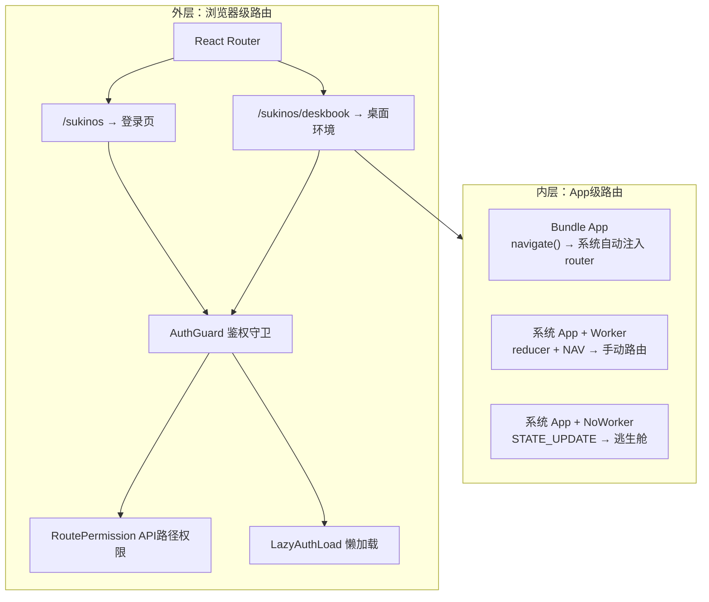

# 前端模块详解

## 一、项目结构

```
src/
├── apis/                    # API 请求层
│   ├── auth.jsx             # 认证相关 API
│   ├── env.jsx              # 环境变量
│   ├── main.jsx             # 导出汇总
│   ├── sukinOs/             # SukinOS APP 相关 API
│   │   ├── app.jsx
│   │   └── main.jsx
│   └── system/              # 系统管理 API
│       ├── config.jsx
│       ├── main.jsx
│       ├── permissionManage.jsx
│       ├── requestLog.jsx
│       ├── status.jsx
│       ├── sukinosAppManage.jsx
│       └── updateLog.jsx
├── apps/                    # 第三方/示例应用
├── component/               # 通用 UI 组件
├── hooks/                   # 通用 Hooks
├── index/                   # 首页/登录入口
├── middleware/              # 前端中间件
│   ├── appear-instance/     # 实例出现动画
│   ├── author-info/         # 作者信息打印
│   ├── routePermission/     # 路由权限拦截
│   ├── tear-mouse/          # 鼠标拖尾特效
│   └── transform-water/     # 水印效果
├── router/                  # 路由配置
│   ├── AuthGuard.jsx        # 鉴权守卫
│   ├── routerHelper.jsx     # 懒加载/鉴权工具组件
│   ├── main.jsx             # 根路由配置
│   ├── index/               # 首页路由
│   ├── sukinos/             # 桌面路由
│   ├── apps/                # 应用路由
│   └── jump.jsx             # 跳转路由
├── store/                   # Redux 状态管理
│   ├── main.jsx             # store 配置（动态 reducer/中间件）
│   ├── transform.jsx        # 状态转换器
│   └── persist/             # 持久化配置
├── sukinos/                 # SukinOS 桌面环境核心
│   ├── layout.jsx           # 桌面整体布局
│   ├── store.jsx            # 桌面状态管理
│   ├── style.module.css     # 桌面样式
│   ├── login/               # 登录页面
│   ├── deskBook/            # 桌面 UI 核心
│   │   ├── layout.jsx       # 桌面框架
│   │   ├── boot/            # 启动画面
│   │   ├── customApp/       # 自定义应用入口
│   │   ├── shortcut/        # 桌面快捷方式
│   │   ├── statusBar/       # 状态栏
│   │   └── window/          # 窗口管理器
│   ├── hooks/               # 桌面 Hooks
│   ├── middleware/           # 桌面中间件
│   │   ├── InteractiveAwakening/  # 交互唤醒
│   │   └── VfsImage/        # VFS 镜像
│   ├── resources/           # 内置应用
│   │   ├── developer/       # 开发者中心
│   │   ├── drawBoard/       # 画板（绘图+思维导图）
│   │   ├── fileSystem/      # 文件系统
│   │   ├── localDev/        # 本地开发
│   │   ├── notebook/        # 记事本
│   │   ├── setting/         # 设置
│   │   ├── sheet/           # 表格
│   │   ├── start/           # 开始菜单
│   │   └── store/           # APP 商店
│   └── utils/               # 桌面工具
│       ├── process/         # 进程内核
│       ├── file/            # 文件系统
│       ├── security.js      # 安全工具
│       ├── config.js        # 配置常量
│       └── tool.js          # 通用工具
├── url/                     # Axios 实例与拦截器
├── main.jsx                 # React 入口
└── App.jsx                  # （根组件合并到 main.jsx）
```

## 二、入口与全局配置

### 2.1 main.jsx

```jsx
<Provider store={store}>
  <PersistGate persistor={persistore}>
    <AlertProvider />
    <ConfirmProvider />
    <AuthorInfoPrinter />
    <RoutePermission />        {/* 路由权限中间件 */}
    <RouterProvider router={router} />
  </PersistGate>
</Provider>
```

### 2.2 路由权限中间件

**位置**: `src/middleware/routePermission/layout.jsx`

- 渲染 `null`，无 UI 效果
- 启动时从后端加载路由权限配置到模块级缓存
- 监听 Redux 中 `userInfo` 变化，同步当前用户信息
- 与 axios 请求拦截器联动，本地拦截越权请求

**缓存模块**: `src/middleware/routePermission/cache.js`

```javascript
checkRoutePermission(method, path): boolean
// - 配置未加载 → 放行
// - 未登录 → 拦截
// - root → 放行
// - 路由不在配置中 → 放行
// - 匹配 allowed_roles/allowed_users → 放行
// - 其余 → 拦截
```

## 三、路由系统

SukinOS 的路由是**双层架构**：外层是浏览器级 React Router（页面间导航 + 鉴权），内层是 App 级路由（应用内部页面导航）。

### 3.1 两层路由总览



> App 级路由的完整深度解析（Bundle vs 系统 App 路由策略、三种 Worker 模式消息链路、Dispatch 双路径、saveState 持久化链）详见 [module/07-app-routing.md](./module/07-app-routing.md)

### 3.2 路由层次

```javascript
createBrowserRouter([
  ...indexRouter,     // /, /about, /log, /* 404
  ...testRouter,
  ...educationRouter, // education 应用
  ...sukinosRouter,   // /sukinos, /sukinos/deskbook
  ...jumpRouter       // 跳转路由（放最后）
])
```

SukinOS 的两条路由定义在 `src/router/sukinos/main.jsx`：

| 路径 | 页面 | 鉴权 |
|------|------|------|
| `/sukinos` | 登录/启动页 | `requireAuth=true`（AuthGuard） |
| `/sukinos/deskbook` | 桌面环境 | `requireAuth=true`（AuthGuard） |

### 3.3 AuthGuard 鉴权守卫

**位置**: `src/router/AuthGuard.jsx`

`AuthGuard` 执行 5 步判断链：

```
AuthGuard({element, allowRoles})
  │
  ├── 1. isVerifying? → 挂起渲染 <Loading />（后端校验 session 期间）
  │
  ├── 2. isLoginPage (/sukinos)?
  │     ├── isAuthenticated → 重定向到 /sukinos/deskbook
  │     └── !isAuthenticated → 正常渲染登录页
  │
  ├── 3. isProtectedPath && !isAuthenticated → 重定向到 /sukinos
  │
  ├── 4. allowRoles.length > 0 && !allowRoles.includes(userRole)
  │     → 重定向到 /jump?title=权限不足
  │
  └── 5. RoutePermission 检查 → 路由权限不足则拦截
```

### 3.4 RoutePermission 路由权限中间件

**位置**: `src/sukinos/middleware/RoutePermission.jsx` + `src/middleware/routePermission/`

RoutePermission 是后端配置驱动的 API 路由权限检查：
- 用户登录后从 `/api/system/permission/routes-permission` 加载权限配置表
- `checkRoutePermission(method, path)` 根据配置表判断当前用户是否有权访问
- 规则：未配置放行、`_auto: true` 自动放行、`_locked: true` 仅 root、显式配置按角色/用户校验

### 3.5 懒加载工具

**位置**: `src/router/routerHelper.jsx`

| 组件 | 说明 |
|---|---|
| `LazyComponent` | 基础懒加载组件（含 `Map` 缓存池，防重复挂载） |
| `AuthWrapper` | 鉴权包装组件 |
| `LazyAuthLoad` | 懒加载 + 鉴权组合组件（`LazyComponent` + `AuthWrapper`） |
| `createLazyRoute` | 创建懒加载路由元素 |

> AuthGuard 鉴权守卫完整 5 步流程图、RoutePermission 中间件详细逻辑、两层路由体系总览详见 [module/07-app-routing.md](./module/07-app-routing.md) §1

## 四、Redux Store

### 4.1 Store 配置

**位置**: `src/store/main.jsx`

**特性**:
- 静态 Reducer: `sukinos`（持久化）、`education`（持久化）
- 动态 Reducer 注入: `store.injectReducer(key, reducer)`
- 开关式中间件: 支持动态注入和启用/禁用
- 持久化: 使用 `redux-persist`，localStorage 存储

### 4.2 SukinOS Store

**位置**: `src/sukinos/store.jsx`

**核心状态**:
```javascript
{
  userInfo: {},           // 用户信息
  theme: '',              // 主题
  ui: {},                 // UI 状态
  assistant: {
    verificationCodes: {} // 多业务验证码状态
  },
  setting: { isDisplay: true },  // 桌面设置
  appStore: {
    storePath: { ... },   // 商店 API 路径
    generateApp: { ... }  // APP 生成配置
  },
  fileSystemConfig: {
    isPrivate: true       // 文件系统默认私有
  }
}
```

## 五、SukinOS 桌面环境

### 5.1 桌面布局 (`sukinos/layout.jsx`)

```
┌─────────────────────────────────────────────────────┐
│  ┌─────────────────────────────────────────────────┐│
│  │              窗口管理器 (Window)                  ││
│  │  ┌─────────┐ ┌─────────┐ ┌───────────────────┐ ││
│  │  │ 应用 A  │ │ 应用 B  │ │ 应用 C            │ ││
│  │  └─────────┘ └─────────┘ └───────────────────┘ ││
│  └─────────────────────────────────────────────────┘│
│  ┌─────────────────────────────────────────────────┐│
│  │ 开始 │ 任务栏(窗口切换)            │ 状态栏(时间)││
│  └─────────────────────────────────────────────────┘│
└─────────────────────────────────────────────────────┘
```

### 5.2 窗口管理器 (`deskBook/window/`)

| 模块 | 说明 |
|---|---|
| `layout.jsx` | 窗口容器（位置/大小/层级管理） |
| `process/layout.jsx` | 进程视图（APP 渲染容器） |

窗口特性：
- 拖拽移动
- 缩放调整大小
- 最小化/最大化/关闭
- Z-index 层级管理

### 5.3 进程内核 (`utils/process/`)

| 模块 | 说明 |
|---|---|
| `kernel.js` | 进程内核主入口 |
| `kernelParts/core.js` | 核心调度器 |
| `kernelParts/lifecycle.js` | 进程生命周期 |
| `kernelParts/instance.js` | 实例管理 |
| `kernelParts/registry.js` | 应用注册表 |
| `kernelParts/messaging.js` | 进程间通信 |
| `kernelParts/cache.js` | 进程缓存 |
| `kernelParts/flags.js` | 标志位管理 |
| `kernelParts/internals.js` | 内部方法 |
| `kernelParts/resourceAccess.js` | 资源访问控制 |
| `kernelParts/settings.js` | 设置管理 |
| `kernelParts/main.js` | 入口 |
| `renderProcess.jsx` | 渲染进程 React 组件 |
| `renderWindow.js` | 窗口渲染器 |
| `generateApp.js` | APP 生成器 |
| `generateWorker.js` | Worker 生成器 |
| `workerDrive.js` | Worker 驱动 |
| `commHub.js` | 通信中枢 |
| `babelLoader.js` | Babel 加载器 |
| `styleSyncHub.js` | 样式同步中枢 |
| `indexDb.js` | IndexedDB 存储 |

进程架构采用**沙箱隔离 + 通信桥**的微内核模式：
- 每个 APP 运行在独立的 Worker 或 Iframe 中
- 通过 `commHub` 进行进程间通信（IPC）
- 主进程负责窗口管理和资源调度
- 支持动态加载第三方 APP

### 5.4 内置应用注册机制

每个内置应用包含：
- `registry.jsx` - 应用注册（应用元数据、图标、打开方式）
- `layout.jsx` - 应用主组件
- `style.module.css` - 样式
- `readme.md` - 文档

## 六、API 请求层

### 6.1 认证 API (`src/apis/auth.jsx`)

| 方法 | 说明 |
|---|---|
| `asistant.getVerificationCode()` | 获取验证码 |
| `asistant.judgeVerificationCode()` | 校验验证码 |
| `login()` | 登录（密码/验证码） |
| `user.checkToken()` | 检查 Token 有效性 |
| `user.logout()` | 注销 |
| `user.updateUserInfo()` | 更新用户信息 |
| `user.updatePassword()` | 修改密码 |

### 6.2 Axios 拦截器 (`src/url/`)

- 请求拦截器：检查路由权限、添加请求头
- 响应拦截器：统一错误处理、Token 过期处理

## 七、通用组件 (`component/`)

| 组件 | 说明 |
|---|---|
| `alert/` | 全局 Alert 提示框 |
| `confirm/` | 全局 Confirm 确认框 |
| `info/loding/` | 加载中 |
| `info/page/` | 通用信息页面 |

## 八、API 接口汇总

### 用户端 API

| 路径 | 说明 | 认证 |
|---|---|---|
| `/user/status/*` | 认证/登录/注册 | 公开/登录 |
| `/sukinos/app/*` | APP 商店/上传/管理 | 登录 |

### 管理端 API

全部位于 `/system/` 前缀下，大部分需要 root 权限：
- 用户管理、权限管理、配置管理、日志审计、系统监控

详细列表见[后端模块详解](./3-后端模块详解.md)。
