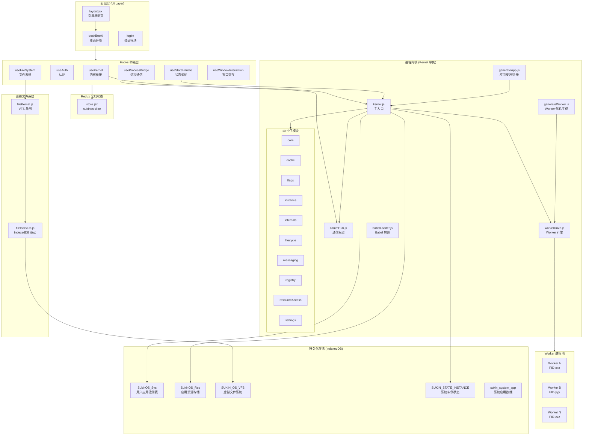
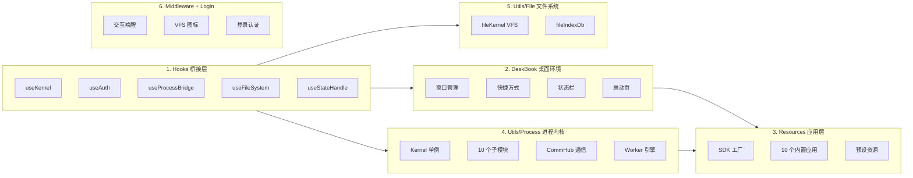
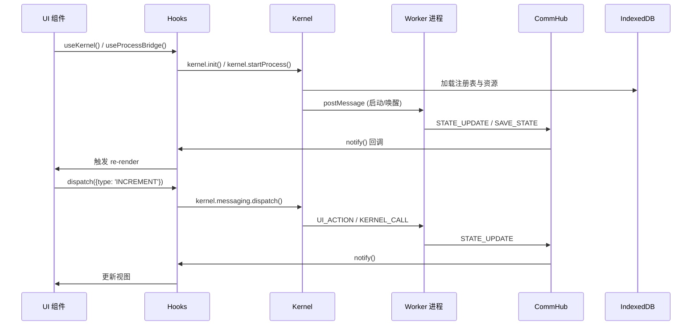
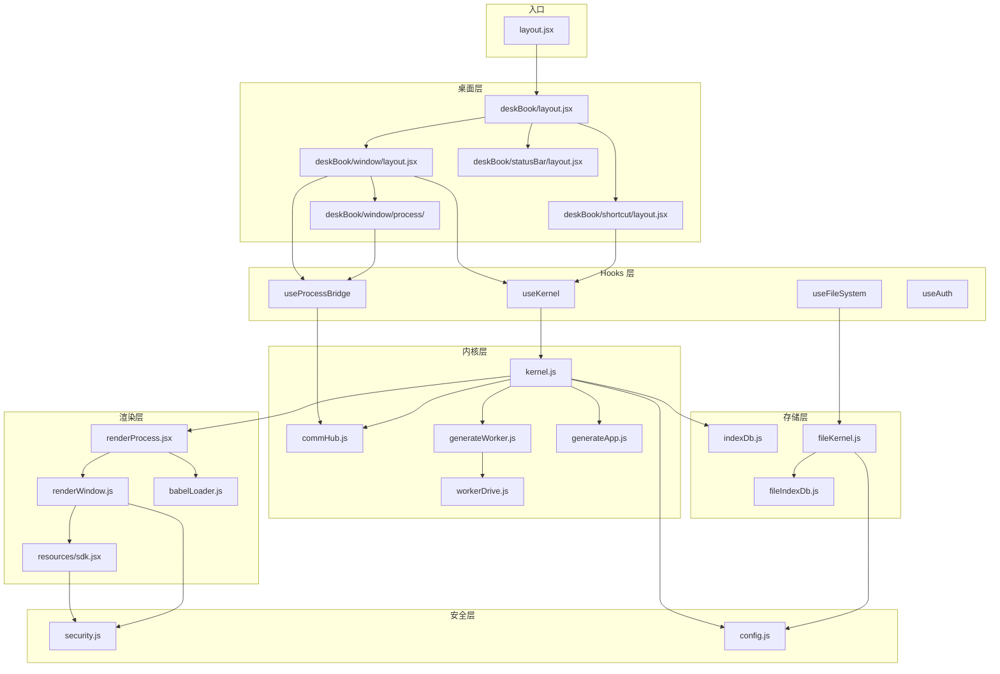

# SukinOS 架构总览

> 本文档是 SukinOS 系统的**架构总览与专题索引**。各专题的完整接口级文档位于 `module/` 同级目录，此处仅提供一句话概括和交叉引用链接。

## 1. 系统概述

SukinOS 是一个运行在浏览器端的**桌面操作系统 Web 应用**，采用 **React + Redux + Web Worker** 前端架构，搭配 **FastAPI + SQLAlchemy + Celery + Redis + MySQL** 后端服务。它模拟了传统操作系统的核心能力：应用的安装、启动、运行、休眠、窗口管理、虚拟文件系统、进程间通信以及安全沙箱隔离。

### 核心特性

| 特性 | 说明 |
|------|------|
| 应用生命周期管理 | 安装、启动、休眠、唤醒、终止 |
| 窗口管理 | 拖拽、缩放、最大化、多窗口并发 |
| 虚拟文件系统 (VFS) | 基于 IndexedDB 的类 Unix 文件系统 |
| 进程沙箱 | Worker 线程隔离 + API 代理 + CDN 白名单 |
| 内置应用 | 10 个系统级应用（文件管理器、笔记本、画板等） |
| 用户应用 | 支持通过开发者工具或应用商店安装第三方应用 |
| 个性化 | 主题、窗口偏好、桌面快捷方式等用户配置 |
| 数据持久化 | 5 个 IndexedDB 数据库 + MySQL 8 张表 |
| JWT 认证 | 双 Token 机制（Access 30min + Refresh 7天）+ 静默刷新 |
| 请求审计 | 全量 API 请求日志 + 敏感信息脱敏 |
| WebSocket | 多标签页管理 + 心跳检测 + 登录时长追踪 |
| SSE 本地开发 | 服务端推送热更新 + Token 鉴权 |

---

## 2. 系统架构图



---

## 3. 目录结构

```
sukinos/
├── layout.jsx                 # 引导启动页
├── store.jsx                  # Redux 全局状态管理
├── style.module.css           # 全局样式
├── component/                 # 公共 UI 组件
├── deskBook/                  # 桌面环境（boot/shortcut/statusBar/window/customApp）
├── hooks/                     # React Hooks 桥接层（14 个）
├── login/                     # 登录模块
├── middleware/                # 中间件（InteractiveAwakening/VfsImage）
├── resources/                 # 系统应用资源（10 个内置应用 + SDK 工厂）
└── utils/                     # 工具层
    ├── process/               #   进程内核系统（Kernel + CommHub + Worker 引擎）
    │   └── kernelParts/       #     Kernel 子模块（10 个）
    ├── file/                  #   文件系统工具（fileKernel + fileIndexDb）
    ├── _db.js                 #   系统应用数据库
    ├── config.js              #   全局配置/常量
    ├── security.js            #   安全沙箱
    └── tool.js                #   通用工具函数
```

---

## 4. 六大核心模块



| # | 模块 | 概述 | 详细文档 |
|---|------|------|---------|
| 1 | **Hooks 桥接层** | 14 个 Hook 连接 Redux Store、Kernel 与 UI，是系统交互的核心桥梁。涵盖内核桥接、认证、进程通信、文件系统、窗口交互等全部 UI→底层通道。 | [01-hooks.md](./01-hooks.md) |
| 2 | **DeskBook 桌面环境** | 用户交互主界面，包含窗口管理器（拖拽/缩放/z-index）、桌面快捷方式、底部状态栏、启动页、自定义应用容器。含 12 项 GPU/渲染性能优化措施。 | [02-deskbook.md](./02-deskbook.md) |
| 3 | **Resources 应用层** | SDK 工厂（devAppSdk/adminAppSdk 双权限模型）+ 10 个内置应用注册详情 + InteractiveAwakening/VfsImage 中间件 + 开发者扩展指南。 | [03-resources.md](./03-resources.md) |
| 4 | **进程内核** | Kernel 单例 + 10 个 kernelParts 子模块 + CommHub 通信枢纽 + 3 种 Worker 运行模式 + 完整生命周期（安装→启动→休眠→恢复→终止）。 | [04-process-kernel.md](./04-process-kernel.md) |
| 5 | **文件系统与安全** | VFS 内核-驱动两层架构 + Inode 数据模型 + 安全沙箱 8 类策略（PID 命名空间/CDN 白名单/API 禁用/Blob 递归沙箱化/设备屏蔽/SDK 冻结等）+ 系统数据库 + 通用工具。 | [05-file-system-tools.md](./05-file-system-tools.md) |
| 6 | **中间件与认证** | Redux Store 完整状态树 + 8 个 Reducer + 7 个 Selector + 登录模块 3 种业务模式 + useAuth Hook + 三层权限控制 + AuthGuard 鉴权守卫。 | [06-middleware-login.md](./06-middleware-login.md) |

> **路由与消息处理** — 双层路由体系（浏览器级 + App级）、三种运行模式消息处理差异（RealWorker/VirtualWorker/NoWorker）、Dispatch 双路径、跨应用唤起与会话恢复、Pub/Sub 主题体系。详见 [07-app-routing.md](./07-app-routing.md)

---

## 5. 数据存储

SukinOS 使用 5 个 IndexedDB 数据库实现全量本地持久化：

| 数据库 | 配置常量 | Store Name | KeyPath | 主要用途 |
|--------|---------|------------|---------|---------|
| SukinOS_Sys | `DB_SYS` | `registry` | `name` | 用户安装的应用注册信息、PID 状态、savedState |
| SukinOS_Res | `DB_RES` | `ui_bundles` | `resourceId` | 应用的完整资源（逻辑代码、UI 内容、元数据） |
| SUKIN_OS_VFS | `DB_VFILE` | `files` | `id` | VFS 虚拟文件系统的所有 Inode 节点 |
| SUKIN_STATE_INSTANCE | `DB_STATE_INSTANCE` | `instance` | `id` | 系统实例状态（文件句柄等有状态运行时数据） |
| sukin_system_app | `DB_SYSTEM_APP` | — | — | 系统应用的用户数据（画板作品、表格数据等） |

> 数据库 Inode 数据模型、VFS 驱动层详细接口详见 [05-file-system-tools.md](./05-file-system-tools.md)

---

## 6. 核心数据流



> 数据流完整链路、CommHub 三种通信模式、消息协议详见 [04-process-kernel.md](./04-process-kernel.md)；三种 Worker 模式的消息处理差异详见 [07-app-routing.md](./07-app-routing.md)

---

## 7. 专题索引

### 7.1 SDK 架构

SDK 是应用与系统交互的唯一接口，通过工厂函数 `createSdkForInstance` 为每个应用实例创建隔离的安全 SDK。根据 `isSystemApp` 选择 `adminAppSdk`（完整权限）或 `devAppSdk`（有限权限），注入 PID 命名空间的 Storage/IndexedDB/Fetch 代理，然后深度冻结 + 只读代理包裹。

> SDK 权限对比表、注入流程 Mermaid 图、10 个内置应用注册详情详见 [03-resources.md](./03-resources.md)

### 7.2 安全沙箱

多层安全沙箱确保每个应用进程在隔离环境中运行：PID 命名空间隔离（Storage/IndexedDB）、Fetch 注入（`x-kernel-process-id` Header）、CDN 白名单、Blob 递归沙箱化、API 禁用（eval/Function/XMLHttpRequest/importScripts）、设备屏蔽（USB/Bluetooth/HID）、SDK 冻结（Proxy 拦截写操作）、清理机制（`clearSandboxStorageByPid`/`clearAppSandboxData`）。

> 沙箱策略完整表格、CDN 白名单列表、Worker 沙箱前导代码、VirtualWorker 资源追踪与清理详见 [05-file-system-tools.md](./05-file-system-tools.md)

### 7.3 进程内核与通信

Kernel 单例内部组合了 10 个子模块（Core/Cache/Flags/Instance/Internals/Lifecycle/Messaging/Registry/ResourceAccess/Settings），通过 CommHub 实现三种通信模式：EventBus（系统事件）、subscribers（状态订阅）、topicSubscribers（主题 Pub/Sub）。

> Kernel 完整公共 API、10 个子模块详解、CommHub 消息协议、5 个核心调用链 Mermaid 图详见 [04-process-kernel.md](./04-process-kernel.md)

### 7.4 应用生命周期

应用状态机：INSTALLED → RUNNING → HIBERNATED → Terminated。支持三种运行模式：RealWorker（标准沙箱）、VirtualWorker（iframe+Proxy帧对齐节流+资源追踪清理）、NoWorker（宿主线程 sysConfig 注入+processStateAction+ACTION_ECHO）。会话恢复保护 `originalStatus === HIBERNATED` 时保持 HIBERNATED 不强行转 RUNNING。

> 状态机完整 Mermaid 图、startProcess 冷启动流程、hibernate/forceKillProcess/forceReStartApp/clearAppSavedState/forceResetApp/restoreSession/evokeApp 全 API 详解详见 [04-process-kernel.md](./04-process-kernel.md)

### 7.5 路由与消息处理

双层路由体系：外层浏览器级路由（React Router + AuthGuard 鉴权守卫 + RoutePermission 中间件 + LazyAuthLoad 懒加载），内层 App 级路由（Bundle App 自动注入 router + NAVIGATE vs 系统 App 手动 reducer + NAV）。Dispatch 双路径：KERNEL_CALL 内核拦截路径 vs UI_ACTION 透传路径。

> 四维度分层详解、三种 Worker 模式消息链路、跨应用唤起、会话恢复、Pub/Sub 主题体系详见 [07-app-routing.md](./07-app-routing.md)

### 7.6 Redux Store 与登录认证

Redux Store 使用 Redux Toolkit `createSlice`，状态树包含 userInfo/theme/ui/assistant/setting/appStore/fileSystemConfig 7 个域，8 个 Reducer + 7 个 Selector。登录模块支持 3 种业务模式（账号密码/验证码/管理员），useAuth Hook 提供完整的认证流程接口，三层权限控制（菜单权限/路由权限/APP 权限注册池）。

> Store 状态树完整结构、Reducer/Selector 列表、登录模块 3 种模式流程、useAuth 接口、AuthGuard 鉴权守卫详见 [06-middleware-login.md](./06-middleware-login.md)

---

## 8. 模块依赖关系



---

## 9. 全局配置

`config.js` 定义了系统的核心配置常量：

### 核心字段环境变量

| 常量 | 值 | 说明 |
|------|----|------|
| `ENV_KEY_RESOURCE_ID` | `'resourceId'` | 资源唯一标识符（DB_RES 主键） |
| `ENV_KEY_NAME` | `'name'` | 应用名称（DB_SYS 主键、物理文件名前缀） |
| `ENV_KEY_IS_BUNDLE` | `'isBundle'` | 是否支持路由捆绑包 |
| `ENV_KEY_LOGIC` | `'logic'` | 业务逻辑纯净代码 |
| `ENV_KEY_CONTENT` | `'content'` | 界面视图源码 |
| `ENV_KEY_META_INFO` | `'metaInfo'` | 操作系统元数据 |

### 应用个性化配置

| 字段 | 默认值 | 说明 |
|------|--------|------|
| `hasShortcut` | `true` | 创建桌面图标 |
| `blockEd` | `false` | 固定至状态栏 |
| `isFullScreen` | `true` | 默认全屏启动 |
| `autoStart` | `false` | 开机自动运行 |
| `allowResize` | `true` | 允许调整窗口大小 |
| `showInLauncher` | `false` | 在启动器中显示 |

---

## 10. 权限管理系统

权限管理系统控制谁能访问哪些功能，分为五个独立维度：

| 维度 | 说明 |
|------|------|
| 菜单权限 | 侧边栏导航菜单对角色/用户的可见性 |
| 路由权限 | API 接口的访问控制，支持角色/用户白名单 |
| APP 注册池 | 商店 APP 的授权控制，黑白名单 |
| 注册权 | 谁有权将 APP 加入权限控制池 |
| 系统 APP 放权 | 内置系统 APP 的可见性控制 |

> 五维权限体系详解、后端中间件链、RoutePermission 完整逻辑详见 [../2-系统架构.md](../2-系统架构.md)

---

## 附录A：Mermaid 架构图索引

详细的 Mermaid 语法文件位于 `docs/mermaid/` 目录，可直接复制到 https://mermaid.live/ 查看渲染效果：

| 文件 | 内容 |
|------|------|
| `01-system-overview.mmd` | 系统整体架构（前端 + 后端） |
| `02-kernel-architecture.mmd` | Kernel 进程内核详细架构 |
| `03-commhub-communication.mmd` | CommHub 通信枢纽架构 |
| `03-app-routing.mmd` | 应用路由导航机制（含浏览器级路由、三种 Worker 模式、Pub/Sub 体系） |
| `04-vfs-file-system.mmd` | 虚拟文件系统 (VFS) 架构 |
| `05-security-sandbox.mmd` | 安全沙箱体系 |
| `06-app-lifecycle.mmd` | 应用生命周期状态机 |
| `07-backend-architecture.mmd` | 后端 FastAPI 架构 |
| `08-auth-flow.mmd` | JWT 双 Token 认证流程 |
| `09-database-er.mmd` | 数据库 ER 图（8 张表） |
| `10-backend-routes.mmd` | 后端 API 路由结构 |
| `11-websocket-flow.mmd` | WebSocket 多标签页管理流程 |
| `12-sse-localdev.mmd` | SSE 本地开发热更新流程 |
| `13-request-log-middleware.mmd` | 请求日志中间件流程 |
| `14-app-store-flow.mmd` | 应用商店安装与更新流程 |
| `15-redux-store.mmd` | Redux Store 状态树 |
| `16-permission-system.mmd` | 权限管理系统 |
| `17-three-layer-auth.mmd` | 三层认证体系 |
| `18-auto-lifecycle.mmd` | 自动生命周期 |

## 附录B：专题文档索引

| 文档 | 主题 | 说明 |
|------|------|------|
| [01-hooks.md](./01-hooks.md) | Hooks 桥接层 | 14 个 Hook 完整接口文档、调用链关系图、依赖关系矩阵 |
| [02-deskbook.md](./02-deskbook.md) | DeskBook 桌面环境 | 8 个组件详解、12 项性能优化措施、全局快捷键 |
| [03-resources.md](./03-resources.md) | Resources 应用层 | SDK 双权限模型、createSdkForInstance 工厂流程、10 个内置应用、中间件 |
| [04-process-kernel.md](./04-process-kernel.md) | 进程内核系统 | Kernel 全 API、CommHub 消息协议、10 个子模块详解、5 个核心调用链 |
| [05-file-system-tools.md](./05-file-system-tools.md) | 文件系统与安全 | VFS 内核-驱动两层架构、安全沙箱 8 类策略、系统数据库、通用工具 |
| [06-middleware-login.md](./06-middleware-login.md) | 中间件与认证 | Redux Store 详情、登录模块、useAuth Hook、三层权限控制 |
| [07-app-routing.md](./07-app-routing.md) | 路由与消息处理 | 双层路由体系、三种 Worker 模式消息链路、Dispatch 双路径、跨应用唤起、Pub/Sub |

## 附录C：后端数据库表概览

| # | 表名 | 模型类 | 说明 |
|---|------|--------|------|
| 1 | `users` | `User` | 用户表（账号、密码、权限、头像） |
| 2 | `user_expand` | `UserExpand` | 用户扩展信息（在线状态、总活跃时长） |
| 3 | `user_time_behavior` | `UserTimeBehavior` | 用户行为时间统计 |
| 4 | `user_time_week` | `TimeWeek` | 用户周活跃统计 |
| 5 | `sukinos_app` | `D_SukinosApp` | SukinOS 应用表（乐观锁版本控制） |
| 6 | `request_logs` | `D_RequestLog` | 请求审计日志表 |
| 7 | `system_configs` | `D_SystemConfig` | 系统配置表 |
| 8 | `system_updates` | `D_SystemUpdate` | 系统更新日志表 |

## 附录D：后端 API 路由概览

| 路由前缀 | 模块 | 主要端点 |
|----------|------|---------|
| `/api/user` | 用户模块 | login, register, logout, refresh, info, update, avatar, captcha |
| `/api/sukinos/app` | SukinOS 应用 | upload, update, appList, searchApp, myUpload, delete, checkUpdates |
| `/api/sukinos/localdev` | 本地开发 | SSE 热更新端点 |
| `/api/system/permission` | 权限管理 | registry, menus, routes-permission, role, registry-power |
| `/ws/{user_id}` | WebSocket | 多标签页连接、心跳、登录/登出追踪 |

### 中间件链（由内到外）

```
RequestLogMiddleware → RoutePermissionMiddleware → StaticAuthMiddleware → CORSMiddleware
```

> 后端架构详解、中间件链完整逻辑、认证流程详见 [../2-系统架构.md](../2-系统架构.md)、[../3-后端模块详解.md](../3-后端模块详解.md)
