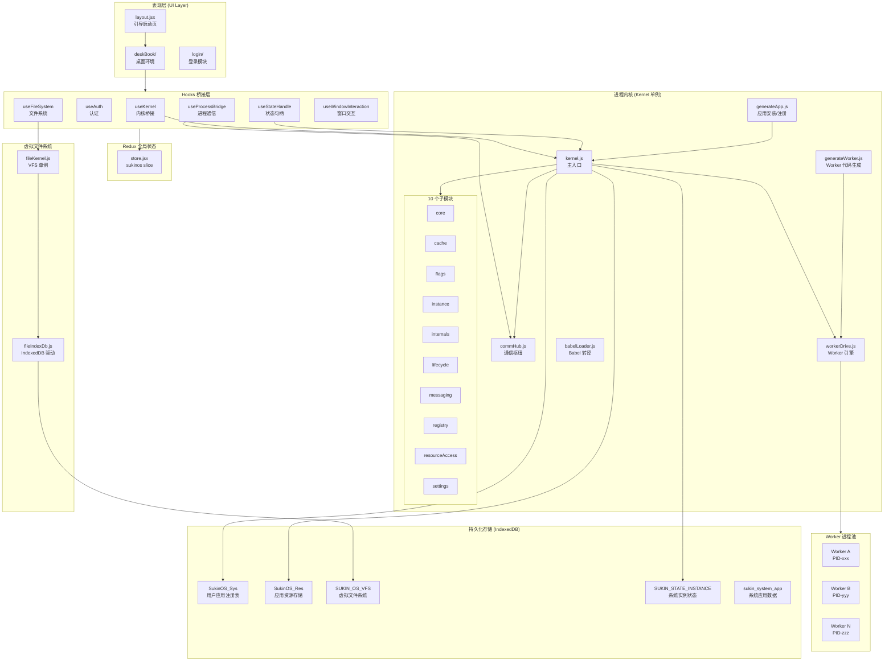
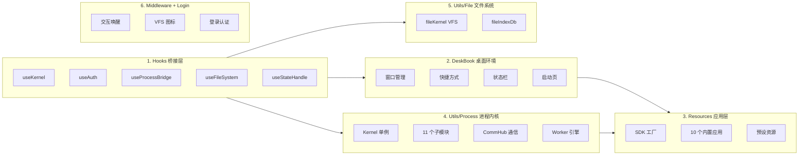
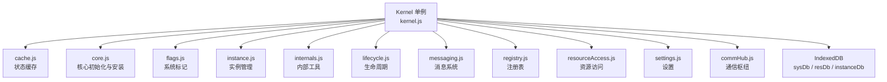
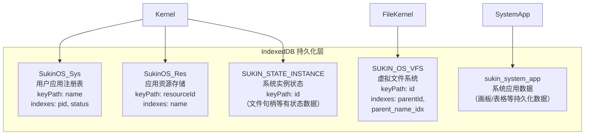
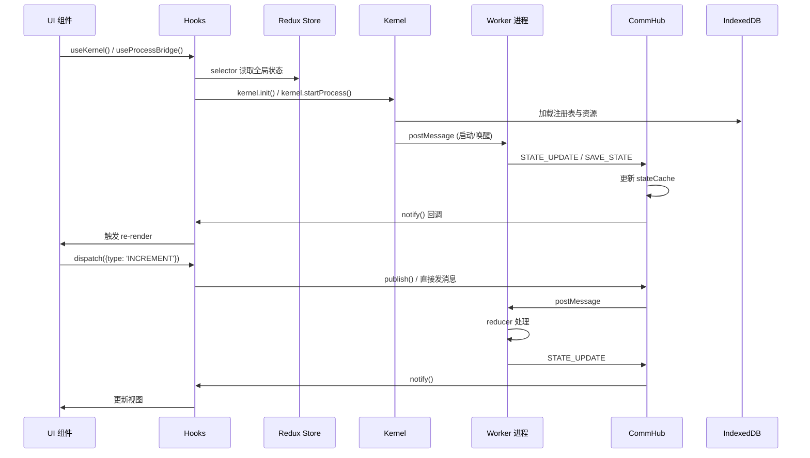
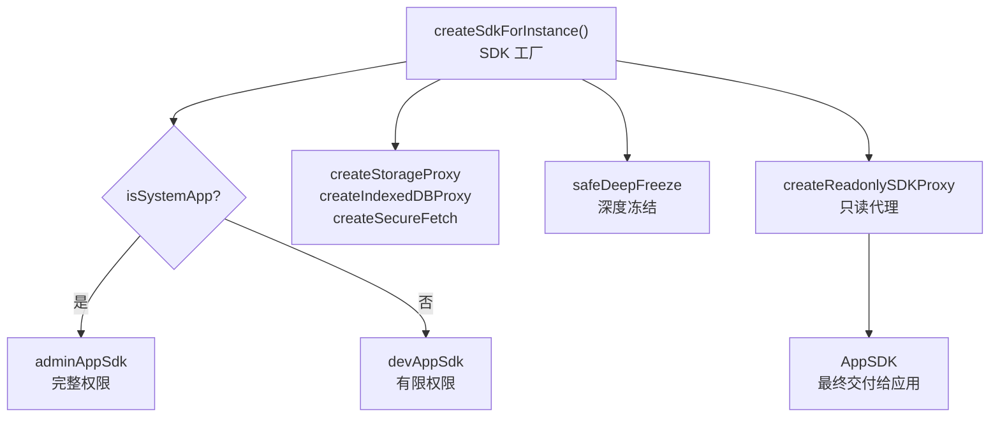
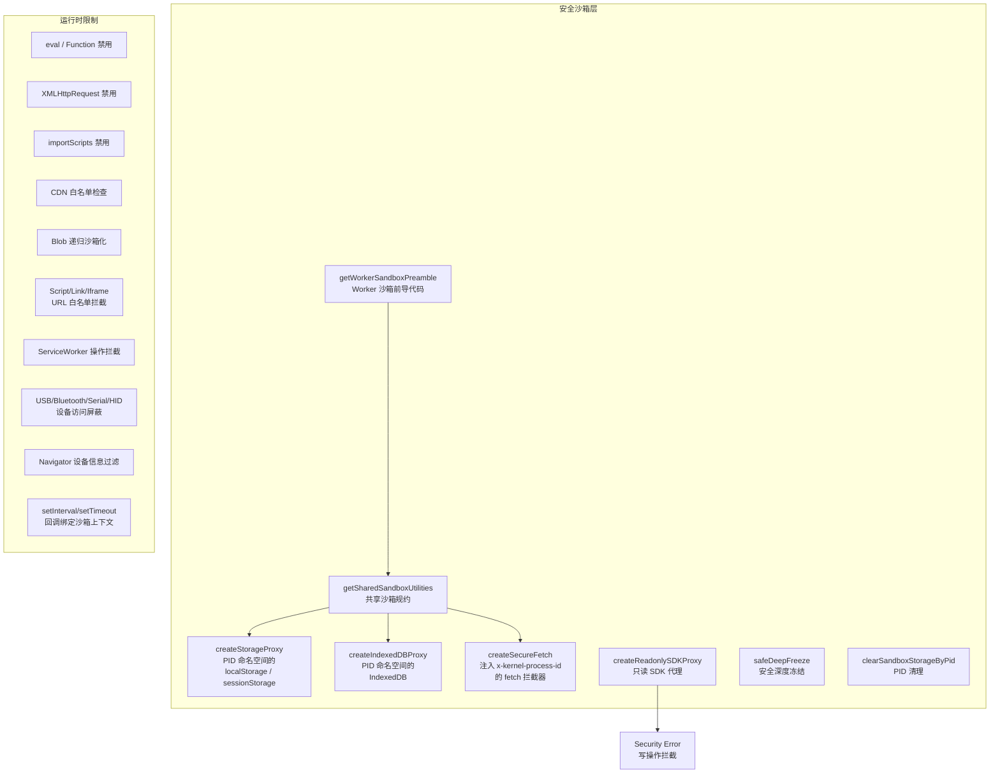
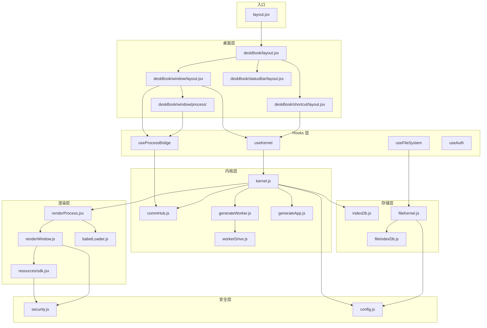
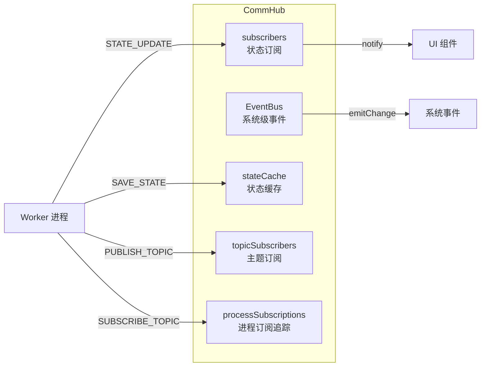
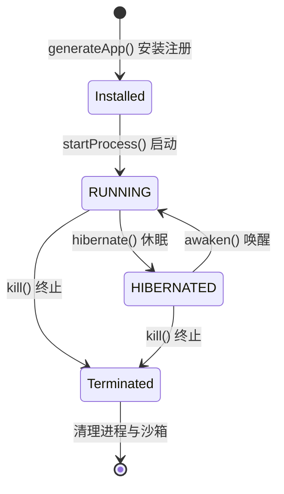

# SukinOS 架构总览

## 1. 系统概述

SukinOS 是一个运行在浏览器端的**桌面操作系统 Web 应用**，采用 **React + Redux + Web Worker** 三层架构。它模拟了传统操作系统的核心能力：应用的安装、启动、运行、休眠、窗口管理、虚拟文件系统、进程间通信以及安全沙箱隔离。

### 核心特性

| 特性 | 说明 |
|------|------|
| 应用生命周期管理 | 安装、启动、休眠、唤醒、终止 |
| 窗口管理 | 拖拽、缩放、最大化、多窗口并发 |
| 虚拟文件系统 (VFS) | 基于 IndexedDB 的类 Unix 文件系统 |
| 进程沙箱 | Worker 线程隔离 + API 代理 + CDN 白名单 |
| 内置应用 | 10 个系统级应用（文件管理器、笔记本、画板等） |
| 用户应用 | 支持通过开发者工具或应用商店安装第三方应用 |
| 个性化 | 主题、窗口偏好、桌面快捷方式等用户配置 |
| 数据持久化 | 5 个 IndexedDB 数据库实现全量数据本地持久化 |

---

## 2. 系统架构图



---

## 3. 目录结构

```
sukinos/
├── layout.jsx                 # 引导启动页（拖拽组装动画 → 终端控制台 → 登录）
├── store.jsx                  # Redux 全局状态管理（Redux Toolkit createSlice）
├── style.module.css           # 全局样式
├── component/                 # 公共 UI 组件
│   └── fileSystemView/        #   文件系统视图
├── deskBook/                  # 桌面环境
│   ├── layout.jsx             #   桌面主布局
│   ├── boot/                  #   启动页
│   │   ├── layout.jsx
│   │   └── style.module.css
│   ├── customApp/             #   自定义应用容器
│   │   ├── layout.jsx
│   │   └── style.module.css
│   ├── shortcut/              #   桌面快捷方式/图标
│   │   ├── layout.jsx
│   │   └── style.module.css
│   ├── statusBar/             #   底部状态栏
│   │   ├── layout.jsx
│   │   └── style.module.css
│   └── window/                #   窗口管理
│       ├── layout.jsx         #     窗口主组件
│       ├── process/           #     进程渲染容器
│       └── style.module.css
├── hooks/                     # React Hooks 桥接层（14 个）
│   ├── main.jsx               #   统一导出
│   ├── useAuth.jsx            #   认证（登录/验证码/Session）
│   ├── useKernel.jsx          #   内核桥接（应用列表/启动/休眠）
│   ├── useProcessBridge.jsx   #   进程通信（状态订阅/dispatch/publish-subscribe）
│   ├── useFileSystem.jsx      #   虚拟/本地文件系统操作
│   ├── useFileKernel.jsx      #   轻量级 VFS 文件操作
│   ├── useStateHandle.jsx     #   IndexedDB 实例与文件句柄管理
│   ├── useOpfs.jsx            #   Origin Private File System
│   ├── usePersonalization.jsx #   个性化/主题配置
│   ├── useWindowInteraction.jsx # 窗口拖拽/缩放/最大化
│   ├── useDebounce.jsx        #   防抖
│   ├── useThrottle.jsx        #   节流
│   ├── useWheelToHorizontalScroll.jsx # 横向滚轮滚动
│   └── userWindowForKernel.jsx # 内核窗口 Hook（预留）
├── login/                     # 登录模块
│   ├── layout.jsx
│   ├── form/                  #   登录表单
│   │   ├── layout.jsx
│   │   └── style.module.css
│   └── style.module.css
├── middleware/                # 中间件
│   ├── main.jsx               #   统一导出
│   ├── InteractiveAwakening/  #   App 间交互唤醒
│   │   ├── main.jsx
│   │   └── style.module.css
│   └── VfsImage/              #   VFS 图标解析
│       └── main.jsx
├── resources/                 # 系统应用资源（10 个内置应用）
│   ├── sdk.jsx                #   SDK 工厂（devAppSdk / adminAppSdk / createSdkForInstance）
│   ├── preset_resources.jsx   #   预设资源注册表
│   ├── developer/             #   开发者工具
│   ├── fileSystem/            #   文件管理器
│   ├── notebook/              #   笔记本
│   ├── store/                 #   应用商店
│   ├── setting/               #   系统设置
│   ├── start/                 #   开始页
│   ├── localDev/              #   本地开发
│   ├── systemManage/          #   系统管理
│   ├── drawBoard/             #   画板
│   └── sheet/                 #   表格
└── utils/                     # 工具层
    ├── process/               #   进程内核系统
    │   ├── kernel.js           #     Kernel 单例（主入口）
    │   ├── commHub.js          #     通信枢纽（EventBus + 状态缓存 + 主题订阅）
    │   ├── generateWorker.js   #     Worker 代码生成器
    │   ├── workerDrive.js     #     Worker 运行时引擎
    │   ├── generateApp.js      #     应用安装/注册/删除
    │   ├── babelLoader.js      #     Babel 转译
    │   ├── renderProcess.jsx   #     进程渲染器
    │   ├── renderWindow.js     #     窗口渲染器
    │   ├── indexDb.js          #     通用 IndexedDB 封装
    │   ├── styleSyncHub.js     #     样式同步
    │   └── kernelParts/        #     Kernel 子模块（11 个）
    │       ├── main.js         #       子模块统一导出
    │       ├── cache.js        #       状态缓存
    │       ├── core.js         #       核心初始化与安装
    │       ├── flags.js        #       系统标记
    │       ├── instance.js     #       实例管理
    │       ├── internals.js    #       内部工具（队列/僵尸文件清理/上传）
    │       ├── lifecycle.js    #       生命周期管理
    │       ├── messaging.js    #       消息系统
    │       ├── registry.js      #       注册表（systemApps/userApps 映射）
    │       ├── resourceAccess.js #      资源访问
    │       └── settings.js     #       设置管理
    ├── file/                  #   文件系统工具
    │   ├── fileKernel.js       #     VFS 虚拟文件系统（单例）
    │   └── fileIndexDb.js      #     VFS IndexedDB 持久化驱动
    ├── _db.js                 #   系统应用数据库
    ├── config.js              #   全局配置/常量
    ├── security.js            #   安全沙箱
    ├── tool.js                #   通用工具函数
    ├── date.js                #   日期格式化
    └── classcreate.js         #   BEM 命名工具
```

---

## 4. 六大核心模块



### 4.1 Hooks 桥接层

Hooks 是连接 Redux Store、Kernel 进程内核与 UI 组件的核心桥梁。所有桌面环境组件和系统应用都通过 Hooks 与底层交互。

| Hook | 职责 |
|------|------|
| `useKernel` | 内核桥接：获取应用列表、启动/休眠进程、监听系统事件 |
| `useAuth` | 认证管理：登录验证、验证码倒计时、Session 维护 |
| `useProcessBridge` | 进程通信：状态订阅、dispatch 消息、发布-订阅主题 |
| `useFileSystem` | 文件系统：VFS 读写、本地文件系统访问 |
| `useFileKernel` | 轻量级 VFS 操作（直接调用 fileKernel 单例） |
| `useStateHandle` | IndexedDB 实例管理、文件句柄持久化 |
| `useOpfs` | Origin Private File System 操作 |
| `usePersonalization` | 个性化主题、用户偏好配置 |
| `useWindowInteraction` | 窗口拖拽、缩放、最大化/最小化交互 |
| `useDebounce` / `useThrottle` | 通用防抖/节流工具 |
| `useWheelToHorizontalScroll` | 横向滚轮滚动转换 |
| `userWindowForKernel` | 内核级窗口 Hook（预留接口） |

### 4.2 DeskBook 桌面环境

桌面环境是用户交互的主界面，负责窗口管理、桌面图标排列、底部状态栏和启动动画。

- **window/** — 窗口管理器：支持拖拽、缩放、最大化、多窗口 z-index 层级管理
- **shortcut/** — 桌面快捷方式：应用图标的双击启动、右键菜单
- **statusBar/** — 底部状态栏：时间、系统状态、快速启动栏
- **boot/** — 启动页：系统引导加载动画
- **customApp/** — 自定义应用容器：用户安装的第三方应用渲染

### 4.3 Resources 应用层

系统内置 10 个应用，每个应用通过 SDK 工厂创建隔离的运行环境。

| 应用 | 目录 | 说明 |
|------|------|------|
| 开发者工具 | `developer/` | 应用开发、调试、代码编辑 |
| 文件管理器 | `fileSystem/` | VFS 文件浏览与管理 |
| 笔记本 | `notebook/` | 富文本笔记 |
| 应用商店 | `store/` | 应用浏览、搜索、上传、下载 |
| 系统设置 | `setting/` | 主题、偏好、系统配置 |
| 开始页 | `start/` | 应用启动器 |
| 本地开发 | `localDev/` | 本地开发环境 |
| 系统管理 | `systemManage/` | 高级系统管理（管理员权限） |
| 画板 | `drawBoard/` | 绘图应用 |
| 表格 | `sheet/` | 电子表格 |

### 4.4 Utils/Process 进程内核

进程内核是 SukinOS 的心脏，采用 Kernel 单例模式管理所有应用的生命周期。Kernel 类内部组合了 10 个子模块，每个子模块负责一个独立职责域。



**核心运行流程：**

1. `kernel.init()` — 调用 `core.init()` 加载注册表、初始化子模块
2. `kernel.startProcess()` — 通过 `generateWorker.js` 生成 Worker 代码，`workerDrive.js` 创建 Worker 实例
3. `commHub` — 处理 Worker <-> UI 的消息分发、状态缓存和主题发布/订阅
4. `lifecycle` — 管理 RUNNING / HIBERNATED 状态切换
5. `registry` — 维护 `systemApps` Map 和 `userApps` Map 双注册表

### 4.5 Utils/File 文件系统

VFS 虚拟文件系统实现了类 Unix 的目录树结构，支持文件的创建、读写、删除、移动、复制等操作。

- **fileKernel.js** — VFS 单例，管理 `inodeMap`（内存镜像）和 `treeMap`（目录树索引）
- **fileIndexDb.js** — IndexedDB 持久化驱动，提供 `mount()` / `loadAllInodes()` 等磁盘操作
- 启动时调用 `boot()` 从 IndexedDB 加载所有 Inode 到内存，构建高速索引

### 4.6 Middleware + Login

- **InteractiveAwakening** — App 间交互唤醒中间件（如从一个应用唤起另一个应用）
- **VfsImage** — VFS 图标解析中间件（将虚拟文件系统中的图标资源解析为可渲染内容）
- **Login** — 登录模块，包含验证码倒计时、账号验证等认证流程

---

## 5. 数据存储

SukinOS 使用 5 个 IndexedDB 数据库实现全量本地持久化：



| 数据库 | 配置常量 | Store Name | KeyPath | 主要用途 |
|--------|---------|------------|---------|---------|
| SukinOS_Sys | `DB_SYS` | `registry` | `name` | 用户安装的应用注册信息、PID 状态、savedState |
| SukinOS_Res | `DB_RES` | `ui_bundles` | `resourceId` | 应用的完整资源（逻辑代码、UI 内容、元数据） |
| SUKIN_OS_VFS | `DB_VFILE` | `files` | `id` | VFS 虚拟文件系统的所有 Inode 节点 |
| SUKIN_STATE_INSTANCE | `DB_STATE_INSTANCE` | `instance` | `id` | 系统实例状态（文件句柄等有状态运行时数据） |
| sukin_system_app | `DB_SYSTEM_APP` | — | — | 系统应用的用户数据（画板作品、表格数据等） |

---

## 6. 核心数据流



### 数据流说明

1. **Redux Store**（`store.jsx`）存储用户信息、主题、设置、验证码状态、应用商店路径等全局状态
2. **Hooks** 通过 `createSelector` 从 Store 读取数据，同时桥接到 Kernel 进行进程操作
3. **Kernel** 是所有应用进程的管理中枢，维护 `processes Map`（PID → Worker 实例）
4. **CommHub** 负责 Worker ↔ UI 的双向消息通信，包含 EventBus（系统事件）、subscribers（状态订阅）、topicSubscribers（主题发布/订阅）
5. **Worker** 运行在独立线程，每个应用有独立的 Worker，通过 `postMessage` 与主线程通信

---

## 7. SDK 架构

SDK 是应用与系统交互的唯一接口，通过工厂函数为每个应用实例创建隔离的安全 SDK。



### SDK 权限对比

| 能力 | devAppSdk | adminAppSdk |
|------|-----------|-------------|
| React 核心 | ✅ | ✅ |
| 公共组件 | ✅ | ✅ |
| 内核 API（有限） | `evokeApp`, `getTypeApps` | 全部 Kernel 方法 |
| Hooks | `useFileSystem` | 全部 Hooks |
| 系统组件 | — | 全部 10 个内置应用 |
| Middleware | ✅ | ✅ |
| 高级 API | — | `rootSeed`（管理员种子生成） |

### SDK 注入流程

1. **选择 baseSdk** — 根据 `isSystemApp` 选择 `adminAppSdk` 或 `devAppSdk`
2. **注入安全代理** — 为每个 PID 创建独立的 Storage / IndexedDB / Fetch 代理
3. **深度冻结** — 对 API 和 System 部分执行 `safeDeepFreeze`，防止应用篡改
4. **只读代理包裹** — 通过 `createReadonlySDKProxy` 包裹，拦截所有写操作

---

## 8. 安全沙箱架构

SukinOS 实现了多层安全沙箱，确保每个应用进程在隔离环境中运行，无法越权访问其他应用或系统资源。



### 沙箱策略

| 机制 | 说明 |
|------|------|
| **PID 命名空间隔离** | 所有 Storage 和 IndexedDB 操作自动添加 `pid-{pid}_` 前缀 |
| **Fetch 注入** | 每次 fetch 请求自动注入 `x-kernel-process-id` Header |
| **CDN 白名单** | 仅允许 `TRUSTED_CDN_WHITELIST` 中的域名加载外部资源 |
| **Blob 递归沙箱** | 通过 Blob 创建的 Worker 也会被注入沙箱前导代码 |
| **API 禁用** | `eval`、`Function`、`XMLHttpRequest`、`importScripts` 完全禁用 |
| **SDK 冻结** | AppSDK 对象通过 Proxy 拦截所有写操作，抛出 Security Error |
| **设备屏蔽** | USB、Bluetooth、Serial、HID 等硬件 API 被拦截 |
| **Navigator 过滤** | ServiceWorker 注册/注销操作被禁用 |
| **清理机制** | `clearSandboxStorageByPid` 可一键清理指定 PID 的所有存储数据 |

### CDN 白名单

```javascript
const TRUSTED_CDN_WHITELIST = [
  'https://unpkg.com/',
  'https://cdn.jsdelivr.net/',
  'https://cdn.bytedance.com/',
  'https://lf3-cdn-tos.bytecdntp.com/cdn/',
  'https://cdn.bootcdn.net/',
  'https://cdn.bootcss.com/',
  'https://cdn.staticfile.org/',
  'https://g.alicdn.com/',
  'https://npm.elemecdn.com/',
];
```

---

## 9. 全局配置

`config.js` 定义了系统的核心配置常量：

### 核心字段环境变量

| 常量 | 值 | 说明 |
|------|----|------|
| `ENV_KEY_RESOURCE_ID` | `'resourceId'` | 资源唯一标识符（DB_RES 主键） |
| `ENV_KEY_NAME` | `'name'` | 应用名称（DB_SYS 主键、物理文件名前缀） |
| `ENV_KEY_IS_BUNDLE` | `'isBundle'` | 是否支持路由捆绑包 |
| `ENV_KEY_LOGIC` | `'logic'` | 业务逻辑纯净代码 |
| `ENV_KEY_CONTENT` | `'content'` | 界面视图源码 |
| `ENV_KEY_META_INFO` | `'metaInfo'` | 操作系统元数据 |

### 应用文件规范

| 常量 | 说明 |
|------|------|
| `SUKIN_EXT` | `.sukin-worker.js` — 应用 Worker 文件扩展名 |
| `SUKIN_PRE` | `uuid-` — 应用文件名前缀 |

### 文件类型

| 枚举 | 值 | 说明 |
|------|----|------|
| `FileType.FILE` | 1 | 普通文件 |
| `FileType.DIRECTORY` | 2 | 目录 |

### 应用个性化配置

| 字段 | 默认值 | 说明 |
|------|--------|------|
| `hasShortcut` | `true` | 创建桌面图标 |
| `blockEd` | `false` | 固定至状态栏 |
| `isFullScreen` | `true` | 默认全屏启动 |
| `autoStart` | `false` | 开机自动运行 |
| `allowResize` | `true` | 允许调整窗口大小 |
| `showInLauncher` | `false` | 在启动器中显示 |

---

## 10. 模块依赖关系



---

## 11. Redux Store 结构

`store.jsx` 使用 Redux Toolkit 的 `createSlice` 定义，状态树如下：

```javascript
{
  sukinos: {
    userInfo: {},                    // 用户信息
    theme: '',                       // 主题标识
    ui: {},                          // UI 配置
    assistant: {
      verificationCodes: {}          // 验证码状态（支持多业务并发）
      // [type]: { codeId, seed, account, endTime, isRunning }
    },
    setting: { isDisplay: true },   // 全局体系设置
    appStore: {
      storePath: {                   // 应用商店 API 路径
        baseUrl, listUrl, uploadUrl, checkUpdatesUrl,
        searchUrl, myUploadUrl, deleteUrl
      },
      generateApp: {                 // 应用生成配置
        singleIframe: false,
        truthAllApp: false,
        useVirtualWorker: false     // 主线程轻量替代方案
      }
    },
    fileSystemConfig: {
      isPrivate: true                // 文件系统是否私有
    }
  }
}
```

### Selectors

| Selector | 说明 |
|----------|------|
| `selectorSetting` | 获取全局设置 |
| `selectorUserInfo` | 获取用户信息 |
| `selectorStoreSettingStorePath` | 获取应用商店路径配置 |
| `selectGenerateApp` | 获取应用生成配置 |
| `selectFileSystemConfig` | 获取文件系统配置 |
| `selectVerificationData(type)` | 获取指定类型的验证码数据 |

### Actions

| Action | 说明 |
|--------|------|
| `startVerificationCountdown` | 启动验证码倒计时（支持动态类型和限时时长） |
| `resetVerification` | 清除验证码信息 |
| `updateSeting` | 更新全局设置 |
| `setUserInfo` | 更新用户信息 |
| `setStorePath` | 设置应用商店路径 |
| `resetStorePath` | 重置应用商店路径为默认值 |
| `setFileSystemConfig` | 设置文件系统配置 |
| `setGenerateApp` | 设置应用生成配置 |

---

## 12. CommHub 通信枢纽

CommHub 是 Worker 与 UI 之间的消息中枢，实现了三种通信模式：



| 消息类型 | 方向 | 说明 |
|----------|------|------|
| `STATE_UPDATE` | Worker → UI | 应用状态变更，更新缓存并通知订阅者 |
| `SAVE_STATE` | Worker → UI | 持久化请求，写入 IndexedDB |
| `PUBLISH_TOPIC` | Worker → System | 应用向系统发布主题消息 |
| `SUBSCRIBE_TOPIC` | Worker → System | 应用订阅系统主题 |
| `sys_change` 事件 | CommHub → 全局 | 系统级变更事件广播 |

---

## 13. Kernel 子模块职责

| 子模块 | 文件 | 核心职责 |
|--------|------|---------|
| **Core** | `core.js` | 系统初始化、内核启动、安装队列执行 |
| **Cache** | `cache.js` | 运行时状态缓存管理 |
| **Flags** | `flags.js` | 系统标记（系统应用识别、dispatch 注入） |
| **Instance** | `instance.js` | 进程实例创建与管理 |
| **Internals** | `internals.js` | 安装队列、僵尸文件清理、云端上传 |
| **Lifecycle** | `lifecycle.js` | 进程生命周期：RUNNING / HIBERNATED 状态管理 |
| **Messaging** | `messaging.js` | 消息分发与变更通知 |
| **Registry** | `registry.js` | 双注册表维护（systemApps / userApps Map） |
| **ResourceAccess** | `resourceAccess.js` | 资源读取与缓存 |
| **Settings** | `settings.js` | 应用与系统设置管理 |

---

## 14. 应用生命周期



1. **安装** — `generateApp.js` 将应用资源写入 `DB_RES`，注册信息写入 `DB_SYS`
2. **启动** — `generateWorker.js` 生成 Worker 代码 → `workerDrive.js` 创建 Worker 实例 → 注册到 `processes Map`
3. **运行** — Worker 处理 dispatch 消息，通过 `STATE_UPDATE` 推送状态到 CommHub
4. **休眠** — 保存状态到 `savedState`，Worker 线程挂起
5. **唤醒** — 恢复 Worker 线程，加载 `savedState`
6. **终止** — 调用 `kill()` 终止 Worker，通过 `clearSandboxStorageByPid` 清理存储
