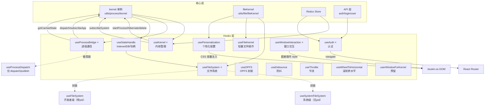
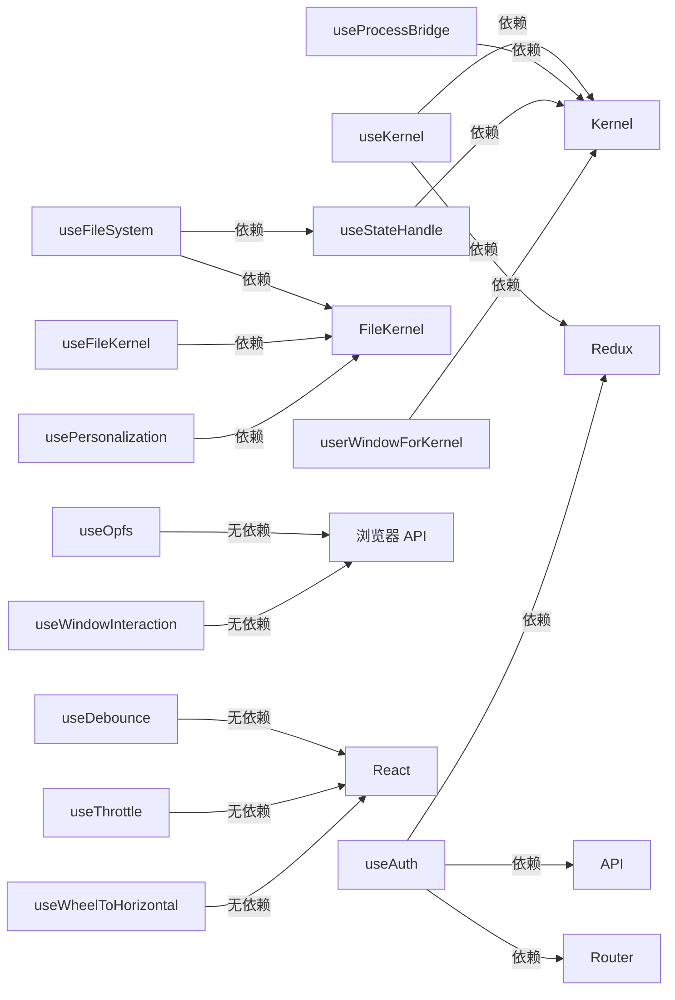

# SukinOS Hooks 模块详解

> Hooks 是 SukinOS 的核心抽象层，封装了内核通信、文件系统、认证、窗口交互等关键能力，为上层 UI 组件提供声明式 API。

## 目录结构

```
src/sukinos/hooks/
├── main.jsx                    # 统一导出入口
├── useKernel.jsx               #  内核管理 Hook
├── useProcessBridge.jsx        #  进程通信 Hook
├── useAuth.jsx                 #  认证 Hook
├── useFileSystem.jsx           #  文件系统 Hook
├── useWindowInteraction.jsx   #  窗口交互 Hook
├── useFileKernel.jsx           # 轻量文件操作 Hook
├── useStateHandle.jsx          # IndexedDB/目录句柄管理
├── useOpfs.jsx                 # Origin Private File System 封装
├── usePersonalization.jsx      # 桌面个性化主题配置
├── userWindowForKernel.jsx     # 内核窗口权限（预留）
├── useDebounce.jsx             # 防抖工具 Hook
├── useThrottle.jsx             # 节流工具 Hook
└── useWheelToHorizontalScroll.jsx  # 滚轮转水平滚动 Hook
```

## 统一导出入口 — `main.jsx`

`main.jsx` 是 Hooks 模块的统一导出入口，通过 `export *` 重新导出所有 Hook：

```jsx
export * from "./useAuth"
export * from "./useFileSystem"
export * from "./useKernel"
export * from "./useProcessBridge"
export * from "./useStateHandle"
export * from "./useWindowInteraction"
export * from "./userWindowForKernel"
export * from "./useWheelToHorizontalScroll"
export * from "./useDebounce"
export * from "./useThrottle"
```

外部模块统一通过以下方式引入：

```js
import { useKernel, useAuth, useProcessBridge } from '@/sukinos/hooks'
```

> **注意**: `useOpfs` 和 `usePersonalization` 未在 `main.jsx` 中导出，需直接引用文件路径导入。

---

## 各 Hook 详解

### 1. `useKernel` — 内核管理 Hook ⭐

**文件**: `useKernel.jsx`

**职责**: 管理内核（Kernel）单例的生命周期，同步内核状态到 React 组件，提供应用启动、休眠、删除等核心操作。

**依赖**:
- `kernel` 单例 (`@/sukinos/utils/process/kernel`)
- Redux selectors: `selectFileSystemConfig`, `selectorUserInfo`, `selectGenerateApp`
- 配置常量: `ENV_KEY_META_INFO`

**内部状态**:

| 状态 | 类型 | 说明 |
|------|------|------|
| `apps` | `Array` | 全量应用列表 |
| `isReady` | `boolean` | 内核是否就绪 |
| `loading` | `boolean` | 启动加载中 |
| `runningApps` | `Array` | 运行中的应用 |
| `hibernatedApps` | `Array` | 休眠中的应用 |
| `blockEdApps` | `Array` | 固定（钉住）的应用 |
| `userApps` | `Array` | 用户已安装的应用 |

**核心方法**:

| 方法 | 说明 |
|------|------|
| `bootSystem()` | 调用 `kernel.init()` 启动内核，成功后执行 `refresh()` |
| `refresh()` | 调用 `kernel.getApps()` 获取应用列表并刷新所有状态 |
| `applyDelta(change)` | 根据 `change.type` 增量更新 UI：`APP_STATUS`（应用状态变更）、`APP_META`（元信息变更）、`APP_REGISTRY`（注册变更，触发全量刷新） |
| `startApp(args)` | 调用 `kernel.startProcess()` 启动应用 |
| `hibernateApp(pid)` | 调用 `kernel.hibernate()` 休眠应用 |
| `deleteApp(args)` | 调用 `kernel.deleteApp()` 删除应用 |
| `reStartApp(args)` | 调用 `kernel.reStartApp()` 重启应用 |
| `forceReStartApp(args)` | 调用 `kernel.forceReStartApp()` 强制重启应用 |

**订阅机制**:
- 通过 `kernel.subscribeSystem()` 订阅内核系统级事件，回调函数为 `applyDelta()`
- 组件挂载时若内核已就绪，立即执行一次 `refresh()`

**返回值**:

```js
{
  kernel,              // 内核单例引用
  apps,                // 全量应用列表
  isReady,             // 内核就绪状态
  loading,             // 加载中标志
  bootSystem,          // 启动系统方法
  running,             // runningApps + hibernatedApps 合集
  runningApps,         // 运行中应用
  hibernatedApps,      // 休眠中应用
  blockEdApps,         // 固定应用
  userApps,            // 已安装应用
  startApp,            // 启动应用
  hibernateApp,        // 休眠应用
  deleteApp,           // 删除应用
  reStartApp,          // 重启应用
  forceReStartApp      // 强制重启应用
}
```

---

### 2. `useProcessBridge` — 进程通信 Hook ⭐

**文件**: `useProcessBridge.jsx`

**职责**: 建立内核 Worker 与 React 组件之间的双向状态通信桥梁，是应用 UI 与内核逻辑交互的核心枢纽。

**依赖**:
- `kernel` 单例 (`@/sukinos/utils/process/kernel`)

**内部状态**:

| 状态 | 说明 |
|------|------|
| `state` | 当前应用的 UI 状态，初始化时从 `kernel.getCachedState(pid)` 读取，防止首帧状态丢失 |

**Ref 机制**:
- `renderFrameRef`: 渲染帧锁，配合 `requestAnimationFrame` 节流，避免竞态导致内存泄漏
- `activeSubscriptionsRef`: 跟踪当前组件实例创建的所有全局消息主题订阅，卸载时自动清理

**核心方法**:

| 方法 | 说明 |
|------|------|
| `dispatch(action)` | 向指定 pid 的 Worker 分发 action → `kernel.dispatch(pid, action)` |
| `publish(topic, payload)` | 向内核通用通信枢纽发布消息 → `kernel.publish(topic, payload)` |
| `subscribe(topic, cb)` | 订阅内核主题消息，带闭包保护代理（`stableWrapper`），避免 inline callback 导致的重复重连 |

**订阅机制**:
- 通过 `kernel.subscribeApp(pid)` 订阅应用自身 Worker 的状态变更
- 状态更新使用 `requestAnimationFrame` 节流，避免高频渲染
- 组件卸载时自动注销所有主题订阅

**额外导出 — `useProcessDispatch(pid)`**:

极简动作通信 Hook，仅暴露 `dispatch` 和 `publish`，不订阅状态。专供仅需分发 Action 或发布消息、无需感知 UI 渲染的组件使用，降低无效渲染。

```js
import { useProcessDispatch } from '@/sukinos/hooks'
const { dispatch, publish } = useProcessDispatch(pid)
```

**返回值**:

```js
{ state, dispatch, publish, subscribe }
```

---

### 3. `useAuth` — 认证 Hook ⭐

**文件**: `useAuth.jsx`

**职责**: 封装用户登录、注册、验证码、Session 校验、Token 自动刷新、退出登录等完整认证流程。

**依赖**:
- Redux: `dispatch`, `selectorUserInfo`, `selectVerificationData`
- React Router: `useNavigate`
- API: `asistantApi`, `loginApi`, `userApi`（`@/apis/auth`）
- 全局锁: `authLock`, `startAutoRefresh`, `stopAutoRefresh`
- 工具: `loginDateWs`, `generateShortSeed`, `alert`

**参数**:
- `bizType`: 业务类型，默认 `'login'`，可选 `'recoverPassword'`

**内部状态**:

| 状态 | 说明 |
|------|------|
| `timeLeft` | 验证码倒计时剩余秒数 |
| `isSending` | 验证码发送中标志 |
| `isCheckingAuth` | Session 校验中标志（配合 Guard 防止页面闪烁） |

**计算属性**:
- `isAuthenticated`: `userInfo.id` 是否存在
- `userRole`: `userInfo.role || 'guest'`

**核心方法**:

| 方法 | 说明 |
|------|------|
| `sendVerificationCode(account, message)` | 发送验证码 → `asistantApi.getVerificationCode()` → `dispatch(startVerificationCountdown)` |
| `executeAuth(mode, formData, onSuccess)` | 执行认证（登录/重置密码）→ `loginApi()` → `dispatch(setUserInfo)` → `loginDateWs.createWsDate()` → `navigate('/sukinos/deskbook')` |
| `checkSession()` | 校验 Session → `userApi.checkToken()` → 更新 Redux 中的 userInfo |
| `logout()` | 退出登录 → 设置 `authLock.isLoggingOut` → 清空 Redux → `userApi.logout()` → `navigate('/sukinos')` |

**自动 Token 刷新**:
- `isAuthenticated` 变为 `true` 时启动 `startAutoRefresh()`
- `isAuthenticated` 变为 `false` 时停止 `stopAutoRefresh()`
- 组件卸载时自动清理定时器

**返回值**:

```js
{
  userInfo,              // 用户信息对象
  isAuthenticated,        // 是否已认证
  isCheckingAuth,        // 是否正在校验
  userRole,              // 用户角色
  timeLeft,              // 验证码倒计时
  isSending,             // 发送中标志
  sendVerificationCode,  // 发送验证码
  executeAuth,           // 执行认证
  checkSession,         // 校验 Session
  logout                 // 退出登录
}
```

---

### 4. `useFileSystem` — 文件系统 Hook ⭐

**文件**: `useFileSystem.jsx`

**职责**: 提供完整的文件系统操作能力，支持虚拟文件系统（VFS）和本地文件系统（File System Access API）两种模式。

**依赖**:
- `fileKernel` (`@/sukinos/utils/file/fileKernel`)
- `FileType` (`@/sukinos/utils/config`)
- `useStateHandle`, `generateShortId`, `formatTimeSlash`, `dataToBase64Mapper`
- `alert`

**支持三种模式**:

| 模式 | 说明 |
|------|------|
| `'virtual'` | 虚拟文件系统（VFS），数据存储在内存/IndexedDB |
| `'local'` | 本地文件系统，使用 File System Access API |
| `'remote'` | 远程文件系统（预留，暂未实现） |

**两个导出版本**:

```js
// 系统级 Hook：无 pid 隔离，供系统内部使用
import { useSystemFileSystem } from '@/sukinos/hooks'
const { state, navigation, operation } = useSystemFileSystem('virtual')

// 开发者级 Hook：带 pid 前缀隔离，强制要求 options.pid
import { useFileSystem } from '@/sukinos/hooks'
const { state, navigation, operation } = useFileSystem('virtual', { pid: 'app-xxx' })
```

> `useFileSystem` 调用时必须传入 `options.pid`，否则会抛出错误。

**内部 Hook — `useBaseFileSystem(mode, options)`**:

核心文件系统处理逻辑，`useSystemFileSystem` 和 `useFileSystem` 都是其封装。

**内部状态**:

| 状态 | 说明 |
|------|------|
| `currentId` | 当前目录 ID |
| `items` | 当前目录内容列表 |
| `history` | 导航历史栈 |
| `breadcrumbs` | 面包屑路径 |
| `isReady` | 文件系统是否就绪 |

**全局同步机制**:
- `globalFileIdMap` (`Map`): 全局 ID 映射，防止 React 渲染周期内 ID 变更
- `globalHandleRegistry` (`Map`): 全局句柄注册表，跨组件通过 ID 找回原始物理句柄
- `listeners` (`Set`) + `notifyAll()`: 全局广播监听，同步不同组件间的状态更新

**导航方法**:

| 方法 | 说明 |
|------|------|
| `loadDir(id, pushHistory)` | 加载指定目录内容 |
| `handleBack()` | 返回上一级目录 |
| `handleRefresh()` | 刷新当前目录 |

**操作方法**:

| 方法 | 说明 |
|------|------|
| `handleCreate({type})` | 创建文件或文件夹 → `fs.mkdir` / `fs.writeFile` |
| `handleRename({id, name, newName, parentId, type})` | 重命名，local 模式优先使用 `move` API，不支持时降级为读-写-删 |
| `handleDelete({id, name, parentId})` | 删除文件/文件夹 |
| `handleOpenFile(item)` | 读取文件内容 |
| `handleSave({id, content, parentId, name})` | 保存文件内容 |
| `handleUploadFiles(files)` | 上传文件（仅 virtual 模式），通过 `dataToBase64Mapper` 转换 |
| `handleClearFiles(suffix)` | 递归删除匹配后缀的文件（受 pid 隔离） |
| `handleSearchBySuffix(suffix)` | 递归搜索匹配后缀的文件（受 pid 隔离） |

**iframe 兼容**:
- 提供 `extractSafeBuffer()` 解决 iframe/沙箱环境下 `file instanceof File` 为 false 的问题

**返回值**:

```js
{
  state: { currentId, items, history, breadcrumbs, isReady, handleRegistry },
  navigation: { loadDir, handleBack, handleRefresh },
  operation: { handleCreate, handleRename, handleDelete, handleOpenFile, handleSave, handleUploadFiles, handleClearFiles, handleSearchBySuffix }
}
```

---

### 5. `useFileKernel` — 轻量文件操作 Hook

**文件**: `useFileKernel.jsx`

**职责**: 轻量级文件内核操作 Hook，仅基于虚拟文件系统（VFS），提供文件查询、写入、删除等基础操作。

**依赖**:
- `fileKernel` (`@/sukinos/utils/file/fileKernel`)
- `FileType` (`@/sukinos/utils/config`)

**参数**:
- `parentId`: 目标目录 ID，默认 `'root'`

**内部状态**:

| 状态 | 说明 |
|------|------|
| `items` | 当前目录文件列表 |
| `loading` | 加载中标志 |

**方法**:

| 方法 | 说明 |
|------|------|
| `fetchFiles()` | 从 VFS 读取文件列表 |
| `getImages()` | 过滤图片文件（png/jpg/jpeg/webp/gif/svg/bmp） |
| `getFilesByExt(exts)` | 按扩展名过滤文件 |
| `writeFile(name, content)` | 写入文件，自动处理重名（加时间戳） |
| `deleteFile(id)` | 删除文件 |
| `isExist(name)` | 检查文件名是否存在 |
| `readFile(id)` | 读取文件内容 |
| `refresh()` | 刷新文件列表 |

**自动订阅**:
- 通过 `fs.watch()` 自动监听文件变化，触发 `fetchFiles()` 更新

**返回值**:

```js
{ items, images, loading, getFilesByExt, isExist, readFile, writeFile, deleteFile, refresh }
```

---

### 6. `useStateHandle` — IndexedDB/目录句柄管理 Hook

**文件**: `useStateHandle.jsx`

**职责**: 管理 IndexedDB 实例和文件系统目录句柄（DirectoryHandle），用于本地文件系统模式的持久化存储。

**依赖**:
- `kernel` 单例
- `DB_INSTANCE_ID` (`@/sukinos/utils/config`)
- `alert`

**内部状态**:

| 状态 | 说明 |
|------|------|
| `stateInstance` | IndexedDB 数据库实例 |
| `systemDirHandle` | 系统目录句柄 |

**方法**:

| 方法 | 说明 |
|------|------|
| `getInstance()` | 获取数据库实例 → `kernel.getInstanceDb()` |
| `getSystemDirHandleInstance()` | 从 IndexedDB 读取目录句柄 → `stateInstance.getData(DB_INSTANCE_ID)` |
| `saveSystemDirHandle(handle)` | 持久化目录句柄到 IndexedDB |
| `initialize()` | 初始化（调用 `getSystemDirHandleInstance()`） |

**返回值**:

```js
{
  stateInstance,                // DB 实例
  systemDirHandle,              // 目录句柄
  getInstance,                  // 获取实例
  getSystemDirHandleInstance,   // 获取目录句柄
  saveSystemDirHandle,          // 保存目录句柄
  initialize,                   // 初始化
  hasInstance: !!stateInstance,         // 实例是否存在
  hasSystemDirHandle: !!systemDirHandle, // 目录句柄是否存在
  instanceReady: !!stateInstance && !!systemDirHandle // 完全就绪
}
```

---

### 7. `useOPFS` — Origin Private File System 封装

**文件**: `useOpfs.jsx`

**职责**: 封装浏览器 Origin Private File System (OPFS) 的 CRUD 操作，无外部依赖，纯浏览器 API。

**参数**:
- `target`: 文件名（string）或文件句柄（FileSystemFileHandle）

**内部状态**:

| 状态 | 说明 |
|------|------|
| `handle` | OPFS 文件句柄 |
| `isReady` | 句柄是否就绪 |
| `error` | 错误信息 |

**方法**:

| 方法 | 说明 |
|------|------|
| `readText()` | 读取文件文本内容 |
| `getFileInfo()` | 获取文件信息（name, size, lastModified） |
| `write(data)` | 普通覆盖写入 |
| `safeWrite(data)` | 安全写入：创建临时文件 -> 写入 -> 替换原文件（原子操作降级） |
| `append(data)` | 追加写入 |
| `rename(newName)` | 重命名，带防重名检测，优先使用原生 `move` API |
| `remove()` | 删除文件 |

**返回值**:

```js
{ handle, isReady, error, readText, getFileInfo, write, safeWrite, append, rename, remove }
```

---

### 8. `usePersonalization` — 桌面个性化主题配置 Hook

**文件**: `usePersonalization.jsx`

**职责**: 管理桌面个性化配置（颜色、字体、背景、图标、窗口透明度等），提供 15 套预设主题和自动 CSS 变量注入。

> **注意**: 此 Hook 未在 `main.jsx` 中导出，需直接引用：
> ```js
> import usePersonalization from '@/sukinos/hooks/usePersonalization'
> ```

**依赖**:
- `fileKernel` (`@/sukinos/utils/file/fileKernel`)
- `FileType`, `preSystemFileData` (`@/sukinos/utils/config`)

**内部状态**:

| 状态 | 说明 |
|------|------|
| `config` | 个性化配置对象（颜色、字体、背景、透明度等） |
| `localAssets` | 本地资源文件列表 `{ images, videos, fonts }` |

**15 套预设主题（`PRESET_STYLES`）**:

| 键名 | 名称 | 说明 |
|------|------|------|
| `classic` | 经典蓝调 | 沉稳专业的蓝色主题 |
| `darkMode` | 暗夜模式 | 护眼深色主题 |
| `freshGreen` | 清新绿意 | 自然舒适的绿色主题 |
| `warmOrange` | 温暖橙光 | 充满活力的橙色主题 |
| `pinkDream` | 粉红梦幻 | 温柔浪漫的粉色主题 |
| `minimalBlackWhite` | 极简黑白 | 纯粹简洁的黑白主题 |
| `techBluePurple` | 科技蓝紫 | 未来感的蓝紫渐变主题 |
| `forestDeep` | 森林深绿 | 深邃宁静的森林主题 |
| `cherryBlossom` | 樱花粉白 | 甜美清新的樱花主题 |
| `businessDark` | 商务深蓝 | 专业稳重的商务主题 |
| `sunnyBeach` | 阳光沙滩 | 明快活泼的海滩主题 |
| `purpleMystery` | 紫色魅影 | 神秘高贵的紫色主题 |
| `vintageBrown` | 复古棕褐 | 怀旧复古的棕色调 |
| `oceanSong` | 海洋之歌 | 清新凉爽的海洋主题 |
| `goldenClassic` | 高贵金典 | 奢华高贵的金色主题 |

**方法**:

| 方法 | 说明 |
|------|------|
| `updateConfig(key, value)` | 更新单个配置项 |
| `updateMultipleConfigs(updates)` | 批量更新配置 |
| `applyPresetStyle(presetKey)` | 应用预设主题 |
| `getAllPresetStyles()` | 获取所有预设主题列表 |
| `updateCustomColor(target, baseColor, shade)` | 更新自定义颜色（映射到 CSS 变量） |
| `getCurrentAccentColor()` | 获取当前主题强调色 |
| `getFileBase64(fileId)` | 从 VFS 读取文件并转为 Base64 |
| `refreshConfig()` | 触发配置刷新 |

**自动持久化**:
- `config` 变化 → 防抖 800ms → 写入 `sukin_config.json` 到 VFS

**自动应用（CSS 注入）**:
- `config` 变化 → 注入 CSS 变量到 `#sukin-os` 容器
- 处理背景：纯色（`bgType: 'color'`）、图片（`bgType: 'image'`）、视频（`bgType: 'video'`）
- 处理字体：支持预设字体和自定义字体文件
- 处理窗口透明度：使用 `color-mix` 混合透明度
- 处理毛玻璃效果：`blur(20px) saturate(160%)`

**导出常量**:
- `PRESET_ACCENTS`: 预设强调色数组
- `PRESET_BG_COLORS`: 预设背景色数组
- `PRESET_FONTS`: 预设字体列表
- `defaultPersonalization`: 默认配置对象
- `colorSystem`: 色彩系统（yellow/apricot/cyan/red/black/primary）
- `colorSystemRange`: 色阶范围（50/100/200/300/400/500/900）

**返回值**:

```js
{ config, localAssets, updateConfig, updateMultipleConfigs, updateCustomColor, getCurrentAccentColor, getFileBase64, refreshConfig, applyPresetStyle, getAllPresetStyles }
```

---

### 9. `useWindowInteraction` — 窗口交互 Hook ⭐

**文件**: `useWindowInteraction.jsx`

**职责**: 实现窗口拖拽、8 方向缩放（e/w/s/n/se/sw/ne/nw）、最大化/还原功能，追求极致性能。

**依赖**: 无外部依赖

**配置常量**:

| 常量 | 值 | 说明 |
|------|------|------|
| `MIN_WIDTH` | `300` | 窗口最小宽度 |
| `MIN_HEIGHT` | `200` | 窗口最小高度 |

**参数**:

| 参数 | 类型 | 默认值 | 说明 |
|------|------|--------|------|
| `winSize` | `{x,y,w,h}` | — | 窗口初始位置和尺寸 |
| `allowResize` | `boolean` | `true` | 是否允许缩放 |
| `SAFE_DRAG_AREA` | `number` | `40` | 安全拖拽区域阈值，防止窗口拖出屏幕 |
| `isIframeMode` | `boolean` | `false` | 物理沙箱（iframe）模式 |

**性能优化 — 全 Ref 架构**:
- 完全弃用 `useState`，所有状态存储在 `useRef` 中
- DOM 更新直接操作 `element.style`，不触发 React 重渲染
- 避免高频拖拽/缩放时的性能瓶颈

**iframe 模式优化**:
- `requestAnimationFrame` 节流（8ms，约 125fps）
- `transform3d` 硬件加速拖拽
- 拖拽期间临时禁用 iframe 内 `pointerEvents`，防止鼠标进入 iframe 导致事件丢失
- 拖拽结束后将 `transform` 增量物理化为 `left/top`

**方法**:

| 方法 | 说明 |
|------|------|
| `handleMouseDown(e, type)` | 处理鼠标按下事件，type 可选值: `drag`/`e`/`w`/`s`/`n`/`se`/`sw`/`ne`/`nw` |
| `setMaximized(isMaximizing)` | 最大化/还原切换，保存恢复前的矩形 |
| `getCurrentRect()` | 获取当前窗口矩形 `{x, y, w, h}` |
| `getIsDragging()` | 查询是否正在拖拽中 |

**返回值**:

```js
{ windowElRef, handleMouseDown, setMaximized, getCurrentRect, getIsDragging }
```

---

### 10. `useDebounce` — 防抖工具 Hook

**文件**: `useDebounce.jsx`

**职责**: 返回防抖包装后的回调函数。

**参数**:

| 参数 | 类型 | 说明 |
|------|------|------|
| `fn` | `Function` | 原始函数 |
| `delay` | `number` | 延迟毫秒数 |
| `deps` | `Array` | 依赖数组 |

**实现**:
- 使用 `useRef` 存储 `timeoutId` 和最新函数引用
- 每次调用清除上一次的定时器，重新计时
- 函数引用始终最新（通过 `fnRef`）

**用法**:

```js
const debouncedSearch = useDebounce((query) => { /* ... */ }, 300, [query])
```

---

### 11. `useThrottle` — 节流工具 Hook

**文件**: `useThrottle.jsx`

**职责**: 返回节流包装后的回调函数，支持尾部调用补偿。

**参数**:

| 参数 | 类型 | 说明 |
|------|------|------|
| `fn` | `Function` | 原始函数 |
| `delay` | `number` | 节流间隔毫秒数 |
| `deps` | `Array` | 依赖数组 |

**实现**:
- 使用 `useRef` 存储上次调用时间戳和定时器
- 若距上次调用已超过 delay 则立即执行
- 否则延迟到 `delay - timeSinceLastCall` 后执行（尾部调用补偿）

**用法**:

```js
const throttledScroll = useThrottle((e) => { /* ... */ }, 100)
```

---

### 12. `useWheelToHorizontalScroll` — 滚轮转水平滚动 Hook

**文件**: `useWheelToHorizontalScroll.jsx`

**职责**: 将鼠标垂直滚轮事件转换为水平滚动，带惯性效果和速度控制。

**参数**:

| 参数 | 类型 | 默认值 | 说明 |
|------|------|--------|------|
| `ref` | `RefObject` | — | 目标元素 ref |
| `enabled` | `boolean` | `true` | 是否启用 |
| `speed` | `number` | `1` | 基础速度 |
| `minSpeed` | `number` | `0.2` | 最小速度阈值 |
| `maxSpeed` | `number` | `6` | 最大速度限制 |
| `acceleration` | `number` | `0.05` | 加速度 |
| `smoothing` | `number` | `1` | 平滑系数 |
| `invert` | `boolean` | `false` | 是否反转方向 |
| `preventDefault` | `boolean` | `false` | 是否阻止默认行为 |
| `ratio` | `number` | `1` | 滚动比率 |
| `limitSpeed` | `boolean` | `false` | 是否限制最大速度 |

**实现细节**:
- 使用 `velocityRef` 存储当前速度
- 惯性衰减：每帧速度乘以 `0.92`，低于 `minSpeed` 时停止
- `requestAnimationFrame` 驱动动画循环
- 触控板检测（`deltaMode === 0`）自动降低灵敏度

---

### 13. `userWindowForKernel` — 内核窗口权限 Hook（预留）

**文件**: `userWindowForKernel.jsx`

**职责**: 预留 Hook，当前返回空对象 `{}`，为未来内核窗口权限扩展做准备。

**依赖**:
- `kernel` 单例

**当前状态**: 返回空对象 `{}`

---

## Hook 调用链关系图



## Hook 依赖关系矩阵



## 使用场景索引

| 场景 | 推荐 Hook | 说明 |
|------|-----------|------|
| 系统启动 | `useKernel` | 调用 `bootSystem()` 启动内核 |
| 应用窗口 UI | `useProcessBridge` | 订阅 Worker 状态，双向通信 |
| 应用事件分发 | `useProcessDispatch` | 无状态感知的轻量通信 |
| 用户登录/注册 | `useAuth` | 完整认证流程 |
| 文件管理器 | `useFileSystem` | 全功能文件操作 |
| 应用文件读写 | `useFileKernel` | 轻量级 VFS 操作 |
| 桌面主题配置 | `usePersonalization` | 15 套预设 + 自定义 |
| 窗口拖拽/缩放 | `useWindowInteraction` | 高性能 Ref 架构 |
| 性能敏感输入 | `useDebounce` / `useThrottle` | 防抖/节流 |
| 横向滚动容器 | `useWheelToHorizontalScroll` | 滚轮转水平滚动 |
| OPFS 文件操作 | `useOPFS` | 浏览器原生文件系统 |
