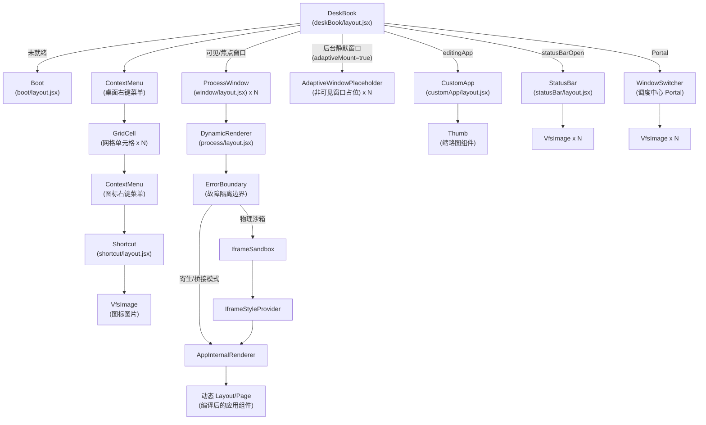
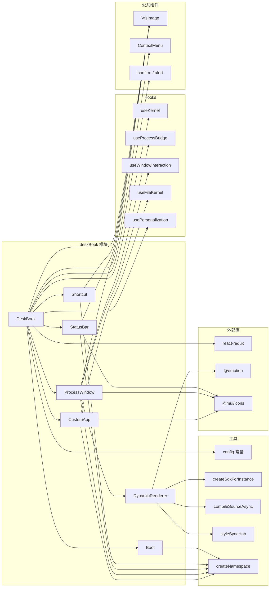

# DeskBook -- 桌面环境模块

## 1. 模块概述

DeskBook 是 SukinOS 的桌面环境核心模块，负责模拟操作系统的桌面体验。它涵盖了从系统启动引导、桌面图标网格布局、窗口进程管理、状态栏导航到应用自定义配置的完整桌面交互链路。

### 核心能力

- **系统引导**：启动画面展示与内核初始化触发
- **桌面图标网格**：基于 CSS Grid 的图标排列，支持拖拽交换与位置持久化
- **窗口管理**：多窗口层级排序、拖拽/缩放、最大化/最小化、进程生命周期
- **进程沙箱**：支持物理 iframe 沙箱、桥接模式、寄生模式三种运行隔离策略
- **窗口调度中心**：类 Ubuntu 的 Alt+Tab 窗口切换器（Ctrl+Alt+C）
- **状态栏**：底部应用栏，支持拖拽滚动，点击切换聚焦/休眠
- **应用自定义**：图标上传、偏好开关等资自定义配置面板

---

## 2. 文件列表与职责

| 文件路径 | 职责说明 |
|---------|---------|
| `deskBook/layout.jsx` | 桌面主容器，编排所有子模块，管理全局状态（窗口层级、网格布局、快捷键、应用排序） |
| `deskBook/style.module.css` | 桌面主容器样式 |
| `deskBook/boot/layout.jsx` | 系统启动引导界面，展示 SukinOS 品牌信息和启动按钮 |
| `deskBook/boot/style.module.css` | 启动界面样式 |
| `deskBook/shortcut/layout.jsx` | 桌面快捷方式图标组件，展示应用图标与名称 |
| `deskBook/shortcut/style.module.css` | 快捷方式图标样式 |
| `deskBook/statusBar/layout.jsx` | 底部状态栏，展示运行中应用图标，支持鼠标拖拽横向滚动 |
| `deskBook/statusBar/style.module.css` | 状态栏样式 |
| `deskBook/window/layout.jsx` | 应用窗口容器，管理窗口标题栏、缩放/拖拽、最大化、进程状态面板 |
| `deskBook/window/AdaptivePlaceholder.jsx` | 后台窗口轻量占位组件（自适应挂载优化），非可见窗口仅渲染 `<div style="display:none">` 而非完整 ProcessWindow |
| `deskBook/window/style.module.css` | 窗口容器样式 |
| `deskBook/window/process/layout.jsx` | 进程动态渲染引擎，包含 ErrorBoundary、Iframe 沙箱、代码编译与 SDK 注入 |
| `component/fileSystemView/layout.jsx` | 通用文件系统浏览视图组件（列表/网格布局），供应用内部使用 |

---

## 3. 组件树结构



---

## 4. 各组件详情

### 4.1 DeskBook (`deskBook/layout.jsx`)

**组件类型**：`React.memo(DeskBook)`，顶层桌面容器。

#### State

| 状态变量 | 类型 | 用途 |
|---------|------|------|
| `zOrders` | `Record<string, number>` | PID 到 z-index 的映射，控制窗口层级 |
| `maxZ` | `number` | 当前最大 z-index 值，初始 10 |
| `statusBarOpen` | `boolean` | 状态栏显隐状态（持久化到 localStorage） |
| `currentFocus` | `string \| null` | 当前焦点窗口的 PID |
| `gridSize` | `{ rows, cols }` | 桌面网格的行列数 |
| `appPositions` | `Record<string, string>` | PID 到 "row-col" 的坐标映射 |
| `dragOverCell` | `string \| null` | 当前拖拽悬停的格子坐标 |
| `editingApp` | `object \| null` | 正在编辑配置的应用对象 |
| `showWindowSwitcher` | `boolean` | 窗口调度中心显隐 |
| `selectedWindowIndex` | `number` | 调度中心选中索引 |

#### 关键 Refs

| Ref | 用途 |
|-----|------|
| `mainContainerRef` | 主容器 DOM 引用，用于网格计算和焦点管理 |
| `viewRef` | 桌面视图 DOM 引用，用于空白区域焦点抢夺 |
| `runningOrderRef` | 维护应用先来后到的 PID 顺序 |
| `windowRefsMap` | 收集每个 ProcessWindow 的 DOM 引用，用于 Switcher 动画 |
| `stateRef` | 缓存最新状态引用，避免全局键盘监听器的闭包陷阱 |
| `appPositionsRef` | 最新位置引用，用于 pagehide 事件安全保存 |

#### 计算属性（useMemo）

| 名称 | 用途 |
|------|------|
| `isRunningApps` | 从 `apps` 中过滤出非 INSTALLED 状态的应用，按 PID 先来后到排序 |
| `showDisplay` | PID 到 `boolean` 的映射（`status === 'RUNNING'`），控制窗口显示 |
| `sortedRunningApps` | 按 `currentFocus` 优先、然后 z-index 降序排列，用于 Switcher 展示 |

#### 关键方法

| 方法 | 说明 |
|------|------|
| `handleFocus(pid)` | 提升 PID 的 z-index 到最高，设置 `currentFocus` |
| `handleStartApp(pid)` | 先聚焦再调用 `startApp({ pid })` |
| `handleColseApp(pid)` | 休眠应用、清理 z-index 和焦点 |
| `handleForceKill(pid)` | 强制终止进程、清理 z-index 和焦点 |
| `handleGlobalKeyDown(event)` | 全局快捷键处理：Ctrl+R（软刷新）、Ctrl+Alt+C（Switcher）、Ctrl+Alt+O（状态栏） |
| `autoArrangeApps(apps, positions, rows, cols)` | 自动排列未分配位置的快捷方式图标 |
| `handleDragStart / Over / Leave / Drop` | 桌面图标拖拽事件处理（支持位置交换） |
| `handleCustomUpdate(newConfig)` | 调用内核更新资源自定义配置 |
| `handleUnload()` | 在 pagehide 事件中持久化图标位置到 localStorage |

#### Props 传递给子组件

| 子组件 | 关键 Props |
|--------|-----------|
| `Boot` | `boot={bootSystem}`, `loading={loading}` |
| `Shortcut` | `app={{ label, ...appData }}` |
| `ProcessWindow` | `kernel, pid, fileName, zIndex, onFocus, onClose, onKill, isDisplay, isShow, exposeState, reStartApp, forceReStartApp, generateAppSetting, app, showWindowSwitcher, isSelected, initialRect, windowSize` |
| `StatusBar` | `blockEdApps, startApp, hibernateApp, currentFocus, onFocus, isRunningApps` |
| `CustomApp` | `initialCustom, onUpdateConfig, onClose, editingAppName` |

---

### 4.2 Boot (`deskBook/boot/layout.jsx`)

**组件类型**：`memo(Boot)`，纯展示组件。

#### Props

| Prop | 类型 | 说明 |
|------|------|------|
| `boot` | `function` | 点击按钮时触发的系统启动回调 |
| `loading` | `boolean` | 启动中状态，控制按钮文案和 spinner |

#### 功能

- 展示 SukinOS 品牌信息（Logo、标题、副标题）
- 展示四个特性标签：PWA_READY、LOCAL_SECURE、FETCH_MODE、EXT_MODULES
- 点击按钮调用 `boot()` 启动系统

---

### 4.3 Shortcut (`deskBook/shortcut/layout.jsx`)

**组件类型**：`React.memo(Shortcut)`，纯展示组件。

#### Props

| Prop | 类型 | 说明 |
|------|------|------|
| `app` | `object` | 应用对象，包含 `label` 和图标相关字段 |

#### 功能

- 使用 `VfsImage` 渲染应用图标
- 展示应用名称标签

---

### 4.4 StatusBar (`deskBook/statusBar/layout.jsx`)

**组件类型**：`React.memo(StatusBar)`，底部应用状态栏。

#### Props

| Prop | 类型 | 说明 |
|------|------|------|
| `blockEdApps` | `array` | 锁定的应用列表（如系统应用） |
| `startApp` | `function` | 启动应用的回调 |
| `hibernateApp` | `function` | 休眠应用的回调 |
| `currentFocus` | `string \| null` | 当前焦点 PID |
| `onFocus` | `function` | 聚焦回调 |
| `isRunningApps` | `array` | 当前运行中的应用列表 |
| `className` | `string` | 额外的 CSS 类名 |

#### State

| 状态变量 | 用途 |
|---------|------|
| (无本地状态) | -- |

#### 计算属性

| 名称 | 用途 |
|------|------|
| `displayApps` | 合并 `blockEdApps` 和 `isRunningApps`，去重后生成统一展示列表 |

#### 关键方法

| 方法 | 说明 |
|------|------|
| `handleAppClick(app)` | 三态切换：未运行 -> 启动；运行但未聚焦 -> 聚焦；已聚焦 -> 休眠 |

#### 鼠标拖拽滚动

- 监听 `mousedown` / `mousemove` / `mouseup` 实现拖拽横向滚动
- 监听 `wheel` 事件将纵向滚动转为横向滚动
- 滚动时添加 CSS 类禁用内部 hover 效果

#### 性能优化

- 事件绑定 `useEffect` 依赖为 `[]`（`containerRef` 稳定），消除窗口焦点切换时的事件监听器反复绑/解绑
- `React.memo` 使用自定义比较器：`className, currentFocus, isRunningApps, blockEdApps, onFocus, startApp, hibernateApp`

---

### 4.5 ProcessWindow (`deskBook/window/layout.jsx`)

**组件类型**：`memo(ProcessWindow, memoEqual)`，应用窗口容器。

#### Props

| Prop | 类型 | 说明 |
|------|------|------|
| `app` | `object` | 应用完整对象 |
| `exposeState` | `boolean` | 是否暴露状态面板（开发者模式） |
| `kernel` | `object` | 内核实例 |
| `pid` | `string` | 进程 PID |
| `fileName` | `string` | 应用文件名 |
| `onClose` | `function` | 休眠/关闭回调 |
| `onKill` | `function` | 强制终止回调 |
| `windowSize` | `object` | 默认窗口尺寸 |
| `initialRect` | `object` | 初始窗口位置和大小 |
| `zIndex` | `number` | 当前 z-index |
| `onFocus` | `function` | 聚焦回调 |
| `isDisplay` | `boolean` | 是否参与显示规则 |
| `isShow` | `boolean` | 是否可见 |
| `isFocused` | `boolean` | 是否为当前焦点窗口（控制 resize handle 显隐） |
| `reStartApp` | `function` | 软重启回调 |
| `forceReStartApp` | `function` | 硬重启回调 |
| `generateAppSetting` | `object` | 全局应用生成设置（singleIframe, useVirtualWorker, maxWindows, maxWorkers, workerLRU） |
| `ref` | `Ref` | DOM 引用回传 |
| `showWindowSwitcher` | `boolean` | 调度中心是否开启 |
| `isSelected` | `boolean` | 在调度中心是否被选中 |

#### State

| 状态变量 | 用途 |
|---------|------|
| `showState` | `boolean` | 进程状态面板显隐 |
| `isMaximized` | `boolean` | 窗口是否最大化 |

#### 关键方法

| 方法 | 说明 |
|------|------|
| `handleCompoundMouseDown(e, type)` | 组合鼠标事件：先聚焦再调用拖拽/缩放 hook |
| `toggleMaximize()` | 切换最大化状态 |
| `handleClose()` | 保存当前窗口位置到内核后关闭 |

#### 子组件：DynamicRenderer

- 由 `process/layout.jsx` 导出，在 ProcessWindow 的 content 区域渲染
- 接收 `resource, state, dispatch, pid, isSystemApp, onFocus, forceReStartApp, reStartApp, onKill, generateAppSetting`
- 负责代码编译、SDK 注入和沙箱渲染

#### 自定义 memo 比较

`memoEqual` 对 8 个关键 props 进行浅比较：`pid, zIndex, isShow, isDisplay, exposeState, showWindowSwitcher, isSelected, isFocused`。非焦点窗口的 resize handle 不渲染（0 DOM 节点），大幅降低后台窗口的合成层开销。

---

### 4.6 DynamicRenderer (`deskBook/window/process/layout.jsx`)

**组件类型**：`memo(DynamicRenderer, memoEqual)`，进程动态渲染引擎。

#### 子组件概览

| 子组件 | 用途 |
|--------|------|
| `ErrorBoundary` | Class Component，故障隔离边界。自动重试策略：3 次软重启 + 1 次硬重启，含错误节流 |
| `IframeStyleProvider` | 为 iframe 内部创建独立 Emotion Cache 上下文 |
| `IframeSandbox` | 物理隔离 iframe，拦截敏感 API，同步系统样式，转发键盘/鼠标事件 |
| `AppInternalRenderer` | 根据资源类型（单文件/bundle）渲染对应的 Layout + Page 组件 |

#### Props

| Prop | 类型 | 说明 |
|------|------|------|
| `resource` | `object` | 应用资源对象（content, isBundle, metaInfo） |
| `state` | `object` | Worker 传递的进程状态 |
| `dispatch` | `function` | 状态分发函数 |
| `pid` | `string` | 进程 PID |
| `isSystemApp` | `boolean` | 是否为系统应用 |
| `onFocus` | `function` | 聚焦回调 |
| `forceReStartApp` | `function` | 硬重启回调 |
| `reStartApp` | `function` | 软重启回调 |
| `onKill` | `function` | 强制终止回调 |
| `generateAppSetting` | `object` | 全局应用生成设置 |

#### 沙箱模式判定

```
isParasitism = resource.metaInfo.isParasitism === true
useBridgeMode = (singleIframe || useVirtualWorker) && !isParasitism
```

- **寄生模式**：JS 执行在宿主 window，UI 直接渲染在宿主 DOM
- **桥接模式**：JS 执行在幽灵 iframe（单例），UI 直接渲染在宿主 DOM
- **物理沙箱模式**：JS 执行和 UI 渲染均在独立 iframe 内

#### ErrorBoundary 重试策略

1. 捕获渲染错误后自动进入重试
2. 前 3 次：指数退避软重启（`reStartApp`）
3. 第 4 次：延迟 500ms 硬重启（`forceReStartApp`）
4. 错误节流：同一错误 5 秒内不重复触发
5. 最终失败：展示错误详情 UI，支持手动重试或关闭

#### 幽灵沙箱（getGhostSandbox）

- 单例隐藏 iframe，作为桥接模式的 JS 执行上下文
- 拦截 `indexedDB`, `localStorage`, `sessionStorage`, `openDatabase`, `caches`
- 强迫 App 使用 `SDK.System.*` 替代原生持久化 API
- 宿主注入的 SDK 钩子运行在宿主闭包中，不受此限制（特权通行）

---

### 4.7 CustomApp (`deskBook/customApp/layout.jsx`)

**组件类型**：函数组件，应用自定义配置面板。

#### Props

| Prop | 类型 | 说明 |
|------|------|------|
| `initialCustom` | `object` | 初始自定义配置 |
| `onUpdateConfig` | `function` | 配置更新回调 |
| `onClose` | `function` | 关闭面板回调 |
| `editingAppName` | `string` | 正在编辑的应用名称 |

#### State

| 状态变量 | 用途 |
|---------|------|
| `config` | `object` | 当前配置（合并默认值与 initialCustom） |
| `iconPreview` | `string \| null` | 图标预览 URL |
| `isUploading` | `boolean` | 上传状态 |

#### 内部子组件：Thumb

缩略图组件，通过 `readFile(fileId)` 异步加载图片。

#### 功能

- 左侧：偏好设置开关列表（通过 `appCustomMapper` 配置），包括 `hasShortcut`, `blockEd`, `isFullScreen`, `autoStart`, `allowResize`, `showInLauncher`, `backgroundSleep`, `adaptiveMount`
- 右侧：图标预览与资源库管理（本地上传 / 资源库选择 / 删除）
- 使用 `useFileKernel('root')` 管理文件读写

---

### 4.8 FileSystemView (`component/fileSystemView/layout.jsx`)

**组件类型**：`React.memo(FileSystemView)`，通用文件系统浏览视图。

> 注意：此组件位于 `component/fileSystemView/` 而非 `deskBook/`，但被 deskBook 体系的应用广泛使用。

#### Props

| Prop | 类型 | 说明 |
|------|------|------|
| `items` | `array` | 目录项列表 `[{id, name, type, size, mtime}]` |
| `breadcrumbs` | `array` | 面包屑数据 `[{id, name}]` |
| `isLoading` | `boolean` | 加载状态 |
| `onItemClick` | `function` | 单击项目回调 |
| `onItemDoubleClick` | `function` | 双击项目回调 |
| `onBreadcrumbClick` | `function` | 面包屑点击回调 |
| `onBack` | `function` | 返回上一级 |
| `onRefresh` | `function` | 刷新目录 |
| `defaultLayout` | `string` | 默认视图模式 `'list' \| 'grid'` |

#### State

| 状态变量 | 用途 |
|---------|------|
| `layout` | `string` | 当前视图模式（list / grid） |
| `selectedId` | `string \| null` | 当前选中项 ID |

---

## 5. 函数调用链

### 5.1 应用启动链

```
用户点击桌面图标 Shortcut
  -> DeskBook.handleStartApp(pid)
    -> DeskBook.handleFocus(pid)          // 提升 z-index
    -> useKernel.startApp({ pid })         // 通知内核启动应用
      -> kernel 启动 Worker 进程
      -> Worker 回传 state 更新
      -> DynamicRenderer 编译资源代码
      -> AppInternalRenderer 渲染 UI
```

### 5.2 应用关闭链

```
用户点击窗口关闭按钮 (HorizontalRuleIcon)
  -> ProcessWindow.handleClose()
    -> kernel.saveWindowState(pid, rect)   // 持久化窗口位置
    -> DeskBook.handleColseApp(pid)
      -> kernel.hibernate(pid)            // 休眠进程
      -> 清理 zOrders / currentFocus
```

### 5.3 应用强制终止链

```
用户点击窗口终止按钮 (CloseIcon)
  -> ProcessWindow headerFuncs[close].onClick()
    -> DeskBook.handleForceKill(pid)
      -> kernel.forceKillProcess(pid)      // 强制杀进程
      -> 清理 zOrders / currentFocus
```

### 5.4 错误恢复链

```
应用渲染抛出异常
  -> ErrorBoundary.componentDidCatch()
    -> 错误节流检查 (5s 内去重)
    -> retryCount <= 3: reStartApp (软重启, 指数退避)
    -> retryCount === 4: forceReStartApp (硬重启)
    -> retryCount > 4: 展示最终错误 UI
```

### 5.5 窗口调度中心链

```
Ctrl+Alt+C
  -> DeskBook.handleGlobalKeyDown()
    -> setShowWindowSwitcher(true)
    -> setSelectedWindowIndex(0)
  -> Alt+C / Tab / Arrow 导航
  -> Enter 确认
    -> handleSelectWindow(index)
      -> handleStartApp(pid)
      -> closeWindowSwitcher()
```

### 5.6 桌面图标拖拽链

```
用户拖拽图标
  -> handleDragStart(e, pid)               // 设置 dataTransfer
  -> handleDragOver(e, row, col)          // 高亮目标格
  -> handleDrop(e, targetRow, targetCol)
    -> 读取 sourcePid
    -> 检查目标位置是否已有应用
      -> 有：交换位置
      -> 无：直接放置
    -> setAppPositions()                   // 更新位置映射
    -> localStorage 持久化
```

### 5.7 资源编译与渲染链

```
DynamicRenderer.effect (依赖 resource + iframeMountNode)
  -> 判定沙箱模式 (isParasitism / useBridgeMode)
  -> 确定 JS 执行上下文 (window / ghostSandbox / iframeContentWindow)
  -> compileAndRun(code)
    -> compileSourceAsync(code, pid, Function)   // 动态编译 JS
    -> factory.call(sandboxWin, { exports }, exports, instanceSDK)  // 在沙箱中执行
  -> setModules(resultMap)
  -> combinedCss = scopeCss(modules.style, pid)   // CSS 作用域隔离
  -> 渲染 AppInternalRenderer (通过 createPortal 或直接渲染)
```

---

## 6. 模块间依赖关系

### 6.1 内部依赖（deskBook 模块内）

```
deskBook/layout.jsx
  ├── deskBook/boot/layout.jsx           (Boot)
  ├── deskBook/shortcut/layout.jsx       (Shortcut)
  ├── deskBook/statusBar/layout.jsx      (StatusBar)
  ├── deskBook/window/layout.jsx         (ProcessWindow)
  │   └── deskBook/window/process/layout.jsx  (DynamicRenderer)
  └── deskBook/customApp/layout.jsx      (CustomApp)
```

### 6.2 外部依赖

| 依赖来源 | 导入项 | 使用位置 |
|---------|--------|---------|
| `@/sukinos/hooks/useKernel` | `useKernel` | DeskBook |
| `@/sukinos/hooks/useProcessBridge` | `useProcessBridge` | ProcessWindow |
| `@/sukinos/hooks/useWindowInteraction` | `useWindowInteraction` | ProcessWindow |
| `@/sukinos/hooks/useFileKernel` | `useFileKernel` | CustomApp |
| `@/sukinos/hooks/usePersonalization` | `usePersonalization` | DeskBook |
| `@/sukinos/middleware/VfsImage/main.jsx` | `VfsImage` | DeskBook, Shortcut, StatusBar, ProcessWindow |
| `@/component/contextMenu/layout.jsx` | `ContextMenu` | DeskBook |
| `@/component/confirm/layout` | `confirm` | DeskBook |
| `@/component/alert/layout` | `alert` | DeskBook |
| `@/sukinos/store` | `selectorSetting, selectGenerateApp` | DeskBook |
| `@/sukinos/utils/config` | `WindowSize, SUKIN_EXT, SUKIN_PRE, ENV_KEY_*`, `appCustomMapper`, `appCustom`, `FileType` | 多处 |
| `@/sukinos/resources/sdk` | `createSdkForInstance` | DynamicRenderer |
| `@/sukinos/utils/process/renderWindow` | `compileSourceAsync, scopeCss` | DynamicRenderer |
| `@/sukinos/utils/process/styleSyncHub` | `registerSandboxDoc, updateVisibility` | IframeSandbox |
| `/utils/js/classcreate` | `createNamespace` | 所有组件 (BEM 命名) |
| `/utils/js/func/data/exChangeBase64` | `dataToBase64Mapper` | CustomApp |
| `react-redux` | `useDispatch, useSelector` | DeskBook |
| `@emotion/cache, @emotion/react` | `createCache, CacheProvider` | DynamicRenderer (IframeStyleProvider) |
| `@mui/icons-material` | `CloseIcon, CodeIcon, FullscreenIcon`, `FullscreenExitIcon`, `HorizontalRuleIcon`, `SearchIcon`, `FileUploadIcon`, `DeleteIcon`, `PhotoLibraryIcon` | StatusBar, ProcessWindow, CustomApp |

### 6.3 外部引用 deskBook 的模块

以下模块导入了 deskBook 中的子组件或使用了相关功能：

- 无其他模块直接导入 deskBook 内部组件（deskBook 作为顶层桌面容器由系统入口渲染）

### 6.4 依赖关系总图



---

## 7. 全局快捷键汇总

| 快捷键 | 功能 | 处理位置 |
|--------|------|---------|
| `Ctrl+Alt+C` | 切换窗口调度中心（Switcher） | DeskBook.handleGlobalKeyDown |
| `Ctrl+Alt+O` | 切换状态栏显隐 | DeskBook.handleGlobalKeyDown |
| `Ctrl+R` | 软刷新桌面布局和配置（需确认） | DeskBook.handleGlobalKeyDown |
| `Alt+C`（Switcher 开启时） | 快速轮询切换窗口 | DeskBook.handleGlobalKeyDown |
| `Tab / ArrowRight / ArrowLeft`（Switcher 内） | 导航选择窗口 | DeskBook.handleGlobalKeyDown |
| `Enter`（Switcher 内） | 确认选择 | DeskBook.handleGlobalKeyDown |
| `Escape`（Switcher 内） | 关闭 Switcher | DeskBook.handleGlobalKeyDown |

> iframe 内部的按键事件通过 `postMessage` 转发回父窗口处理，解决跨域焦点丢失问题。

---

## 9. GPU/渲染性能优化措施

## 8. 数据持久化

| Key | 类型 | 用途 |
|-----|------|------|
| `deskbook-layout-positions` | `Record<string, string>` | 桌面图标位置映射（PID -> "row-col"） |
| `deskbook-show-status` | `boolean` | 状态栏显隐状态 |

位置持久化采用双重保障：
1. `useEffect` 监听 `appPositions` 变化实时写入
2. `pagehide` 事件处理器在页面隐藏时写入最新引用

### 9.1 窗口 CSS 优化（window/style.module.css）

| 优化项 | 说明 |
|--------|------|
| `isolation: isolate` | `.su-window` 兜底，创建层叠上下文但不占 GPU 层 |
| `backdrop-filter` 仅焦点窗口 | 从 `.is-active` 移入 `.is-focused`，非焦点窗口不触发 GPU 密集型模糊滤镜 |
| 隐藏窗口 `contain: strict` | `.su-window:not(.is-active)` 添加 `contain: strict`，防止样式重算穿透隐藏子树 |
| `containIntrinsicSize` | `content-visibility: hidden` 的窗口预设 `containIntrinsicSize: 500px 400px`，避免恢复时 Layout 重算 |
| GPU 层仅焦点窗口 | 移除静态 `translateZ(0)`，改为 `.is-focused` 独占，非焦点窗口无合成层 |
| 非焦点阴影简化 | `.is-active:not(.is-focused)` 仅 `box-shadow: 0 1px 4px`，焦点窗口保留完整双层阴影 |

### 9.2 Resize Handle 聚焦独占（window/layout.jsx）

- 8 个 resize handle `<div>` **仅焦点窗口**渲染（`isFocused` 条件守卫）
- 非焦点窗口点击边缘 → `handleEdgeMouseDown` 计算方向 → 先 `onFocus(pid)` 再 `handleMouseDown(dir)`
- 20 窗口场景节省约 140 个 DOM 节点（每窗口从 8 降至 0）

### 9.3 useProcessBridge 条件订阅（hooks/useProcessBridge.jsx）

```javascript
useProcessBridge(pid, { isVisible, backgroundSleep })
```

- 当 `backgroundSleep === true && !isVisible` 时完全跳过 `subscribeApp`，零开销
- 后台静默窗口的 worker 状态变更完全跳过：反序列化 → RAF 调度 → setState → memo 比较链条
- 窗口恢复可见时从 `commHub.stateCache` 拉取最新缓存状态

### 9.4 非焦点 Header 精简（window/layout.jsx）

- 焦点窗口：完整 headerFuncs（CodeIcon + HorizontalRuleIcon + ScreenIcon + CloseIcon 共 4 个 MUI SVG）
- 非焦点窗口：仅渲染 `CloseIcon`，跳过其余 3 个 MUI SVG 图标，减少 GPU 层和 DOM 节点
- `hideHeaderHover` 模式不受影响，hover 时仍可通过 CSS `transform: translateY(0)` 展示完整 header

### 9.6 useDeferredValue 优先渲染（deskBook/layout.jsx）

- 对 `zOrders` 和 `currentFocus` 使用 `useDeferredValue`
- 焦点窗口渲染优先级高于非焦点窗口，非焦点窗口可被高优先级交互打断

### 9.7 memoEqual 精简（window/layout.jsx:202-220）

- 从 17 个 prop 比较精简至 8 个（pid, zIndex, isShow, isDisplay, exposeState, showWindowSwitcher, isSelected, isFocused）
- 父组件通过 `useRef` 稳定化的回调引用（onFocus, onClose, onKill 等）不再参与比较

### 9.6 自适应挂载（AdaptiveWindowPlaceholder）

- **AdaptiveWindowPlaceholder**（`deskBook/window/AdaptivePlaceholder.jsx`）：仅 `<div style="display:none" data-placeholder="true">`，零 iframe/零 header/零 resize handles
- `appCustom.adaptiveMount` 默认 `false`，每个应用可通过 CustomApp 独立配置
- 唤醒时从 `commHub.stateCache` 恢复最新状态

### 9.7 LRU 自动休眠（deskBook/layout.jsx）

- 配置源：`generateApp.maxWindows`（Redux） + `personalConfig.maxWindows`（Personalization），后者为 fallback
- 超出上限时按 `zOrders` 升序淘汰最旧的非焦点窗口
- 配 `backgroundSleep` 的应用额外停止 `useProcessBridge` 订阅
- LRU 开关：`generateApp.workerLRU`（默认 true）

### 9.8 StyleSyncHub 可见性过滤（utils/process/styleSyncHub.js）

| 优化项 | 说明 |
|--------|------|
| `visibleDocs` Set | 仅可见窗口的 iframe doc 接收实时样式写入，隐藏 doc 跳过 |
| `lastCss` 缓存 | CSS 无变化时跳过所有 `flushAll` 写入操作 |
| `updateVisibility()` | 对外 API：窗口可见性变化时调用，恢复可见时立即同步一次最新样式 |
| ThemeObserver 同步范围 | 仅同步 `visibleDocs`，隐藏窗口的 `<html>` 类名更新不再触发 |

### 9.9 桌面 Filter 过渡动画（deskBook/style.module.css）

- 调度中心开启时的 `filter: blur(18px)` 添加 `transition: filter 0.25s`，消除硬切换瞬间的 Paint 尖刺

### 9.10 非焦点 State 跳帧节流（hooks/useProcessBridge.jsx）

- 非可见窗口（`!isVisible`）每 3 帧才处理一次 Worker state 更新，跳过中间帧
- `backgroundSleep` 窗口完全不订阅（零开销），非可见普通窗口降低主线程压力约 2/3
- 恢复可见时从 `kernel.getCachedState(pid)` 拉取最新缓存，视觉瞬间同步

### 9.11 Iframe 可见性解绑（deskBook/window/process/layout.jsx）

- `IframeSandbox` 接收 `isVisible` prop，非可见时返回 `null`（iframe 从 DOM 完全移除）
- 恢复可见时通过 `handleIframeMount` 重建 iframe → `iframeMountNode` 变更触发重新编译 → 从 `commHub.stateCache` 恢复状态
- 物理沙箱模式下，隐藏窗口的 iframe 不再占用渲染管线内存

### 9.12 性能监控指南

```javascript
// DevTools Performance 面板
// 1. 录制 15+ 窗口场景下的 Layout/Recalculate Style 时长
// 2. 监控 FPS：拖拽窗口时是否保持 60fps
// 3. GPU 层：DevTools Layers 面板验证合成层数量

// 验证项目
// - 内存：20 窗口场景下 iframe 是否回落至 maxWindows 上限
// - LRU：打开 15 窗口，观察最旧的 5 个非焦点窗口是否自动休眠
// - backgroundSleep：隐藏窗口的 Worker 线程是否停止状态推送
// - styleSyncHub：隐藏 iframe 是否不再接收样式写入
```
