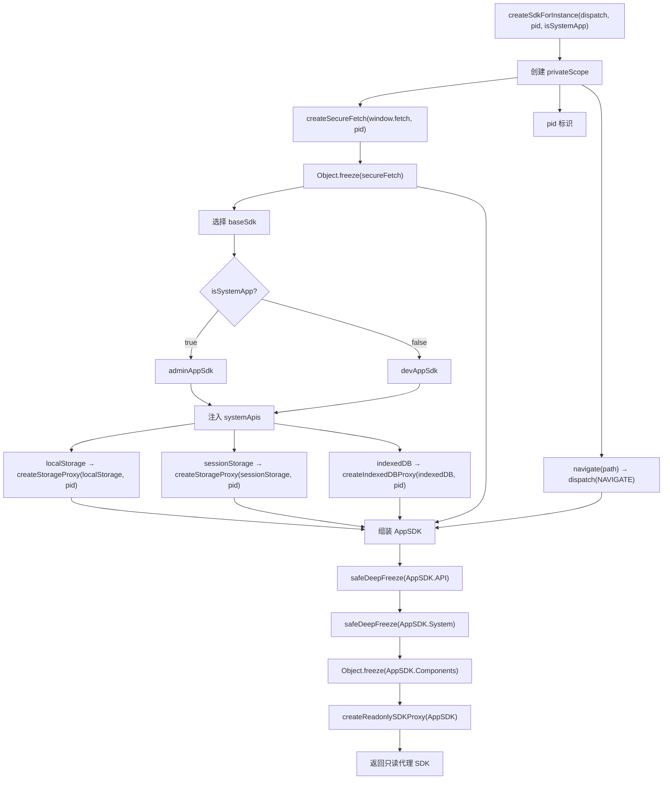
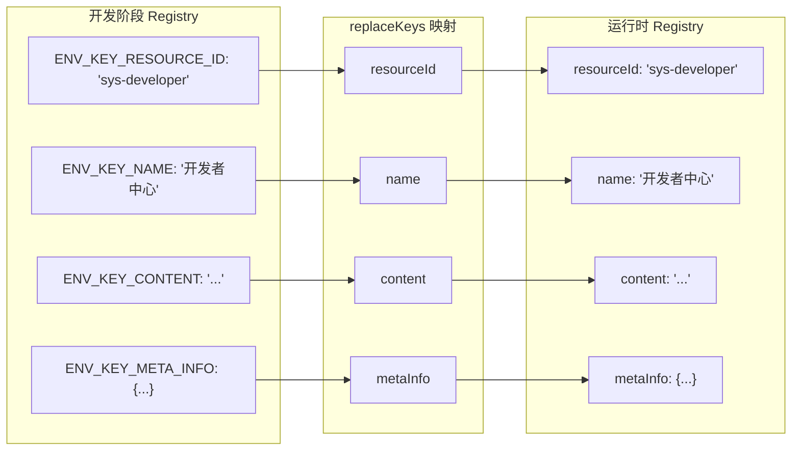
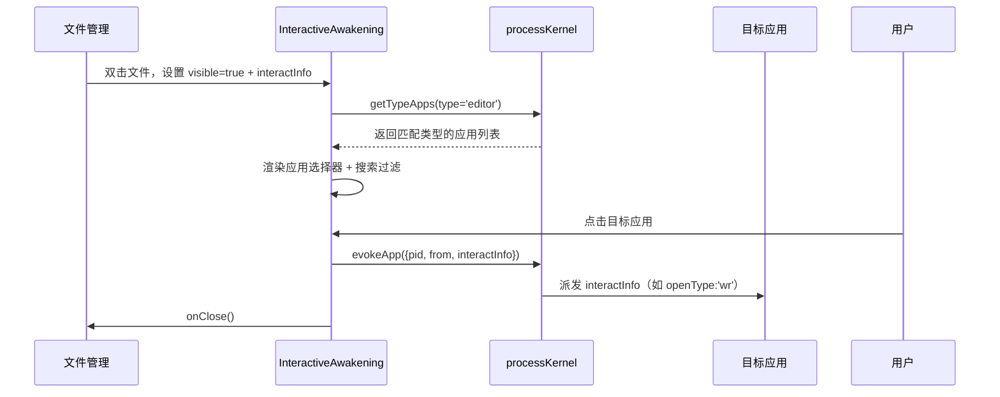
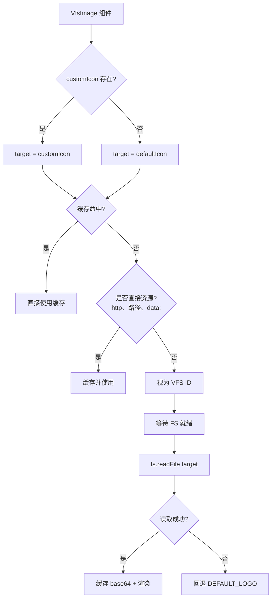
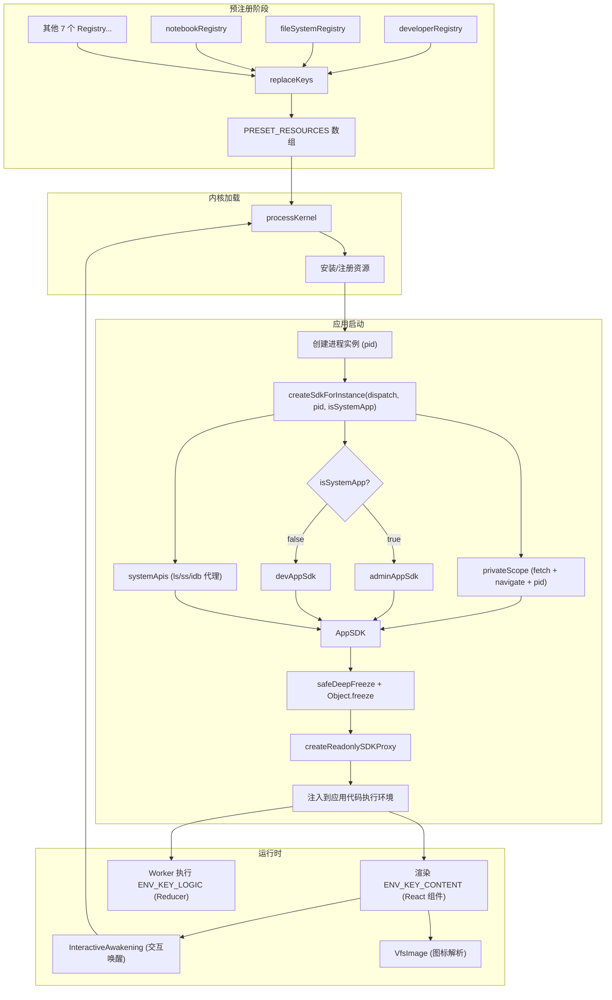

# 03 - 资源与应用模块

## 概述

SukinOS 的资源模块定义了系统中所有预置应用的注册信息、SDK 交付机制和中间件能力。每个应用以 **Registry（注册表）** 为载体，经过 Key 映射后聚合为 `PRESET_RESOURCES` 数组，供内核加载和实例化。

核心文件结构：

```
src/sukinos/resources/
├── sdk.jsx                    # SDK 模板与工厂函数
├── preset_resources.jsx       # 预设资源聚合与 Key 映射
├── developer/
│   ├── registry.jsx           # 开发者中心注册表
│   └── layout.jsx             # 开发者中心 UI 组件
├── fileSystem/
│   ├── registry.jsx           # 文件管理注册表
│   └── layout.jsx             # 文件管理 UI 组件
├── notebook/
│   └── registry.jsx           # 记事本注册表
├── store/
│   └── registry.jsx           # APP商店注册表
├── setting/
│   └── registry.jsx           # 设置注册表
├── start/
│   └── registry.jsx           # 开始菜单注册表
├── localDev/
│   └── registry.jsx           # 本地开发注册表
├── systemManage/
│   └── registry.jsx           # 系统管理注册表
├── drawBoard/
│   └── registry.jsx           # 画板注册表
└── sheet/
    └── registry.jsx           # 表格注册表
```

---

## 1. SDK 架构详解

### 1.1 SDK 模板定义

SDK 提供两层模板，按应用权限分级交付：

#### devAppSdk — 开发者应用 SDK

面向第三方开发者上传的应用，提供受限能力：

| 模块 | 内容 | 说明 |
|------|------|------|
| `React` | `React, useState, useEffect, useRef, useCallback, useMemo` | React 核心库 |
| `Components` | `AllComponent`（`@/component/main` 全部导出） | 公共 UI 组件库 |
| `kernel` | `evokeApp`, `getTypeApps` | 有限内核 API，仅允许唤起应用和查询类型 |
| `hooks` | `useFileSystem` | 文件系统 Hook |
| `middleware` | 全部中间件导出 | `InteractiveAwakening`, `VfsImage` |
| `API` | 空对象（运行时注入私有 Scope） | 运行时动态填充 |

#### adminAppSdk — 管理员/系统应用 SDK

继承 `devAppSdk` 全部能力，额外提供完整系统组件和内核访问：

| 额外模块 | 内容 | 说明 |
|----------|------|------|
| `Components` | `Developer, FileSystem, NoteBook, Setting, Start, Store, LocalDev, SystemDashboard, DrawBoard, Sheet` | 10 个系统级应用组件 |
| `hooks` | 全部 Hooks 导出（`@/sukinos/hooks/main`） | 完整 Hook 能力 |
| `kernel` | `_kernel`（完整 kernel 对象） | 全部内核 API |
| `API.rootSeed` | `generateShortSeed` | 高权限种子生成函数 |

### 1.2 SDK 工厂函数 — `createSdkForInstance`

每个应用进程实例通过工厂函数获得定制化、隔离的 SDK：

```
createSdkForInstance(dispatch, pid, isSystemApp) → AppSDK
```

**构建流程：**



**安全机制层级：**

1. **privateScope 隔离**：每个实例获得独立的 `fetch`（注入 PID）和 `navigate`（路由分发）
2. **systemApis 隔离**：通过 PID 前缀隔离 `localStorage/sessionStorage/indexedDB`，各应用数据互不干扰
3. **深度冻结**：对 `API`、`System`、`Components` 进行冻结，防止运行时篡改
4. **只读代理**：`createReadonlySDKProxy` 包裹整个 SDK，防御 `[Symbol.iterator]` 和恶意属性覆写

---

## 2. 预设资源注册机制

### 2.1 Registry 标准结构

每个应用的注册表是一个标准对象，包含以下键（开发阶段使用 `ENV_KEY_*` 命名，最终映射为运行时键名）：

| ENV_KEY 开发键 | 运行时键名 | 类型 | 说明 |
|----------------|-----------|------|------|
| `ENV_KEY_RESOURCE_ID` | `resourceId` | `string` | 唯一资源 ID（如 `sys-developer`） |
| `ENV_KEY_NAME` | `name` | `string` | 应用显示名称 |
| `ENV_KEY_IS_BUNDLE` | `isBundle` | `boolean` | 是否为 Bundle 应用（多文件打包） |
| `ENV_KEY_CONTENT` | `content` | `string \| object` | UI 视图代码字符串（默认导出 React 组件） |
| `ENV_KEY_LOGIC` | `logic` | `string` | Worker 逻辑代码字符串（Reducer 模式） |
| `ENV_KEY_META_INFO` | `metaInfo` | `object` | 元数据配置 |

### 2.2 Key 映射流程

`preset_resources.jsx` 中通过 `replaceKeys` 函数将开发阶段的人类可读键名映射为运行时键名：



### 2.3 PRESET_RESOURCES 聚合

`preset_resources.jsx` 导入 10 个 Registry，依次执行 `replaceKeys`，输出为 `PRESET_RESOURCES` 数组供内核批量加载。

---

## 3. 各资源模块详情

### 3.1 开发者中心 — `sys-developer`

| 字段 | 值 |
|------|-----|
| `ENV_KEY_RESOURCE_ID` | `sys-developer` |
| `ENV_KEY_NAME` | 开发者中心 |
| `ENV_KEY_IS_BUNDLE` | `false` |
| `worker` | 无（未设置） |
| `exposeState` | `false` |
| `isParasitism` | `true` |
| `saveState` | `false` |
| `hasShortcut` | `true` |

**功能说明**：类 VS Code 的集成开发环境，提供资源管理器、代码编辑器（Monaco）、配置面板、应用预览、上传/更新和开发手册。

**核心能力**（`layout.jsx`）：
- **双盘文件系统**：支持虚拟盘/物理盘切换，通过 `useSystemFileSystem` hook 管理 VFS 状态
- **Monaco 代码编辑器**：异步加载，编辑视图代码和逻辑代码
- **工作区映射**：将 VFS 目录映射为项目文件树，支持自动保存和手动同步
- **应用打包**：区分 Bundle（多文件）和 Single（单文件）两种上传模式
- **实时预览**：内置 `AppView` 预览面板，可即时预览开发中的应用
- **应用创建**：通过 `kernel.uploadResource(payload)` 向内核发送安装指令

### 3.2 文件管理 — `sys-fileSystem`

| 字段 | 值 |
|------|-----|
| `ENV_KEY_RESOURCE_ID` | `sys-fileSystem` |
| `ENV_KEY_NAME` | 文件管理 |
| `ENV_KEY_IS_BUNDLE` | `false` |
| `worker` | `false` |
| `exposeState` | `false` |
| `isParasitism` | `true` |
| `saveState` | `false` |
| `hasShortcut` | `true` |

**功能说明**：类 Windows 资源管理器的文件浏览器，支持虚拟盘/本地盘/云端三种模式。

**核心能力**（`layout.jsx`）：
- **三盘切换**：虚拟盘（VFS）、此电脑（本地文件系统）、云端（远程存储）
- **视图模式**：网格视图和列表视图
- **目录导航**：面包屑导航、前进/后退/刷新
- **文件操作**：创建/重命名/删除，右键菜单支持
- **文件交换**：通过 `ExChange` 组件实现跨盘传输
- **交互唤醒**：双击文件时触发 `InteractiveAwakening` 中间件，选择合适的编辑器打开

### 3.3 记事本 — `sys-notebook`

| 字段 | 值 |
|------|-----|
| `ENV_KEY_RESOURCE_ID` | `sys-notebook` |
| `ENV_KEY_NAME` | 记事本 |
| `ENV_KEY_IS_BUNDLE` | `false` |
| `worker` | `true` |
| `exposeState` | `true` |
| `saveState` | `false` |
| `hasShortcut` | `true` |
| `appType` | `editor` |

**Worker Reducer 逻辑**：处理来自系统的 `dispatch(interactInfo)`，根据 `openType` 判断打开模式：
- `wr`：读写模式 — `type: 1, openType: 'wr'`
- `r`：只读模式 — `type: 1, openType: 'r'`

**视图**：接收 `state`、`handleFocus`、`pid` 等注入属性，使用 `NoteBook` 系统组件渲染。

### 3.4 APP商店 — `sys-store`

| 字段 | 值 |
|------|-----|
| `ENV_KEY_RESOURCE_ID` | `sys-store` |
| `ENV_KEY_NAME` | APP商店 |
| `ENV_KEY_IS_BUNDLE` | `false` |
| `worker` | `false` |
| `exposeState` | `false` |
| `saveState` | `false` |
| `hasShortcut` | `true` |
| `blockEd` | `false` |

**功能说明**：应用商店，使用 `Store` 系统组件渲染，无独立 Worker 逻辑。

### 3.5 设置 — `sys-setting`

| 字段 | 值 |
|------|-----|
| `ENV_KEY_RESOURCE_ID` | `sys-setting` |
| `ENV_KEY_NAME` | 设置 |
| `ENV_KEY_IS_BUNDLE` | `false` |
| `worker` | `true` |
| `exposeState` | `false` |
| `isParasitism` | `true` |
| `saveState` | `false` |
| `hasShortcut` | `true` |
| `blockEd` | `true` |

**功能说明**：系统设置中心，使用 `Setting` 系统组件渲染。`blockEd: true` 表示固定至状态栏。

### 3.6 开始菜单 — `sys-start`

| 字段 | 值 |
|------|-----|
| `ENV_KEY_RESOURCE_ID` | `sys-start` |
| `ENV_KEY_NAME` | 开始 |
| `ENV_KEY_IS_BUNDLE` | `false` |
| `worker` | `false` |
| `exposeState` | `false` |
| `saveState` | `false` |
| `hasShortcut` | `false` |
| `blockEd` | `true` |

**功能说明**：系统开始菜单/启动器，使用 `Start` 系统组件渲染。`hasShortcut: false` 表示不创建桌面快捷方式。

### 3.7 本地开发 — `sys-local-dev`

| 字段 | 值 |
|------|-----|
| `ENV_KEY_RESOURCE_ID` | `sys-local-dev` |
| `ENV_KEY_NAME` | 本地开发 |
| `ENV_KEY_IS_BUNDLE` | `false` |
| `worker` | `true` |
| `exposeState` | `false` |
| `saveState` | `false` |
| `hasShortcut` | `true` |
| `blockEd` | `false` |

**功能说明**：本地开发环境，使用 `LocalDev` 系统组件渲染。

> **注意**：资源 ID 存在拼写问题 `sys-local-dev`（应为 `sys-local-dev`），但已在代码中固化为当前值。

### 3.8 系统管理 — `sys-systemManage`

| 字段 | 值 |
|------|-----|
| `ENV_KEY_RESOURCE_ID` | `sys-systemManage` |
| `ENV_KEY_NAME` | 系统管理 |
| `ENV_KEY_IS_BUNDLE` | `false` |
| `worker` | `false` |
| `exposeState` | `false` |
| `saveState` | `false` |
| `hasShortcut` | `true` |
| `blockEd` | `false` |

**功能说明**：系统仪表盘，使用 `SystemDashboard` 系统组件渲染。

### 3.9 画板 — `sys-drawBoard`

| 字段 | 值 |
|------|-----|
| `ENV_KEY_RESOURCE_ID` | `sys-drawBoard` |
| `ENV_KEY_NAME` | 画板 |
| `ENV_KEY_IS_BUNDLE` | `false` |
| `worker` | `true` |
| `exposeState` | `false` |
| `saveState` | `false` |
| `isParasitism` | `true` |
| `hasShortcut` | `true` |
| `blockEd` | `false` |

**功能说明**：功能丰富的绘图/白板应用，集成画板和思维导图。

**Worker Reducer 逻辑（核心 action 类型）**：

| Action 类型 | 说明 |
|------------|------|
| `NAV` | 路由导航（gallery 等） |
| `SET_TOOL` / `SET_STYLE` / `SET_VIEW` | 设置工具/样式/视图 |
| `SET_SELECTED` | 设置选中元素 |
| `BEGIN_HISTORY` / `ADD_ELEMENT` / `REPLACE_ELEMENTS` / `UPDATE_ELEMENT` / `DELETE_ELEMENTS` | 画布元素 CRUD |
| `UNDO` / `REDO` | 撤销/重做（限制 80 步历史） |
| `LOAD_BOARDS` / `SET_ACTIVE_BOARD` / `LOAD_SCENE` | 画板管理 |
| `LOAD_MINDMAPS` / `SET_ACTIVE_MINDMAP` / `LOAD_MM_NODES` / `ADD_MM_NODE` / `DELETE_MM_NODE` | 思维导图节点 CRUD |
| `LOAD_MM_CONNS` / `ADD_MM_CONN` / `DELETE_MM_CONN` | 思维导图连线 CRUD |
| `AUTO_LAYOUT` | 自动布局 |
| `MM_PUSH_HIST` / `MM_UNDO` / `MM_REDO` / `MM_SELECT_ALL` | 思维导图撤销/重做/全选 |

**初始状态**：包含画布场景（`scene`）、工具（`tool`）、样式（`style`）、视图（`view`）、历史（`history`）、思维导图节点/连线/视图/历史等完整结构。

### 3.10 表格 — `sys-sheet`

| 字段 | 值 |
|------|-----|
| `ENV_KEY_RESOURCE_ID` | `sys-sheet` |
| `ENV_KEY_NAME` | 表格 |
| `ENV_KEY_IS_BUNDLE` | `false` |
| `worker` | `true` |
| `exposeState` | `false` |
| `saveState` | `true` |
| `isParasitism` | `true` |
| `hasShortcut` | `true` |
| `blockEd` | `false` |
| `version` | `v5` |

**功能说明**：功能完整的电子表格应用，支持树形层级、多 Tab、预设列等。

**Worker Reducer 逻辑（核心 action 类型）**：

| Action 类型 | 说明 |
|------------|------|
| `LOAD_STATE` | 加载保存的状态 |
| `RENAME_TABLE` / `ADD_TABLE` / `DELETE_TABLE` | 表 CRUD |
| `ADD_COLUMN` / `UPDATE_COLUMN` / `DELETE_COLUMN` / `REORDER_COLUMNS` | 列 CRUD |
| `ADD_RECORD` / `UPDATE_RECORD` / `DELETE_RECORD` | 记录 CRUD（支持树形结构） |
| `SET_ACTIVE_TABLE` / `SET_ACTIVE_TAB` / `CLOSE_TAB` / `REORDER_TABS` / `OPEN_MANUAL_TAB` / `OPEN_PRESETS_TAB` | Tab 管理 |
| `UPDATE_CONFIG` | 更新表配置（视图类型/搜索/排序/隐藏列/展开行） |
| `IMPORT_DATA` | 导入数据 |
| `ADD_PRESET` / `TOGGLE_PRESET` / `DELETE_PRESET` / `UPDATE_PRESET` | 预设列管理 |

**初始数据**：包含一个示例表「项目目标与任务」，含 5 个列（任务名称/状态/预估耗时/截止日期/优先级）和 2 条主记录（含树形子记录）。

**预设列类型**：`text`, `select`, `number`, `date`, `boolean`, `progress`。

---

## 4. 中间件说明

中间件作为 SDK 的一部分被所有应用（`devAppSdk` 和 `adminAppSdk`）统一访问，通过 `@/sukinos/middleware/main.jsx` 聚合导出。

### 4.1 InteractiveAwakening — 交互唤醒

**文件位置**：`src/sukinos/middleware/InteractiveAwakening/main.jsx`

**用途**：当一个操作需要选择合适的程序来执行时（如打开文件），弹出应用选择器。

**Props 接口**：

| Prop | 类型 | 说明 |
|------|------|------|
| `visible` | `boolean` | 控制显示/隐藏 |
| `type` | `string` | 应用类型过滤（如 `'editor'`） |
| `title` | `string` | 弹窗标题 |
| `description` | `string` | 描述文本 |
| `interactInfo` | `object` | 传递给目标应用的交互信息 |
| `from` | `string` | 来源标识，默认 `'system'` |
| `onClose` | `function` | 关闭回调 |

**工作流程**：



**核心逻辑**：
- 通过 `processKernel.getTypeApps(type)` 获取指定类型的应用列表
- 支持搜索过滤（按应用名称和描述）
- 选择后通过 `processKernel.evokeApp()` 唤醒目标应用，携带完整的 `interactInfo`

**使用场景**：文件管理双击文件 → 弹出编辑器选择 → 传递 `openType: 'wr'` 和文件元信息给目标编辑器。

### 4.2 VfsImage — VFS 图标解析

**文件位置**：`src/sukinos/middleware/VfsImage/main.jsx`

**用途**：统一解析和渲染应用图标，支持多种来源。

**Props 接口**：

| Prop | 类型 | 说明 |
|------|------|------|
| `app` | `object` | 应用对象（包含 `metaInfo`） |
| `className` | `string` | CSS 类名 |
| `style` | `object` | 内联样式 |

**图标解析优先级**：



**全局缓存**：使用模块级 `vfsImageCache`（Map）缓存已解析的图标，避免重复 VFS 读取。

**容错机制**：
- 初始状态设为 `DEFAULT_LOGO` 确保首帧有图标
- `onError` 回退为 `DEFAULT_LOGO`
- 组件卸载时取消异步操作（`isMounted` 守卫）

---

## 5. 应用元数据规范

### 5.1 ENV_KEY_META_INFO 字段说明

| 字段 | 类型 | 说明 |
|------|------|------|
| `version` | `string` | 应用版本号（如 `'v1'`, `'v5'`） |
| `icon` | `string` | 图标（Base64 字符串或 VFS ID） |
| `appType` | `string` | 应用类型：`'system'`（系统应用）/ `'editor'`（编辑器） |
| `worker` | `boolean` | 是否启用 Worker（独立 Reducer 线程处理状态） |
| `exposeState` | `boolean` | 是否向外部暴露状态（其他应用可读取） |
| `saveState` | `boolean` | 关闭时是否保存状态（重启后恢复） |
| `isParasitism` | `boolean` | 是否为寄生应用（无独立窗口，嵌入宿主） |
| `custom.hasShortcut` | `boolean` | 是否创建桌面快捷方式 |
| `custom.blockEd` | `boolean` | 是否固定至状态栏 |

### 5.2 应用分类一览

| 应用 | Resource ID | appType | worker | exposeState | saveState | isParasitism | hasShortcut | blockEd |
|------|-------------|---------|--------|-------------|-----------|-------------|-------------|---------|
| 开发者中心 | `sys-developer` | system | - | false | false | true | true | - |
| 文件管理 | `sys-fileSystem` | system | false | false | false | true | true | - |
| 记事本 | `sys-notebook` | editor | true | true | false | - | true | - |
| APP商店 | `sys-store` | system | false | false | false | - | true | false |
| 设置 | `sys-setting` | system | true | false | false | true | true | true |
| 开始 | `sys-start` | system | false | false | false | - | false | true |
| 本地开发 | `sys-local-dev` | system | true | false | false | - | true | false |
| 系统管理 | `sys-systemManage` | system | false | false | false | - | true | false |
| 画板 | `sys-drawBoard` | system | true | false | false | true | true | false |
| 表格 | `sys-sheet` | system | true | false | true | true | true | false |

---

## 6. 完整调用链



---

## 7. 开发者扩展指南

### 7.1 创建新应用

在 `src/sukinos/resources/` 下新建模块目录，创建 `registry.jsx`：

```jsx
import { getLogoBase64Url } from "@/component/logo/layout";
const logo = () => getLogoBase64Url({ /* 配色 */ });

export default {
  ENV_KEY_RESOURCE_ID: 'sys-myapp',
  ENV_KEY_NAME: '我的应用',
  ENV_KEY_IS_BUNDLE: false,
  ENV_KEY_CONTENT: `
    export default ({ PageComponent, navigate, state, dispatch, pid }) => {
      const { Components } = AppSDK;
      return (
        <div style={{height:'100%', width:'100%', display:'flex', flexDirection:'column'}}>
          {/* 应用 UI */}
        </div>
      );
    }
  `,
  ENV_KEY_LOGIC: `
    const initialState = {};
    function reducer(state = initialState, action) {
      switch(action.type) {
        default: return state;
      }
    }
  `,
  ENV_KEY_META_INFO: {
    version: 'v1',
    icon: logo(),
    appType: 'system',
    worker: true,
    exposeState: false,
    saveState: false,
    isParasitism: true,
    custom: { hasShortcut: true, blockEd: false }
  }
}
```

然后在 `preset_resources.jsx` 中导入并添加到 `rawResources` 数组。

### 7.2 SDK 可用 API 汇总

| SDK 路径 | devAppSdk | adminAppSdk | 说明 |
|----------|:---------:|:-----------:|------|
| `AppSDK.React` | Y | Y | React 核心 |
| `AppSDK.useState` 等 | Y | Y | 常用 Hooks |
| `AppSDK.Components.AllComponent` | Y | Y | 公共组件 |
| `AppSDK.Components.Developer` 等 | N | Y | 系统组件（10个） |
| `AppSDK.kernel.evokeApp` | Y | Y | 唤起应用 |
| `AppSDK.kernel.getTypeApps` | Y | Y | 查询类型应用 |
| `AppSDK.kernel`（完整） | N | Y | 全部内核 API |
| `AppSDK.kernel.rootSeed` | N | Y | 种子生成 |
| `AppSDK.hooks.useFileSystem` | Y | Y | 文件系统 Hook |
| `AppSDK.hooks`（全部） | N | Y | 全部 Hooks |
| `AppSDK.middleware.*` | Y | Y | 全部中间件 |
| `AppSDK.API.fetch` | Y | Y | PID 注入的安全 fetch |
| `AppSDK.API.navigate` | Y | Y | 路由导航 |
| `AppSDK.API.pid` | Y | Y | 当前进程 ID |
| `AppSDK.System.localStorage` | Y | Y | PID 隔离的 localStorage |
| `AppSDK.System.sessionStorage` | Y | Y | PID 隔离的 sessionStorage |
| `AppSDK.System.indexedDB` | Y | Y | PID 隔离的 indexedDB |

### 7.3 Worker 模式说明

当 `metaInfo.worker` 为 `true` 时，`ENV_KEY_LOGIC` 中的代码在 Worker 中执行：

- 必须导出 `reducer(state, action)` 函数
- 通过 `dispatch({type: 'xxx'})` 驱动状态变更
- `state` 作为注入属性传入 UI 组件
- 支持 `openType` 机制进行跨应用通信（如文件管理 → 记事本传递 `openType: 'wr'`）
