# SukinOS 进程内核系统

## 概述

进程内核是 SukinOS 的核心运行时引擎，负责应用的安装、注册、进程管理、状态持久化、事件通信和资源调度。内核采用**单例模式**导出，在应用启动时初始化，管理整个系统中所有应用的生命周期。

## 架构总览

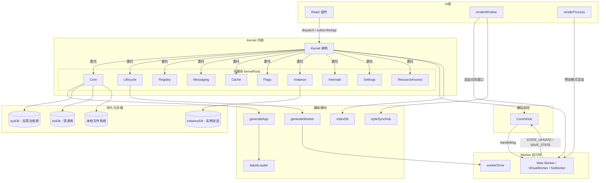

---

## 1. Kernel 类

**文件**: `kernel.js`

Kernel 是系统的核心管理器，采用单例模式导出（`export default new Kernel()`）。它聚合了所有子模块，对外提供统一的公共 API。

### 1.1 构造函数属性

| 分类 | 属性 | 类型 | 说明 |
|------|------|------|------|
| **持久化** | `sysDb` | `IndexDb` | 应用注册表数据库（DB_SYS），以 app.name 为主键 |
| | `resDb` | `IndexDb` | 资源库数据库（DB_RES），以 resourceId 为主键 |
| | `instanceDb` | `IndexDb` | 实例状态数据库（DB_STATE_INSTANCE） |
| | `dirHandle` | `FileSystemDirectoryHandle` | 用户授权的本地文件系统目录句柄 |
| **运行时** | `processes` | `Map<pid, {worker, url}>` | 运行中进程的 Worker 实例映射 |
| **注册表** | `systemApps` | `Map<pid, appInfo>` | 系统应用元数据（仅内存） |
| | `userApps` | `Map<pid, appInfo>` | 用户应用元数据（从 sysDb 加载） |
| | `resourceIdToPid` | `Map<resId, pid>` | 资源ID -> 进程ID 双向映射 |
| | `pidToResourceId` | `Map<pid, resId>` | 进程ID -> 资源ID 双向映射 |
| | `resourceCache` | `Object<resId, resource>` | 所有应用资源的内存缓存 |
| **队列** | `installQueue` | `Array` | 安装任务队列 |
| | `isProcessingQueue` | `boolean` | 队列执行锁 |
| **通信** | `commHub` | `CommHub` | 通信枢纽实例 |
| **预设** | `presetResourceIds` | `Set` | 预置资源ID集合 |
| | `currentUser` | `object` | 当前登录用户信息 |
| | `storeDispatch` | `function` | 仓库操作函数 |
| | `useVirtualWorker` | `boolean` | 是否使用虚拟沙箱机制 |

### 1.2 公共 API 分类

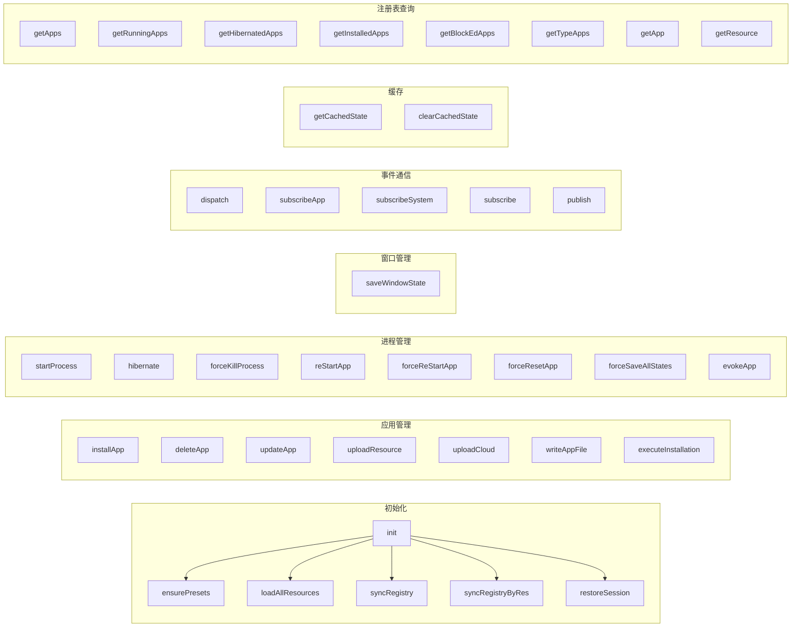

#### 初始化 API

| 方法 | 说明 |
|------|------|
| `init(info)` | 内核初始化，加载资源、构建注册表、恢复会话 |
| `ensurePresets()` | 将系统预置资源写入 resDb |
| `loadAllResources()` | 从 resDb 加载所有资源到内存缓存 |
| `syncSystemAccess()` | 从后端同步当前用户有权访问的系统 APP 列表，白名单模式（仅 `allowed: true` 保留），API 错误时清空所有系统 APP |
| `syncResourcesToFiles()` | 将资源同步写入本地文件系统 |
| `syncRegistry()` | 同步本地文件与注册表（处理僵尸文件/孤儿记录） |
| `syncRegistryByRes()` | 通过资源库构建/补全注册表 |

#### 应用管理 API

| 方法 | 说明 |
|------|------|
| `installApp(params)` | 安装应用（通过队列） |
| `deleteApp(params)` | 删除非系统应用 |
| `updateApp(params)` | 更新应用 |
| `uploadResource(params)` | 上传资源（安装 + 可选云端上传） |
| `uploadCloud(data)` | 上传应用到云端服务器 |
| `writeAppFile(res)` | 将应用写入本地文件 |
| `executeInstallation(params)` | 执行安装/注册（队列处理） |

#### 进程管理 API

| 方法 | 说明 |
|------|------|
| `startProcess({pid, resourceId, interactInfo})` | 启动应用进程（冷启动/唤醒休眠） |
| `hibernate(pid)` | 休眠应用（不终止Worker，仅改状态标记） |
| `forceKillProcess(pid)` | 强制终止进程（根据配置决定是否清除状态） |
| `reStartApp({pid})` | 热重启应用 |
| `forceReStartApp({pid})` | 强制重启应用（清除状态后重启） |
| `forceResetApp(pid)` | 强制重置应用（清空状态 + 杀死进程） |
| `forceSaveAllStates()` | 强制保存所有运行中应用的状态 |
| `restoreSession()` | 恢复上一次会话状态 |
| `evokeApp({pid, from, interactInfo})` | 唤起/拉起应用，支持跨应用交互 |

#### 事件通信 API

| 方法 | 说明 |
|------|------|
| `dispatch(pid, action)` | 向指定进程分发 action |
| `subscribeApp(pid, cb)` | 订阅指定应用的状态变化 |
| `subscribeSystem(cb)` | 订阅系统级变更事件 |
| `subscribe(topic, cb)` | 订阅指定主题消息 |
| `publish(topic, payload)` | 发布指定主题消息 |

#### 其他 API

| 方法 | 说明 |
|------|------|
| `getCachedState(pid)` | 获取缓存的应用状态快照 |
| `clearCachedState(pid)` | 清除缓存的应用状态 |
| `saveWindowState(pid, windowRect)` | 保存窗口几何信息 |
| `setDispatch(dispatch)` | 注入仓库操作函数 |
| `updateResourceCustom(data)` | 更新应用的 custom 配置 |
| `isSystemApp(pid)` | 判断是否为系统应用 |
| `getPidByResourceId(resId)` | 通过资源ID获取PID |
| `getResourceIdByPid(pid)` | 通过PID获取资源ID |
| `getApp(pid)` | 获取应用信息 |
| `getResource(resourceId)` | 获取资源信息 |
| `getInstanceDb()` | 获取实例数据库 |

### 1.3 初始化流程

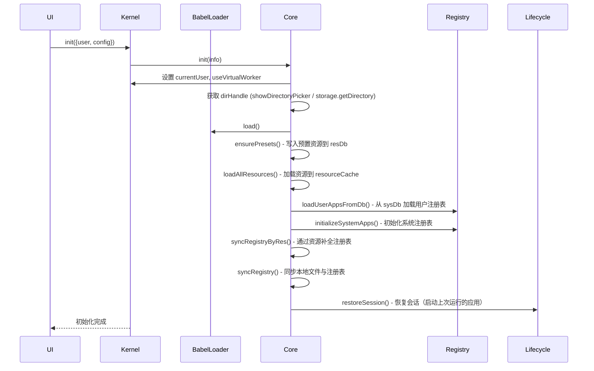

---

## 2. CommHub 通信枢纽

**文件**: `commHub.js`

CommHub 是内核与应用 Worker 之间的通信中枢，集中处理消息分发、状态缓存和系统事件。

### 2.1 核心数据结构

| 属性 | 类型 | 说明 |
|------|------|------|
| `onSaveState` | `function` | Worker 状态保存回调（由 Kernel 注入） |
| `sendToWorker` | `function` | 向 Worker 发送消息的通道（由 Kernel 注入） |
| `eventBus` | `EventTarget` | 系统级事件总线 |
| `subscribers` | `Map<pid, Set<cb>>` | 进程状态订阅者集合 |
| `stateCache` | `Map<pid, state>` | 缓存各进程最新状态 |
| `topicSubscribers` | `Map<topic, Set<cb>>` | 全局主题订阅者 |
| `processSubscriptions` | `Map<pid, Map<topic, unsubFn>>` | 各进程建立的主题订阅（用于进程销毁时清理） |

### 2.2 消息协议

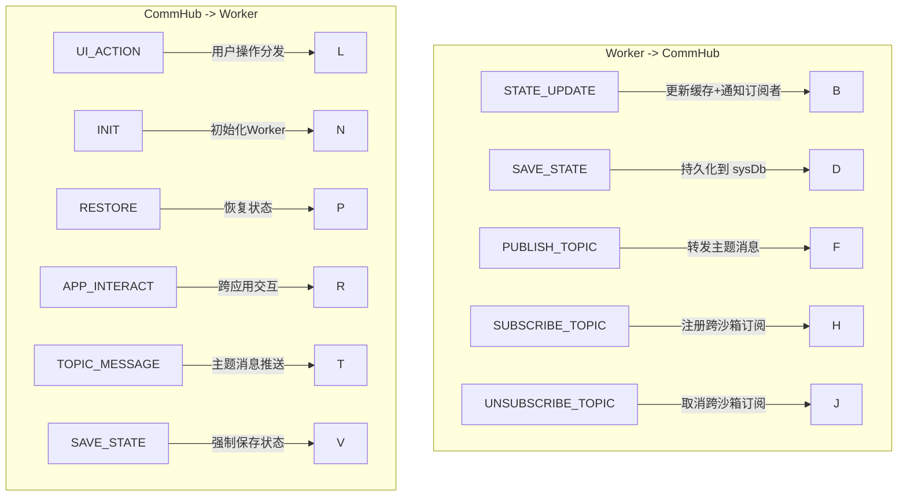

### 2.3 公共方法

| 方法 | 说明 |
|------|------|
| `emitChange(detail)` | 发送系统级变更事件（CustomEvent: 'sys_change'） |
| `notify(pid, type, data)` | 向某个进程的所有订阅者广播状态变化 |
| `getCachedState(pid)` | 获取缓存的状态快照 |
| `clearCachedState(pid)` | 清理缓存的状态快照 |
| `handleMsg(pid, msg)` | 处理来自 Worker 的消息（核心路由） |
| `subscribeApp(pid, cb)` | 订阅单个进程状态变化（返回取消订阅函数） |
| `subscribeSystem(cb)` | 订阅系统级变更事件（返回取消订阅函数） |
| `subscribe(topic, cb)` | 订阅指定主题的消息 |
| `publish(topic, payload)` | 发布指定主题的消息 |
| `clearProcessSubscriptions(pid)` | 清理指定进程的所有主题订阅（防内存泄漏） |

---

## 3. Kernel 子模块架构

**目录**: `kernelParts/`

Kernel 将职责拆分为 10 个子模块，每个子模块持有 Kernel 的弱引用（通过 `#kernel` 私有字段），通过公共方法暴露功能。`main.js` 负责统一 re-export 所有子模块的代理函数。

### 3.1 子模块总览

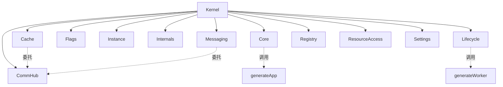

### 3.2 Cache - 缓存管理

**文件**: `kernelParts/cache.js`

代理 CommHub 的状态缓存操作，提供进程状态的读取与清理。

| 方法 | 说明 |
|------|------|
| `getCachedState(pid)` | 通过 CommHub 获取缓存状态 |
| `clearCachedState(pid)` | 通过 CommHub 清除缓存状态 |

### 3.3 Core - 核心业务

**文件**: `kernelParts/core.js`

负责系统初始化、资源加载、应用安装/删除/更新、注册表同步。

| 方法 | 说明 |
|------|------|
| `init(info)` | 完整初始化流程（dirHandle -> Babel -> 预置 -> 资源 -> 注册表 -> 会话恢复） |
| `ensurePresets()` | 写入系统预置资源，初始化 instanceDb |
| `loadAllResources()` | 从 resDb 加载所有资源到 resourceCache |
| `installApp(params)` | 安装应用（走 executeInstallation 队列） |
| `deleteApp(params)` | 删除应用（清理进程/缓存/注册表/资源/沙箱数据） |
| `updateApp(params)` | 更新应用（先终止进程，再覆写安装） |
| `executeInstallation(params)` | 队列化执行安装/注册任务 |
| `syncResourcesToFiles()` | 将资源同步到本地文件 |
| `syncRegistry()` | 同步本地文件系统与注册表 |
| `syncRegistryByRes()` | 通过资源库补全注册表 |
| `writeAppFile(res)` | 写入应用文件到本地 |
| `uploadResource(params)` | 上传资源（安装 + 可选云端上传） |

### 3.4 Flags - 标志位

**文件**: `kernelParts/flags.js`

管理系统应用标识和仓库 dispatch 注入。

| 方法 | 说明 |
|------|------|
| `isSystemApp(pid)` | 判断 PID 是否为系统应用 |
| `setDispatch(dispatch)` | 注入 storeDispatch 函数 |

### 3.5 Instance - 实例管理

**文件**: `kernelParts/instance.js`

提供 instanceDb 的访问入口。

| 方法 | 说明 |
|------|------|
| `getInstanceDb()` | 返回 instanceDb 实例 |

### 3.6 Internals - 内部操作

**文件**: `kernelParts/internals.js`

封装内部操作：队列管理、进程终止、僵尸文件检查、云端上传。

| 方法 | 说明 |
|------|------|
| `inspectZombieFile(fileHandle)` | 检查僵尸文件（物理存在但无注册记录） |
| `uploadCloud(data)` | 上传应用到云端服务器 |
| `kill(pid)` | 终止进程（terminate Worker + revoke URL + 清理订阅） |
| `getProcessApp(pid)` | 获取进程实例 |
| `enqueueInstallTask(task)` | 将任务加入安装队列并触发执行 |
| `processInstallQueue()` | 顺序执行队列中的安装任务 |

### 3.7 Lifecycle - 进程生命周期

**文件**: `kernelParts/lifecycle.js`

管理应用的完整生命周期：启动、休眠、终止、重启、会话恢复。还包含 `VirtualWorker` 和 `NoWorker` 两种替代 Worker 实现。

#### 进程状态机

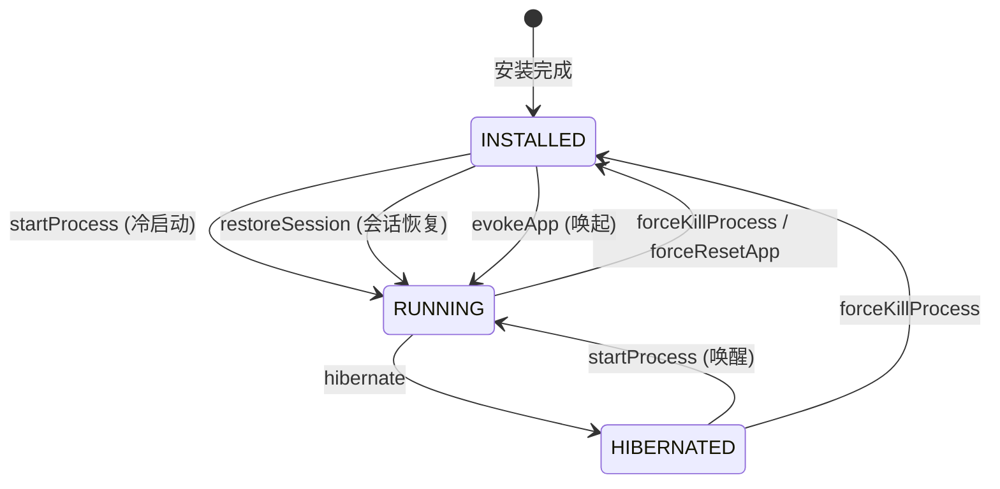

#### 进程启动模式

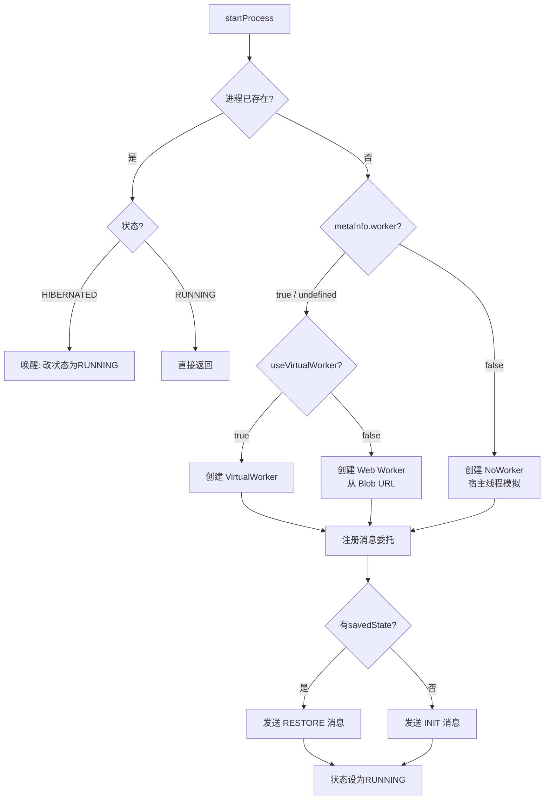

#### VirtualWorker

`VirtualWorker` 是 Web Worker 的轻量化替代方案，使用 `with(sandbox) + Proxy + Shared Iframe` 实现 JS 沙箱隔离。定义在 `lifecycle.js:41-269`。

特性：
- 通过 `new Function('self', 'with(self) { code }')` 执行代码
- 使用隐藏 iframe 的 `contentWindow` 提供隔离环境（`getSharedSandboxIframe()` 创建全局共享沙箱 iframe）
- 拦截并接管 `setTimeout`/`setInterval`/`requestAnimationFrame`，在销毁时自动清理
- 托管全局事件监听器，避免内存泄漏
- STATE_UPDATE 消息通过 `requestAnimationFrame` 帧对齐节流，其他消息通过 `setTimeout(0)` 快速投递
- 支持 `importScripts` 同步脚本加载（通过 XHR 同步请求）
- `addEventListener('message', handler)` 被拦截为 `this.appOnMessage = handler`，确保沙箱内只接收宿主消息

**资源追踪注册表**（lifecycle.js:49-53）：

| 注册表 | 拦截的 API | terminate 清理方式 |
|--------|-----------|-------------------|
| `activeTimeouts` (Set) | `setTimeout` | 遍历 `clearTimeout` |
| `activeIntervals` (Set) | `setInterval` | 遍历 `clearInterval` |
| `activeRAFFrames` (Set) | `requestAnimationFrame` | 遍历 `cancelAnimationFrame` |
| `attachedEventListeners` (Array) | `addEventListener` (非 message) | 遍历 `removeEventListener` |

**消息分流机制**（lifecycle.js:58-81）：

| 消息类型 | 投递方式 | 设计理由 |
|----------|---------|---------|
| `STATE_UPDATE` | `requestAnimationFrame` 帧对齐节流 | 高频状态更新，确保每帧最多投递一次最新的状态 |
| 其他控制流事件 | `setTimeout(0)` 微任务 | 低频事件，需要尽快投递 |

**Proxy 代理层**（lifecycle.js:164-205）：
- `sandboxSelfProxy` 基于 `iframe.contentWindow` 创建 Proxy
- `has: () => true` 确保 `with(sandbox)` 下所有变量查找被拦截
- 所有写操作进入 `localStore`（每个 VirtualWorker 独立内存）
- `boundMethodsCache` (WeakMap) 缓存 `.bind()` 结果防 GC 压力
- 大写开头全局类（Object, Array, Promise）不 bind，直接返回原始引用
- `self` / `globalThis` / `window` 均指向 `sandboxSelfProxy` 自身

> VirtualWorker 消息分流与 Proxy 代理层的完整代码分析详见 [07-app-routing.md](./07-app-routing.md) §3.3

#### NoWorker

`NoWorker` 针对纯前端应用（`worker: false`），在宿主线程模拟 Worker 通信协议。定义在 `lifecycle.js:275-377`。

**sysConfig 构建与注入**（lifecycle.js:286-294）：
NoWorker 在构造时构建完全等价于 Worker 端 `SYS_CONFIG` 的 `sysConfig`，确保广播的 `STATE_UPDATE` payload 格式一致：
```js
this.sysConfig = {
  [ENV_KEY_RESOURCE_ID]: app?.[ENV_KEY_RESOURCE_ID] || '',
  [ENV_KEY_NAME]: app?.[ENV_KEY_NAME] || '',
  [ENV_KEY_IS_BUNDLE]: isBundle,
};
```

**initializeState 校准器**（lifecycle.js:297）：
使用 `initializeState(initialState, isBundle)` 与 Worker 端 INIT handler 完全一致的逻辑初始化状态。Bundle App 的 NoWorker 实例也获得 `{router: {path: 'home'}}` 初始路由。

**初始化时状态广播**（lifecycle.js:301-313）：
构造后，如果存在历史持久化状态（calibratedState 不为 null），立即通过 `setTimeout(0)` 广播给 CommHub 填充 `stateCache`。

**UI_ACTION 处理三种路径**：

| Action 类型 | 处理方式 | 是否改变 state | Echo |
|-------------|---------|---------------|------|
| `STATE_UPDATE` / `UPDATE_STATE` | 直接合并到 `this.state` | ✅ 是 | ❌ |
| `NAVIGATE`（Bundle） | `processStateAction` 注入 `router.path` | ✅ 是 | ❌ |
| 其他 action | `processStateAction` 返回同引用 | ❌ 否 | ✅ ACTION_ECHO |

**ACTION_ECHO 机制**（lifecycle.js:353-360）：
当 `processStateAction` 返回 `nextState === prevState`（无状态变更），NoWorker 产生 `ACTION_ECHO` 消息回调到应用监听器，确保副作用型 action 不被静默跳过。

**SAVE_STATE 兼容**（lifecycle.js:365-370）：
NoWorker 的 `postMessage` 兼容 `SAVE_STATE` 消息，通过 `getCachedState(pid)` 获取缓存状态后调用 `commHub.saveState` 持久化。

> NoWorker sysConfig 注入、processStateAction、ACTION_ECHO 的完整代码分析详见 [07-app-routing.md](./07-app-routing.md) §3.4

| 方法 | 说明 |
|------|------|
| `startProcess({pid, resourceId, interactInfo})` | 启动/唤醒进程（含会话恢复保护） |
| `hibernate(pid)` | 休眠应用（仅改标记，Worker 保持热状态） |
| `forceKillProcess(pid)` | 强制终止进程（根据 saveState 配置决定是否清除状态） |
| `reStartApp({pid})` | 热重启（不清除状态） |
| `forceReStartApp({pid})` | 强制重启（根据 saveState 配置决定清除状态后重启） |
| `forceResetApp(pid)` | 强制重置（**无视 saveState 配置**，清空所有状态 + 杀进程） |
| `saveWindowState(pid, windowRect)` | 保存窗口几何信息 |
| `forceSaveAllStates()` | 强制保存所有运行中应用状态（**不检查 saveState 配置**） |
| `restoreSession()` | 恢复上一次会话（批量启动 RUNNING/HIBERNATED/autoStart 应用） |
| `evokeApp({pid, from, interactInfo})` | 唤起应用（支持跨应用交互，注入 from 信息） |
| `clearAppSavedState(pid)` | 清除应用持久化状态（分裂式：只清 app 保留 window） |
| `clearAppSandboxData(app)` | 清理应用沙箱数据（localStorage/sessionStorage/IndexedDB） |

#### startProcess 会话恢复保护

`startProcess` 在冷启动时有会话恢复保护逻辑（lifecycle.js:508-510）：

```js
const targetStatus = originalStatus === 'HIBERNATED' ? 'HIBERNATED' : 'RUNNING';
```

休眠应用在会话恢复时先建立 Worker 实例保持"热"状态，但不自动显示窗口，避免所有休眠应用同时弹出。

#### clearAppSavedState 分裂式清理

`clearAppSavedState` 是**分裂式清理**（lifecycle.js:593-612）——只重置 `app` 业务状态，保留 `window` 窗口几何信息：

```js
app.savedState = { ...prevSavedState, app: null };  // 保留 window 配置
```

#### forceSaveAllStates 紧急保存

页面刷新触发 `forceSaveAllStates`（lifecycle.js:548-558），向所有 Worker 发送 `SAVE_STATE`，**即发即忘**、**不检查 saveState 配置**，无论配置如何都强制保存。

#### restoreSession 会话恢复

`restoreSession()`（lifecycle.js:697-716）批量恢复 `RUNNING`/`HIBERNATED`/`autoStart` 应用，异步启动不阻塞主流程。

#### evokeApp 跨应用唤起

`evokeApp({pid, from, interactInfo})`（lifecycle.js:719-731）注入 `from` 信息，目标 App 已运行则直接发送 `APP_INTERACT`，未运行则冷启动+交互。

#### forceResetApp 无条件重置

`forceResetApp(pid)`（lifecycle.js:618-639）**无视 saveState 配置**强制清空所有状态并杀死进程，用于用户主动发起的彻底重置操作。

> 以上所有 Lifecycle API 的完整调用链与代码分析详见 [07-app-routing.md](./07-app-routing.md) §5-6

### 3.8 Messaging - 消息通信

**文件**: `kernelParts/messaging.js`

管理事件分发、订阅/发布、系统调用路由和跨应用交互。

| 方法 | 说明 |
|------|------|
| `dispatch(pid, action)` | 分发 action（KERNEL_CALL 走系统路由，其他转发 Worker） |
| `subscribeApp(pid, cb)` | 订阅应用状态变化 |
| `subscribeSystem(cb)` | 订阅系统级事件 |
| `subscribe(topic, cb)` | 订阅指定主题 |
| `publish(topic, payload)` | 发布主题消息 |
| `emitChange(info)` | 发送系统级变更事件 |
| `handleMsg(pid, msg)` | 处理 Worker 消息（委托 CommHub） |
| `notify(pid, type, data)` | 通知进程订阅者 |
| `systemSwitch(process, payload)` | 系统应用内核调用路由 |
| `notSystemSwitch(payload)` | 非系统应用内核调用路由 |
| `appIntereact(process, interactInfo)` | 跨应用交互（发送 APP_INTERACT 消息，由 evokeApp 注入 from 信息） |

#### TOPIC_MESSAGE 缺口说明

**重要设计缺口**：当 CommHub 通过 `sendToWorker` 向订阅进程转发 `TOPIC_MESSAGE` 时，该消息类型在 Worker 内部的消息路由器（workerDrive.js）中**缺少对应的 case 处理**。当前 Worker `onmessage` 只处理 `INIT`、`RESTORE`、`UI_ACTION`、`APP_INTERACT` 四种类型，`TOPIC_MESSAGE` 会落入 `default: break` 被静默丢弃。需要在 Worker 消息路由器中新增 `TOPIC_MESSAGE` case 才能使跨沙箱 Pub/Sub 完整工作。

> Pub/Sub 主题体系的完整协议与转发机制详见 [07-app-routing.md](./07-app-routing.md) §7

### 3.9 Registry - 注册表

**文件**: `kernelParts/registry.js`

管理应用注册表：系统应用初始化、用户应用加载、PID/ResourceID 映射、应用查询。

| 方法 | 说明 |
|------|------|
| `initializeSystemApps()` | 从 PRESET_RESOURCES 初始化系统注册表 |
| `loadUserAppsFromDb()` | 从 sysDb 加载用户注册表到内存 |
| `updateSystemAppInfo(pid, info)` | 更新系统应用信息 |
| `updateUserAppInfo(pid, info)` | 更新用户应用信息 |
| `getApp(pid)` | 获取应用（先查系统再查用户） |
| `getPidByResourceId(resId)` | 通过资源ID获取PID |
| `getResourceIdByPid(pid)` | 通过PID获取资源ID |
| `getApps()` | 获取所有应用（含运行状态） |
| `getRunningApps()` | 获取运行中应用 |
| `getHibernatedApps()` | 获取休眠中应用 |
| `getInstalledApps()` | 获取已安装用户应用 |
| `getBlockEdApps()` | 获取被屏蔽的应用 |
| `getTypeApps(appType)` | 按类型获取应用 |

### 3.10 ResourceAccess - 资源访问

**文件**: `kernelParts/resourceAccess.js`

提供资源库的内存缓存访问。

| 方法 | 说明 |
|------|------|
| `getResource(resourceId)` | 从 resourceCache 获取资源 |

### 3.11 Settings - 配置管理

**文件**: `kernelParts/settings.js`

管理应用的 custom 配置（个性化设置），支持持久化到 sysDb。

| 方法 | 说明 |
|------|------|
| `updateResourceCustom(data)` | 更新应用 custom 配置（合并到 metaInfo.custom） |

---

## 4. 辅助模块

### 4.1 generateWorker - Worker 代码生成器

**文件**: `generateWorker.js`

将应用资源（逻辑代码 + 配置 + 元数据）生成完整的 Worker 可执行脚本。

#### 代码结构

生成的 Worker 代码包含以下部分（通过标记位物理隔离）：

```
┌──────────────────────────────────────┐
│ getWorkerSandboxPreamble (安全前导)   │  <- 沙箱安全代理注入
├──────────────────────────────────────┤
│ {  块级作用域                          │
│   ├── SYS_CONFIG (系统配置)           │  <- <<<SUKIN_OS_SYS_CONFIG_BLOCK_START_V2>>>
│   ├── APP_METAINFO (应用元数据)        │  <- <<<SUKIN_OS_APP_METAINFO_BLOCK_START_V2>>>
│   ├── ORIGIN_COMPONENT (原始组件)      │  <- <<<SUKIN_OS_ORIGIN_COMPONENT_BLOCK_START_V2>>>
│   ├── USER_LOGIC (用户逻辑)           │  <- <<<SUKIN_OS_USER_LOGIC_BLOCK_START_V2>>>
│   ├── processStateAction (共享路由)    │
│   ├── initializeState (初始状态校准)  │
│   ├── RUNNER_SANDBOX_PRIVILEGES       │  <- 沙箱特权边界绑定
│   ├── RUNNER_WORKER_DISPATCHER        │  <- 状态分发器工厂
│   ├── RUNNER_MESSAGE_ROUTER           │  <- 消息协议路由器
│   ├── RUNNER_ORCHESTRATION_ENGINE     │  <- 统一驱动引擎
│   └── runWorkerRuntime(...) 调用      │
│ }                                     │
└──────────────────────────────────────┘
```

#### 标记位系统

使用精确的字符串标记位实现数据块的物理隔离，避免正则表达式解析的性能开销：

| 标记位 Key | 用途 |
|-----------|------|
| `SYS_CONFIG` | 系统配置（resourceId, name, isBundle） |
| `APP_METAINFO` | 应用元数据（author, initialSize, version 等） |
| `ORIGIN_COMPONENT` | 原始视图组件内容 |
| `USER_LOGIC` | 用户自定义逻辑（initialState, reducer, init 函数） |

#### 导出函数

| 函数 | 说明 |
|------|------|
| `generateWorker(args)` | 生成完整 Worker 代码字符串 |
| `parseWorkerCode(workerCode)` | 反解析 Worker 代码，提取配置/逻辑/状态 |

### 4.2 workerDrive - Worker 运行时引擎

**文件**: `workerDrive.js` (inline 导出)

提供 Worker 内部的运行时核心逻辑，以源码字符串形式注入到生成的 Worker 脚本中。

#### 核心组件

| 组件 | 说明 |
|------|------|
| `processStateAction(state, action, isBundle)` | 状态路由处理器（处理 Bundle 的 NAVIGATE） |
| `initializeState(baseState, isBundle)` | 初始状态校准器（自动注入 router.home） |
| `RUNNER_SANDBOX_PRIVILEGES` | 沙箱特权边界绑定器（限制 eval/Function 等，封禁 XHR/importScripts） |
| `RUNNER_WORKER_DISPATCHER` | 状态分发器工厂（创建 dispatch/broadcast/save） |
| `RUNNER_MESSAGE_ROUTER` | 消息协议路由器（处理 INIT/RESTORE/UI_ACTION/APP_INTERACT） |
| `RUNNER_ORCHESTRATION_ENGINE` | 统一驱动引擎编排器（组装并启动 Worker 运行时） |

#### Worker 内部消息处理流程

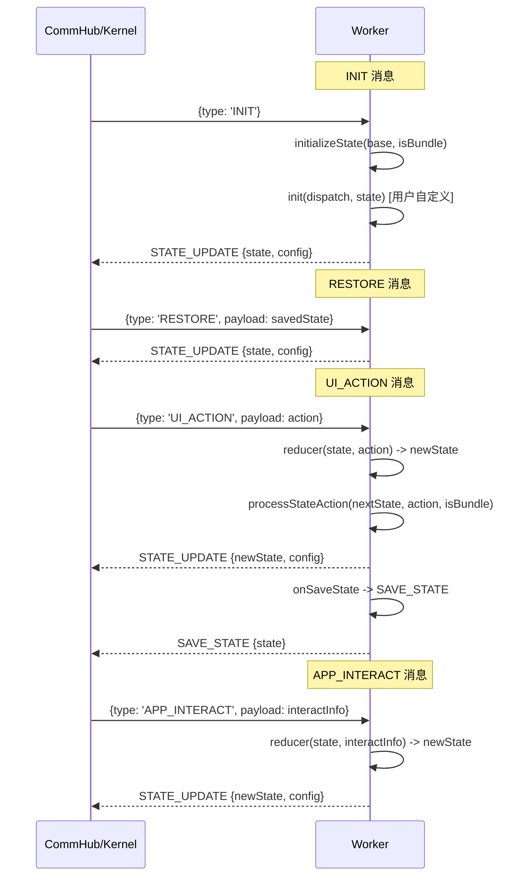

### 4.3 generateApp - 应用安装/注册/删除

**文件**: `generateApp.js`

封装所有与应用安装、注册、文件系统同步相关的操作，被 Core 子模块委托调用。

| 函数 | 说明 |
|------|------|
| `extRegisterAppSys(kernel, appSys)` | 注册应用到系统注册表（sysDb + 缓存 + 映射） |
| `extInspectZombieFile(kernel, fileHandle)` | 检查僵尸文件（解析资源ID，判断有效性） |
| `extUploadCloud(kernel, data)` | 上传应用到云端 |
| `extUpdateCloud(kernel, data)` | 更新云端应用 |
| `extInstallResource(kernel, args)` | 核心安装逻辑（写入 resDb + 分配/更新 PID） |
| `extExecuteInstallation(kernel, params)` | 队列化安装/注册执行 |
| `extSyncResourcesToFiles(kernel)` | 将资源同步到本地文件 |
| `extWriteAppFile(kernel, res)` | 写入本地应用文件 |
| `extUploadResource(kernel, args)` | 资源上传（安装 + 可选云端） |
| `extSyncRegistry(kernel)` | 同步本地文件与注册表 |
| `extSyncRegistryByRes(kernel)` | 通过资源库同步注册表 |
| `extUpdateApp(kernel, params)` | 更新应用 |
| `extDeleteApp(kernel, params)` | 删除应用 |

#### 安装流程

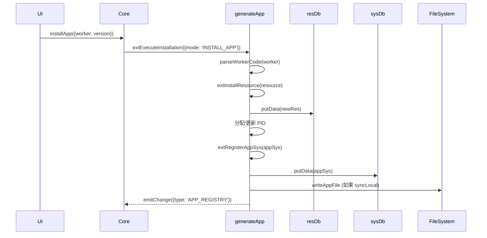

### 4.4 babelLoader - Babel 转译器

**文件**: `babelLoader.js`

将 JSX 代码转译为标准 JavaScript，支持沙箱环境下的 React pragma 定制。

| 方法/属性 | 说明 |
|-----------|------|
| `loaded` | 是否已加载标记 |
| `CDN_URL` | Babel CDN 备用地址 |
| `load()` | 加载 Babel（优先本地 `@babel/standalone`，fallback CDN） |
| `transform(code)` | 转译 JSX 代码（pragma: `AppSDK.React.createElement`） |

关键转译配置：
- `pragma`: `AppSDK.React.createElement`（适配沙箱中的 SDK）
- `pragmaFrag`: `AppSDK.React.Fragment`
- `runtime`: `classic`（启用自定义 pragma）
- `presets`: `['env', ['react', { pragma, pragmaFrag, runtime }]]`

### 4.5 renderProcess - 进程渲染器

**文件**: `renderProcess.jsx`

用于预览模式的进程渲染组件。维护独立的 Logic Worker 执行环境，动态编译视图源码并转换为 React 组件。

核心特性：
- **Worker 状态机**: 为预览创建独立的 Worker 实例，兼容 `generateWorker` 生成格式
- **幽灵沙箱 (Ghost Sandbox)**: 隐藏 iframe，拦截 `indexedDB`/`localStorage` 等敏感 API
- **ErrorBoundary**: 运行期错误边界容器，捕获渲染错误
- **模块编译**: 通过 `compileSourceAsync` 编译视图源码，延迟 400ms 防抖
- **CSS 作用域**: 使用 `scopeCss` 为样式添加 `#proc-${pid}` 前缀隔离
- **单文件/Bundle 模式**: 自动识别是否为 Bundle 应用，动态路由页面

### 4.6 renderWindow - 窗口渲染器

**文件**: `renderWindow.js`

提供视图源码编译工具和 CSS 作用域隔离功能。

| 函数 | 说明 |
|------|------|
| `compileSourceAsync(sourceCode, pid, targetFunctionConstructor)` | 编译源码为可执行 factory 函数 |
| `scopeCss(css, pid)` | CSS 作用域隔离（添加 `#proc-${pid}` 前缀） |

`compileSourceAsync` 流程：
1. 通过 SHA-256 哈希检查编译缓存
2. 加载 Babel 并转译 JSX
3. 注入安全沙箱工具（StorageProxy, IndexedDBProxy, SecureFetch）
4. 生成包含完整安全前导的 factory 函数
5. 支持自定义 Function 构造器（用于 iframe 内执行）

### 4.7 indexDb - 通用数据库封装

**文件**: `indexDb.js`

通用的 IndexedDB 操作类，支持主键、索引和事务。

| 方法 | 说明 |
|------|------|
| `openDB()` | 打开数据库连接（处理版本升级和索引创建） |
| `putData(d)` | 写入数据 |
| `getData(k)` | 获取数据 |
| `getAllData()` | 获取所有数据 |
| `deleteData(k)` | 删除数据 |
| `updateData(k, val)` | 更新数据（读取旧数据 -> 合并 -> 写入） |
| `clearAll()` | 清空所有数据 |
| `isOpen()` | 检查数据库是否已打开 |

配置项：
- `DB_NAME`: 数据库名称
- `STORE_NAME`: ObjectStore 名称
- `KEY_PATH`: 主键路径（默认 `'id'`）
- `VERSION`: 版本号（默认 `1`）
- `INDEXES`: 索引配置数组 `[{name, keyPath?, unique?}]`

### 4.8 styleSyncHub - 样式同步枢纽

**文件**: `styleSyncHub.js`

将宿主文档的 CSS 样式同步到 iframe 沙箱中，确保应用窗口使用系统主题样式。

工作原理：
1. 读取 `document.styleSheets` 中所有已解析的 CSS 规则文本
2. 以 `<style>` 内联方式注入到目标 iframe document
3. 同步主文档 `<html>` 的 class（暗色模式切换）

观察器机制：
- **headObserver**: 监听 `<head>` 新增/删除样式节点
- **contentObserver**: 监听 `<style>` 内容变化（Tailwind JIT / Emotion）
- **themeObserver**: 监听 `<html>` class 变化（暗色模式）

| 方法 | 说明 |
|------|------|
| `registerSandboxDoc(targetDoc)` | 注册 iframe document，立即同步并持续跟踪（返回卸载函数） |

---

## 5. 核心调用链

### 5.1 应用安装完整调用链

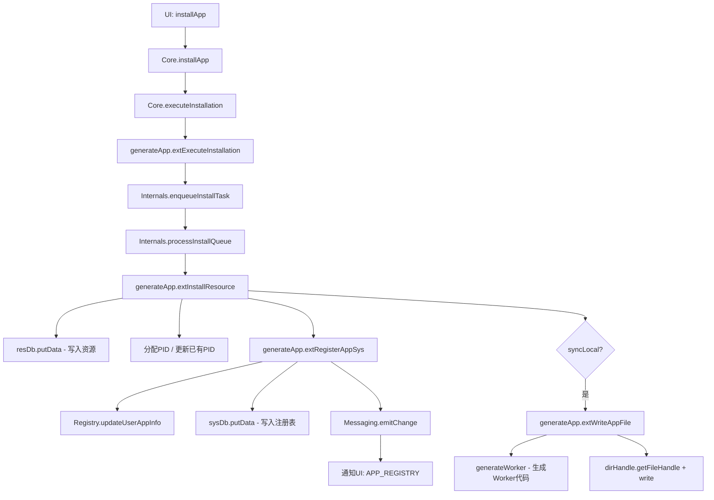

### 5.2 应用启动完整调用链

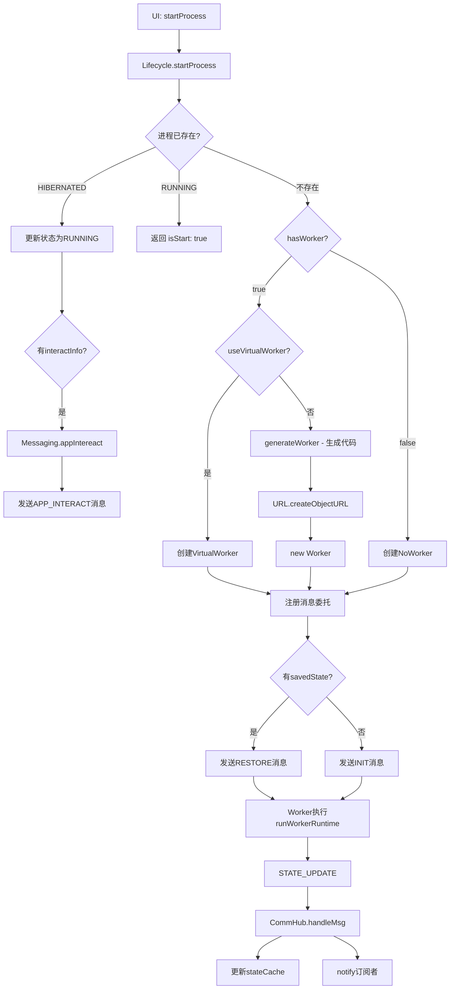

### 5.3 UI Action 分发链

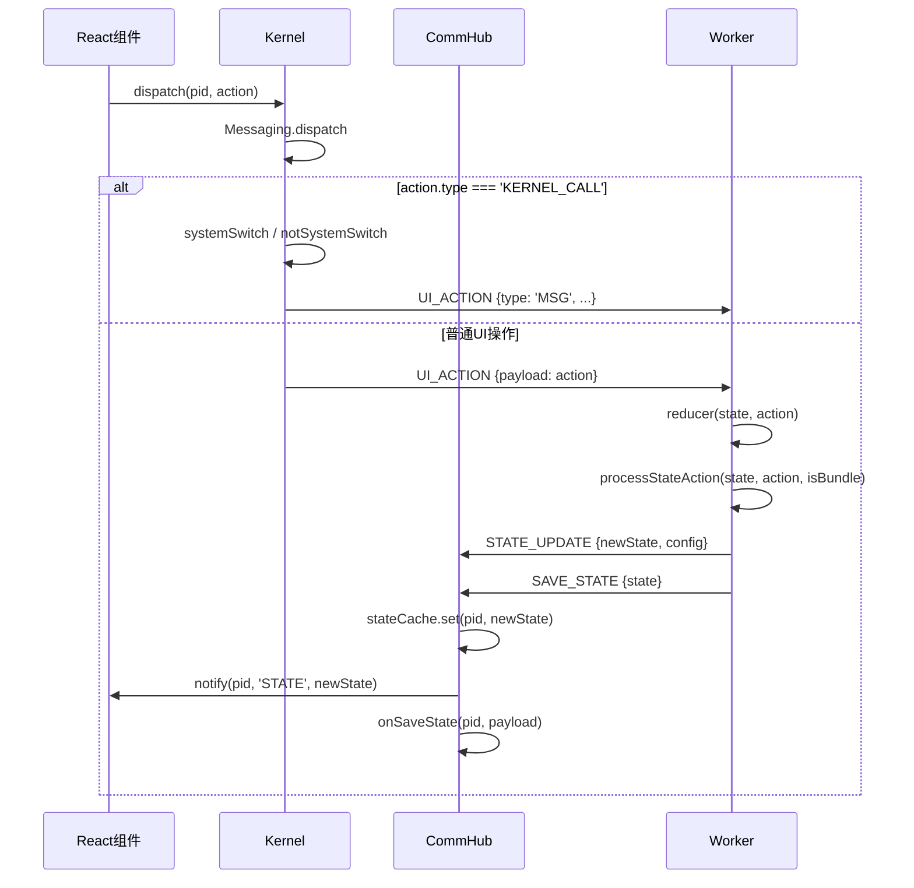

### 5.4 跨应用通信链

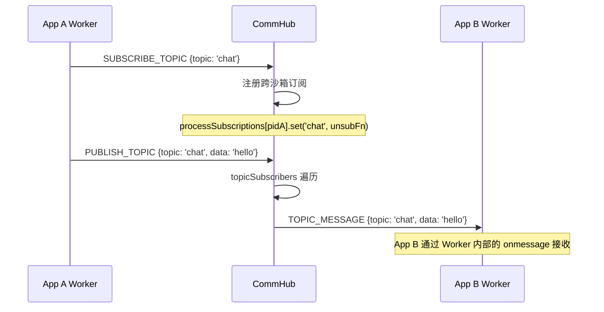

---

## 6. 数据模型

### 6.1 应用注册表记录 (appInfo)

```javascript
{
  pid: 'uuid',                      // 进程唯一标识
  [ENV_KEY_RESOURCE_ID]: 'res-id',   // 关联资源ID
  [ENV_KEY_NAME]: 'app-name',       // 应用名称
  handle: FileSystemFileHandle,      // 本地文件句柄（可能为null）
  savedState: {                     // 持久化状态
    app: { /* 应用内部状态 */ },
    window: { /* 窗口几何信息 */ }
  },
  status: 'INSTALLED' | 'RUNNING' | 'HIBERNATED',  // 应用状态
  isSystemApp: boolean,             // 是否为系统应用,实际并不参与SDK的分发,目前系统级别只会在preset_resources.jsx产生注册并内存判定
  [ENV_KEY_META_INFO]: {            // 元数据
    initialSize: { w: 500, h: 400 },
    version: '0.1',
    createdAt: 'ISO date',
    appType: 'system' | 'user',
    worker: true,                   // 是否使用Worker（false=纯前端）
    saveState: true,                // 关闭时是否保存状态
    syncLocal: true,               // 是否同步到本地文件
    blockEd: false,                 // 是否被屏蔽
    custom: {                       // 用户个性化配置
      autoStart: false,            // 开机自启
      position: { x, y },         // 窗口位置
      // ...
    }
  }
}
```

### 6.2 资源记录 (resource)

```javascript
{
  [ENV_KEY_RESOURCE_ID]: 'res-id',
  [ENV_KEY_NAME]: 'app-name',
  [ENV_KEY_IS_BUNDLE]: true/false,
  [ENV_KEY_CONTENT]: { /* 视图组件内容 */ },
  [ENV_KEY_LOGIC]: 'initialState = {}; function reducer(s) { return s; }',
  [ENV_KEY_META_INFO]: { /* 同上 */ }
}
```

### 6.3 三数据库架构

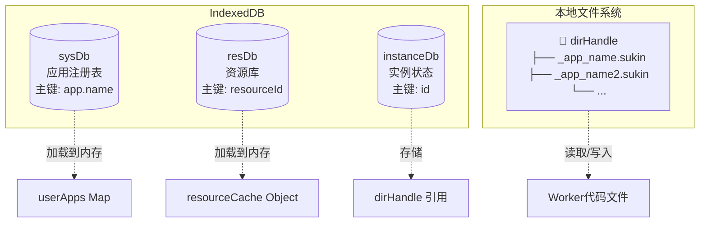

---

## 7. 文件结构

```
process/
├── kernel.js                 # Kernel 单例（公共 API + 子模块聚合）
├── commHub.js                # 通信枢纽（消息路由 + 状态缓存）
├── generateWorker.js          # Worker 代码生成器
├── workerDrive.js             # Worker 运行时引擎（inline 源码）
├── generateApp.js            # 应用安装/注册/删除/同步操作集
├── babelLoader.js            # Babel JSX 转译器
├── renderProcess.jsx         # 进程预览渲染器
├── renderWindow.js           # 窗口渲染器（compileSourceAsync + scopeCss）
├── indexDb.js                # 通用 IndexedDB 封装
├── styleSyncHub.js           # 样式同步枢纽（宿主 -> iframe）
└── kernelParts/
    ├── main.js               # 统一 re-export 所有子模块函数
    ├── cache.js              # Cache - 缓存管理
    ├── core.js               # Core - 核心业务
    ├── flags.js              # Flags - 标志位
    ├── instance.js           # Instance - 实例管理
    ├── internals.js          # Internals - 内部操作
    ├── lifecycle.js          # Lifecycle - 进程生命周期
    ├── messaging.js          # Messaging - 消息通信
    ├── registry.js           # Registry - 注册表
    ├── resourceAccess.js    # ResourceAccess - 资源访问
    └── settings.js           # Settings - 配置管理
```
