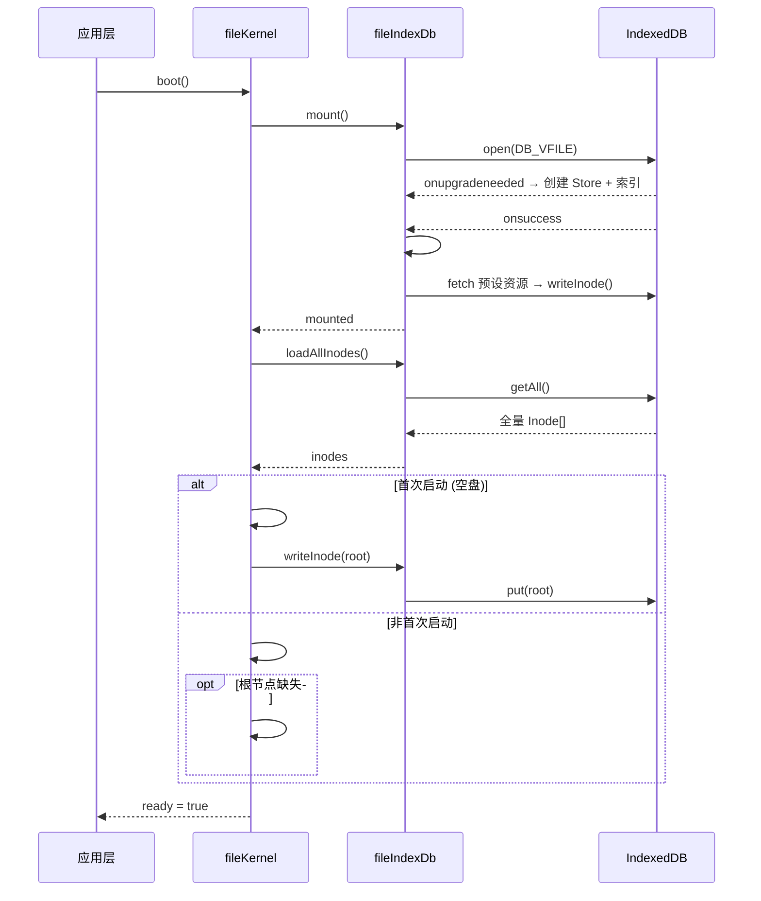
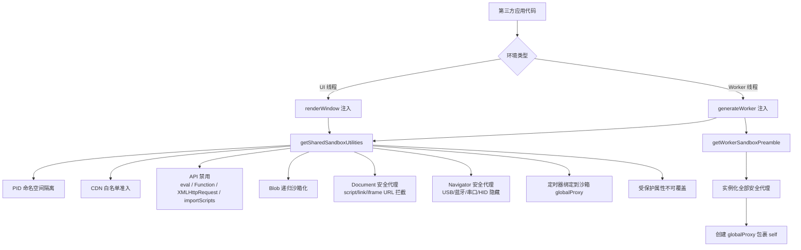
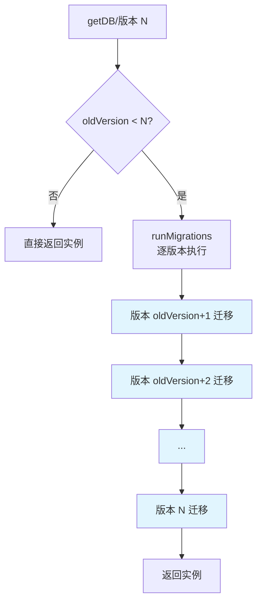
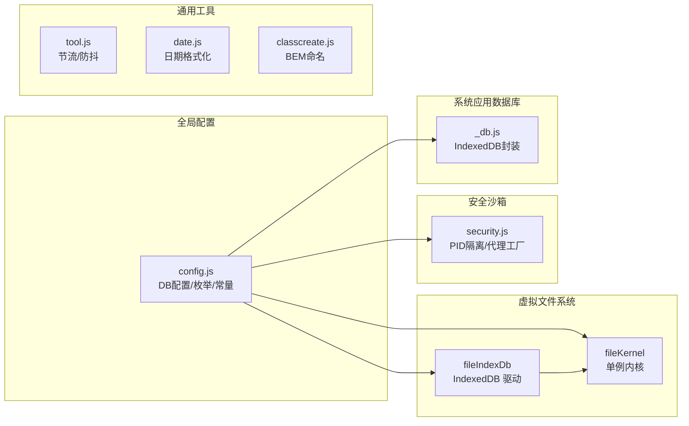

# 05 - 文件系统与工具模块

## 概述

SukinOS 的文件系统与工具模块由虚拟文件系统（VFS）、安全沙箱、全局配置、系统数据库及通用工具函数组成。这些底层模块为上层进程管理、应用加载和 UI 渲染提供持久化存储、命名空间隔离、环境变量契约和基础能力支撑。

---

## 1. 虚拟文件系统（VFS）

### 1.1 架构总览

VFS 采用 **内核-驱动** 两层架构：`fileKernel` 作为内存中的内核层管理文件树与事件分发，`fileIndexDb` 作为驱动层负责 IndexedDB 持久化。系统以**单例模式**导出内核实例。

```
┌─────────────────────────────────────────────────┐
│                  fileKernel（内核层）              │
│  ┌──────────┐  ┌───────────┐  ┌──────────────┐  │
│  │ inodeMap │  │ treeMap   │  │ EventTarget  │  │
│  │(内存镜像) │  │(目录树索引) │  │ (事件总线)    │  │
│  └────┬─────┘  └─────┬─────┘  └──────┬───────┘  │
│       └──────────────┼───────────────┘          │
│                      ▼                          │
│              fileIndexDb（驱动层）               │
│         ┌────────────────────────┐              │
│         │    IndexedDB          │              │
│         │  SUKIN_OS_VFS / files  │              │
│         └────────────────────────┘              │
└─────────────────────────────────────────────────┘
```

### 1.2 fileKernel（文件内核）

> **文件**: `src/sukinos/utils/file/fileKernel.js`

单例导出的虚拟文件系统内核，负责内存索引管理、CRUD 操作与事件分发。

#### 构造属性

| 属性 | 类型 | 说明 |
|------|------|------|
| `driver` | `fileIndexDb` | IndexedDB 持久化驱动实例 |
| `inodeMap` | `Map<id, Inode>` | 全部节点的内存镜像，id 为唯一键 |
| `treeMap` | `Map<parentId, Set<childId>>` | 目录树索引，快速查找子节点 |
| `events` | `EventTarget` | 变更事件总线 |
| `ready` | `boolean` | 文件系统就绪标记 |

#### 核心方法

| 方法 | 签名 | 说明 |
|------|------|------|
| `boot()` | `() => Promise<boolean>` | 挂载驱动 → 加载全量节点 → 构建内存索引 → 格式化磁盘(若为空) |
| `readdir()` | `(id: string) => Inode[]` | 列出目录内容，文件夹优先、按名称字母序排序 |
| `mkdir()` | `(parentId, name) => Promise<Inode>` | 在指定目录下创建子目录 |
| `writeFile()` | `(parentId, name, content) => Promise<Inode>` | 创建新文件并写入内容 |
| `readFile()` | `(id) => Promise<string>` | 读取文件内容（目录类型抛错） |
| `unlink()` | `(id) => Promise<void>` | 递归删除节点及所有子孙节点 |
| `rename()` | `(id, newName) => Promise<void>` | 重命名节点（同目录重名校验） |
| `updateContent()` | `(id, content) => Promise<boolean>` | 更新已有文件的内容和修改时间 |
| `getPath()` | `(id) => Inode[]` | 获取从根到目标节点的完整路径（面包屑） |
| `watch()` | `(callback) => () => void` | 注册文件系统变更监听器，返回取消监听函数 |

#### Inode 数据结构

```typescript
interface Inode {
  id: string         // UUID 标识
  parentId: string   // 父节点 ID（根节点为 null）
  name: string       // 文件/目录名
  type: FileType     // 1=文件, 2=目录
  size: number       // 内容长度
  content: string    // 文件内容（目录为 null）
  ctime: number      // 创建时间戳
  mtime: number      // 修改时间戳
}
```

#### 内部机制

- **`#syncMemory(inode)`** — 将节点写入 `inodeMap` 并更新 `treeMap` 的父子关系
- **`#removeFromMemory(id)`** — 从 `inodeMap` 和 `treeMap` 中移除节点及其子树记录
- **`#formatDisk()`** — 创建根目录节点（固定 ID 为 `'root'`）
- **`#createEntry(parentId, name, type, content)`** — 统一创建入口，含父目录校验、重名检查、UUID 生成、持久化和事件触发
- **`#emitChange(dirId)`** — 通过 `EventTarget` 派发 `'change'` 事件，携带受影响目录 ID

### 1.3 fileIndexDb（持久化驱动）

> **文件**: `src/sukinos/utils/file/fileIndexDb.js`

基于 IndexedDB 的 VFS 持久化驱动，封装底层事务操作并自动挂载预设系统资源。

#### 构造属性

| 属性 | 类型 | 说明 |
|------|------|------|
| `db` | `IDBDatabase \| null` | IndexedDB 数据库实例 |

#### 方法列表

| 方法 | 签名 | 说明 |
|------|------|------|
| `mount()` | `() => Promise<boolean>` | 打开/创建数据库，按 `DB_VFILE` 配置自动创建 ObjectStore 和索引，完成后初始化预设系统资源 |
| `loadAllInodes()` | `() => Promise<Inode[]>` | 读取全部节点，供内核构建内存文件树 |
| `writeInode()` | `(inode) => Promise<id>` | 写入或更新节点，返回节点 ID |
| `readInode()` | `(id) => Promise<Inode>` | 根据 ID 读取单个节点 |
| `unlinkInode()` | `(id) => Promise<boolean>` | 根据 ID 删除节点 |
| `count()` | `() => Promise<number>` | 获取当前存储的文件总数 |
| `exists()` | `(parentId, name) => Promise<boolean>` | 利用 `parent_name_idx` 复合索引快速判断同级目录下是否已有同名文件 |

#### 内部机制

- **`#tx(mode)`** — 事务辅助函数，创建指定模式（`readonly` / `readwrite`）的 ObjectStore 事务
- **`#blobToDataURL(blob)`** — 将 Blob 转为 Base64 DataURL，保持与 CustomApp 存储格式一致
- **`#initSystemResources()`** — 挂载成功后自动检查 `preSystemFileData` 中的预设资源，不存在则从 `public` 目录 fetch 并以 Base64 写入根目录

### 1.4 VFS 启动调用链



---

## 2. 安全沙箱（security.js）

> **文件**: `src/sukinos/utils/security.js`

安全模块提供多层沙箱隔离机制，确保第三方应用代码无法越权访问宿主环境资源。核心策略包括：PID 命名空间隔离、CDN 白名单准入、API 禁用/代理、递归 Worker 沙箱化。

### 2.1 通用安全函数

| 函数 | 签名 | 说明 |
|------|------|------|
| `generateShortSeed` | `(length?, seed?, isNumber?) => string` | 基于加密 API 的随机种子生成器，优先使用 `crypto.getRandomValues`，降级为 `Math.random` |
| `safeDeepFreeze` | `(obj) => obj` | 安全深度冻结对象，自动跳过 Proxy、DOM 节点、window/document 等不可冻结对象 |
| `createReadonlySDKProxy` | `(AppSDK) => Proxy` | 创建严格的只读 SDK 代理，对 `React`、`Components`、`hooks` 外的所有嵌套对象添加写保护 |

### 2.2 沙箱代理工厂

| 函数 | 签名 | 说明 |
|------|------|------|
| `createSecureFetch` | `(originalFetch, pid) => Function` | 高阶 Fetch 拦截器，自动注入 `x-kernel-process-id` 请求头 |
| `createStorageProxy` | `(storage, pid) => Proxy` | PID 命名空间的 Storage 代理（localStorage / sessionStorage），所有键自动添加 `pid-{pid}_` 前缀 |
| `createIndexedDBProxy` | `(indexedDB, pid) => Proxy` | PID 命名空间的 IndexedDB 代理，数据库名自动添加 `pid-{pid}_` 前缀 |
| `clearSandboxStorageByPid` | `(pid) => Promise<void>` | 清理指定 PID 产生的全部存储数据（localStorage、sessionStorage、IndexedDB） |

### 2.3 沙箱环境代码注入

| 函数 | 签名 | 说明 |
|------|------|------|
| `getSharedSandboxUtilities` | `(pid, storageProxySource, indexedDBProxySource, secureFetchSource) => string` | 生成共享沙箱规约代码，注入 `_PID`、`_TRUSTED_CDN`、URL 准入检查、安全代理工厂、Document/Navigator 安全代理、Blob 递归沙箱化、定时器绑定、API 禁用等 |
| `getWorkerSandboxPreamble` | `(pid, storageProxySource, indexedDBProxySource, secureFetchSource) => string` | Worker 线程专用完整 Proxy 沙箱前导代码，基于共享规约实例化所有安全代理并包裹全局对象 |

### 2.4 沙箱安全策略详解



#### PID 命名空间隔离

所有存储操作通过 Proxy 自动添加 `pid-{pid}_` 前缀，实现不同进程的数据隔离：

```
// 应用 A (pid=abc123) 写入
localStorage.setItem('user', 'Alice')
// 实际存储键名: pid-abc123_user

// 应用 B (pid=def456) 读取同名键
localStorage.getItem('user')
// 实际读取键名: pid-def456_user → 返回 null
```

#### 禁用 API

| API | 处理方式 |
|-----|---------|
| `eval` / `Function` | 调用时抛出 Security Error |
| `XMLHttpRequest` | 调用时抛出 Security Error |
| `importScripts` | 调用时抛出 Security Error |
| `navigator.serviceWorker.getRegistration` 等 | 调用时抛出 Security Error |
| `navigator.usb / bluetooth / serial / hid` | 返回 `undefined` |

---

## 3. 全局配置（config.js）

> **文件**: `src/sukinos/utils/config.js`

系统全局配置中心，定义数据模型契约、数据库 Schema、文件类型枚举、商店 API 路径、CDN 白名单、预置系统文件和应用自定义配置等。

### 3.1 核心环境变量键

6 个常量构成应用数据模型的字段契约，驱动层和 Worker 解析逻辑严格依赖这些常量：

| 常量 | 值 | 角色 |
|------|----|------|
| `ENV_KEY_RESOURCE_ID` | `'resourceId'` | 主键，资源数据库和内存缓存唯一键 |
| `ENV_KEY_NAME` | `'name'` | 注册表主键，应用名称与物理文件名标识 |
| `ENV_KEY_IS_BUNDLE` | `'isBundle'` | 模块化标记，决定是否注入 Router 导航 |
| `ENV_KEY_LOGIC` | `'logic'` | 业务逻辑纯净代码（Worker JS） |
| `ENV_KEY_CONTENT` | `'content'` | 界面视图源码（React 组件树） |
| `ENV_KEY_META_INFO` | `'metaInfo'` | 操作系统元数据（图标、窗口尺寸等） |

### 3.2 数据库配置

| 配置项 | 数据库名 | Store 名 | 主键 | 用途 |
|--------|----------|----------|------|------|
| `DB_RES` | `SukinOS_Res` | `ui_bundles` | `resourceId` | 应用资源存储 |
| `DB_SYS` | `SukinOS_Sys` | `registry` | `name` | 用户应用注册表 |
| `DB_VFILE` | `SUKIN_OS_VFS` | `files` | `id` | 虚拟文件系统 |
| `DB_STATE_INSTANCE` | `SUKIN_STATE_INSTANCE` | `instance` | `id` | 有状态实例存储（如文件句柄） |

#### DB_VFILE 索引详情

| 索引名 | keyPath | unique | 用途 |
|--------|---------|--------|------|
| `parentId` | `parentId` | false | 按父目录查询 |
| `parent_name_idx` | `['parentId', 'name'] | true | 同级目录唯一性校验 |

### 3.3 枚举与常量

#### FileType

```javascript
const FileType = {
  FILE: 1,       // 文件
  DIRECTORY: 2   // 目录
}
```

#### 系统数据库名集合

```javascript
const SYSTEM_FS_NAME = ['SUKIN_OS_VFS', 'SukinOS_Sys', 'SukinOS_Res', 'SUKIN_STATE_INSTANCE']
```

#### 窗口尺寸

```javascript
const DefaultWindow = { x: 100, y: 100, w: 500, h: 400 }
```

`WindowSize` 是一个带防抖的运行时缓存对象，监听 `resize` 和 `orientationchange` 事件自动更新，最小更新间隔 1 秒，变化超过 1px 才刷新。

### 3.4 商店 API 路径

| 常量 | 路径 | 用途 |
|------|------|------|
| `SUKINOS_STORE_REMOTE_TOTAL` | `{base}/sukinos/app/appList` | 获取应用列表 |
| `SUKINOS_STORE_REMOTE_UPLOAD` | `{base}/sukinos/app/upload` | 上传应用 |
| `SUKINOS_STORE_REMOTE_UPDATE` | `{base}/sukinos/app/update` | 更新应用 |
| `SUKINOS_STORE_REMOTE_CHECK_UPDATES` | `{base}/sukinos/app/checkUpdates` | 检查更新 |
| `SUKINOS_STORE_REMOTE_SEARCH` | `{base}/sukinos/app/searchApp` | 搜索应用 |
| `SUKINOS_STORE_REMOTE_MY_UPLOAD` | `{base}/sukinos/app/myUpload` | 我上传的应用 |
| `SUKINOS_STORE_REMOTE_DELETE` | `{base}/sukinos/app/delete` | 删除应用 |

### 3.5 CDN 白名单

```javascript
const TRUSTED_CDN_WHITELIST = [
  'https://unpkg.com/',
  'https://cdn.jsdelivr.net/',
  'https://cdn.bytedance.com/',
  'https://lf3-cdn-tos.bytecdntp.com/cdn/',
  'https://cdn.bootcdn.net/',
  'https://cdn.bootcss.com/',
  'https://cdn.staticfile.org/',
  'https://g.alicdn.com/',
  'https://npm.elemecdn.com/',
]
```

### 3.6 预置系统文件

```javascript
const preSystemFileData = [
  { id: 'system_1jpg',    path: '/img/index/1.jpg' },
  { id: 'system_2jpg',    path: '/img/index/2.jpg' },
  { id: 'system_3jpg',    path: '/img/3.jpg' },
  { id: 'system_4jpeg',   path: '/img/4.jpeg' },
  { id: 'system_2mp4',    path: '/video/2.mp4' },
]
```

首次挂载 VFS 时，`fileIndexDb` 会自动从 `public` 目录 fetch 这些资源并以 Base64 写入根目录。

### 3.7 应用自定义配置

```javascript
const appCustomMapper = {
  hasShortcut: '创建桌面图标',
  blockEd: '固定至状态栏',
  isFullScreen: '默认全屏启动',
  autoStart: '开机自动运行',
  allowResize: '允许调整窗口大小',
  showInLauncher: '在启动器中显示',
}

const appCustom = {
  hasShortcut: true,
  blockEd: false,
  isFullScreen: true,
  autoStart: false,
  allowResize: true,
  showInLauncher: false,
}
```

---

## 4. 系统应用数据库（\_db.js）

> **文件**: `src/sukinos/utils/_db.js`

为系统内置应用（画板、思维导图、表格）提供持久化存储的 IndexedDB 封装模块。支持版本迁移策略。

### 4.1 表结构

| Store 常量 | 表名 | 主键 | 说明 |
|------------|------|------|------|
| `STORES.BOARDS` | `sys-drawBoard_boards` | `id` | 画板数据 |
| `STORES.MINDMAPS` | `sys-drawBoard_mindmaps` | `id` | 思维导图数据 |
| `STORES.SHEET` | `sys-sheet_states` | `id` | 表格状态数据 |

### 4.2 API 列表

| 方法 | 签名 | 说明 |
|------|------|------|
| `getDB()` | `(version?) => Promise<IDBDatabase>` | 获取单例数据库实例 |
| `initDatabase()` | `(version?) => Promise<IDBDatabase>` | 初始化数据库（同 `getDB`） |
| `closeDB()` | `() => void` | 关闭数据库连接并清空实例 |
| `getStore()` | `(storeName) => StoreAPI` | 获取指定表的 CRUD 操作接口 |

### 4.3 StoreAPI 接口

`getStore()` 返回一个包含以下异步方法的对象：

| 方法 | 说明 |
|------|------|
| `get(id)` | 根据 ID 获取单条数据 |
| `put(data)` | 新增或更新数据 |
| `getAll()` | 获取表内所有数据 |
| `delete(id)` | 根据 ID 删除数据 |
| `clear()` | 清空整个表 |

### 4.4 版本迁移策略

数据库使用 `migrations` 对象管理版本迁移，每次修改表结构时递增 `CURRENT_VERSION` 并在 `migrations` 中添加对应版本号的迁移函数。迁移按版本号顺序逐个执行，仅在首次打开新版本数据库时触发。



---

## 5. 通用工具函数

### 5.1 节流与防抖（tool.js）

> **文件**: `src/sukinos/utils/tool.js`

| 函数 | 签名 | 说明 |
|------|------|------|
| `throlle` | `(fn, delay=100) => Function` | 节流函数，在 delay 时间内只执行一次 |
| `debounce` | `(fn, delay) => Function` | 防抖函数，连续触发时只执行最后一次 |

> **注意**: `throlle` 为原始拼写（缺少 `t`），使用时需注意函数名。

### 5.2 日期格式化（date.js）

> **文件**: `src/sukinos/utils/date.js`

| 函数 | 签名 | 返回格式 | 示例 |
|------|------|----------|------|
| `formatTime` | `() => string` | `YYYY-MM-DD HH:mm:ss` | `2025-12-27 16:55:52` |
| `formatTimeSlash` | `() => string` | `YYYY/MM/DD HH:mm:ss` | `2025/12/27 16:55:52` |

底层使用 `toLocaleString('sv')` 获取瑞典格式（天然 ISO 格式），再做字符替换。

### 5.3 BEM 命名工具（classcreate.js）

> **文件**: `src/sukinos/utils/classcreate.js`

| 函数 | 签名 | 说明 |
|------|------|------|
| `createNamespace` | `(name) => BEMAPI` | 创建以 `su-{name}` 为前缀的 BEM 命名空间 |

`createNamespace` 返回的 BEMAPI 包含 7 个命名生成函数和 1 个状态函数：

| 方法 | 调用示例 | 输出 |
|------|----------|------|
| `b(suffix?)` | `b('primary')` | `su-name-primary` |
| `e(element)` | `e('icon')` | `su-name__icon` |
| `m(modifier)` | `m('disabled')` | `su-name--disabled` |
| `be(suffix, element)` | `be('primary', 'icon')` | `su-name-primary__icon` |
| `bm(suffix, modifier)` | `bm('primary', 'disabled')` | `su-name-primary--disabled` |
| `em(element, modifier)` | `em('icon', 'large')` | `su-name__icon--large` |
| `bem(suffix, element, modifier)` | `bem('primary', 'icon', 'large')` | `su-name-primary__icon--large` |
| `is(name, state)` | `is('active', true)` | `is-active` |

---

## 6. 模块关系总览


