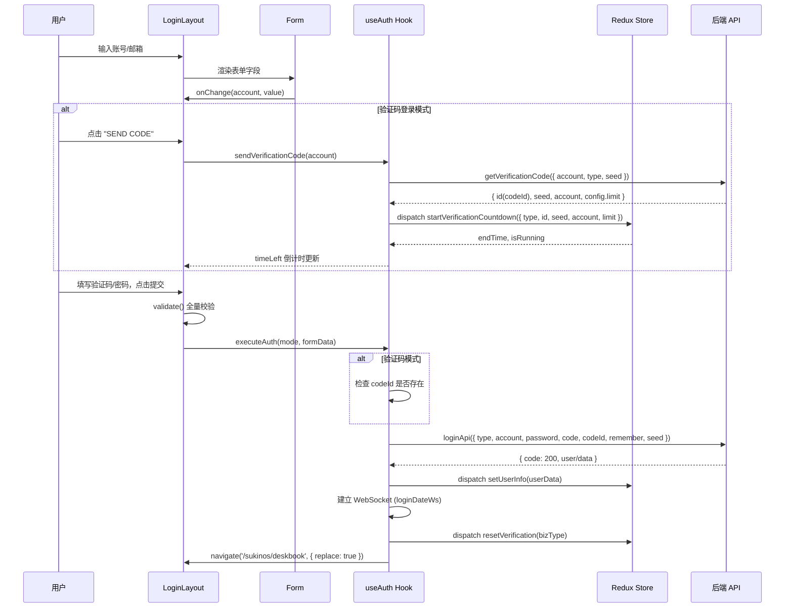
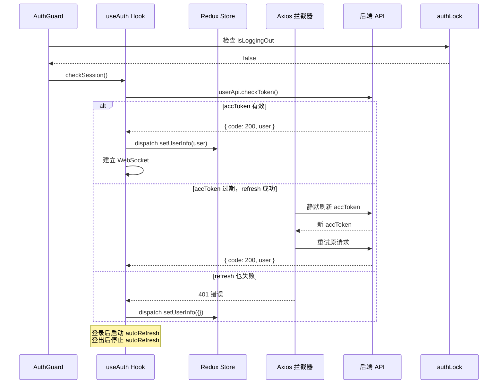
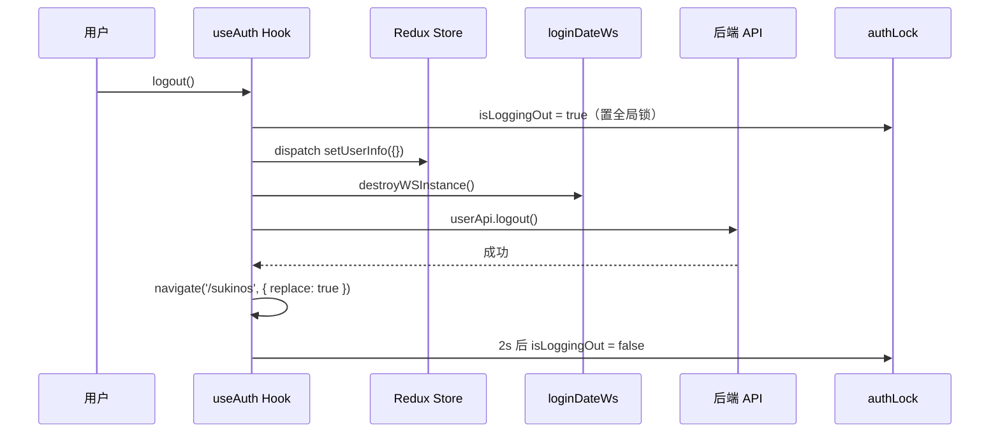
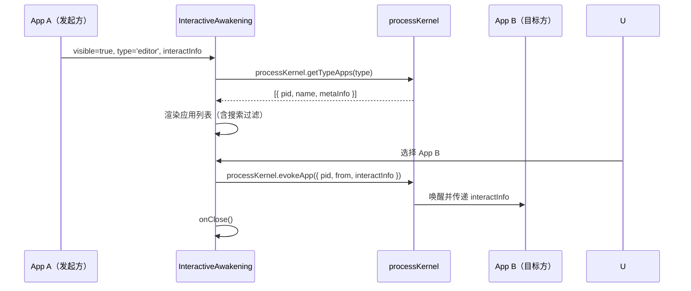
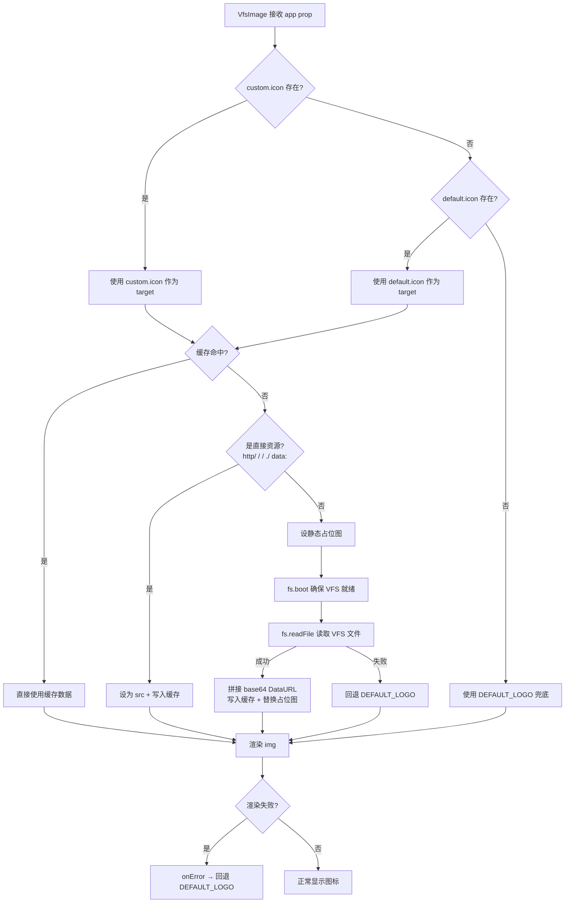
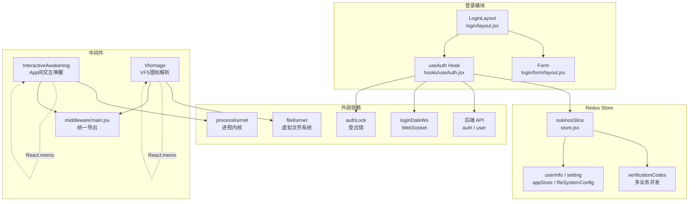

# 中间件、Redux Store 与登录模块

> 本文档涵盖 SukinOS 的中间件层（Middleware）、全局 Redux Store 状态管理，以及完整的登录认证模块。

---

## 目录

- [1. Redux Store 状态管理 (`store.jsx`)](#1-redux-store-状态管理)
- [2. 登录模块 (`login/`)](#2-登录模块)
- [3. 认证 Hook (`useAuth`)](#3-认证-hook-useauth)
- [4. 中间件层 (`middleware/`)](#4-中间件层)
- [5. 架构调用链](#5-架构调用链)

---

## 1. Redux Store 状态管理

**文件**: `src/sukinos/store.jsx`

### 1.1 切片概览

| 切片名称 | 说明 |
|---------|------|
| `sukinos` | SukinOS 全局状态切片，由 `createSlice` 创建 |

### 1.2 初始状态结构

```
initialState
├── userInfo: {}                  // 用户信息（登录后由后端数据填充）
├── theme: ''                     // 主题标识
├── ui: {}                        // UI 通用状态
├── assistant
│   └── verificationCodes: {}     // 验证码状态（支持多业务并发，按 type 索引）
├── setting: { isDisplay: true }  // 系统整体设置
├── appStore
│   ├── storePath: {}             // 商店 API 路径（7 个 URL）
│   │   ├── baseUrl
│   │   ├── listUrl
│   │   ├── uploadUrl
│   │   ├── checkUpdatesUrl
│   │   ├── searchUrl
│   │   ├── myUploadUrl
│   │   └── deleteUrl
│   └── generateApp: {}           // 应用生成配置
│       ├── singleIframe: false
│       ├── truthAllApp: false
│       └── useVirtualWorker: false
└── fileSystemConfig
    └── isPrivate: true           // 文件系统是否私有模式
```

### 1.3 Reducers

| Reducer | Payload | 说明 |
|---------|---------|------|
| `startVerificationCountdown` | `{ type, id, seed, account, limit }` | 启动验证码倒计时，支持动态频率限制（`limit` 秒） |
| `resetVerification` | `type` (string) | 清除指定业务类型的验证码状态 |
| `updateSeting` | `{ key, value }` | 更新系统设置项 |
| `setUserInfo` | `payload` (object) | 设置/更新用户信息 |
| `setStorePath` | `{ key, value }` | 设置商店 API 路径（空字符串会被忽略） |
| `resetStorePath` | `key?` (string) | 重置商店路径：传 key 重置单个，不传则重置全部 |
| `setFileSystemConfig` | `{ key, value }` | 设置文件系统配置 |
| `setGenerateApp` | `{ key, value }` | 设置应用生成配置 |

**验证码并发模型**：`assistant.verificationCodes` 是一个以业务类型（如 `'login'`、`'recoverPassword'`）为键的对象，支持多个业务同时拥有独立的验证码倒计时，互不干扰。

### 1.4 Selectors

| Selector | 返回值 | 说明 |
|----------|--------|------|
| `selectSukinOs(store)` | SukinOS 状态对象 | 基础选择器，带 fallback 到 `initialState` |
| `selectorSetting` | `setting` 对象 | 系统设置 |
| `selectorUserInfo` | `userInfo` 对象 | 当前用户信息 |
| `selectorStoreSettingStorePath` | `storePath` 对象 | 商店 API 路径配置 |
| `selectGenerateApp` | `generateApp` 对象 | 应用生成配置 |
| `selectFileSystemConfig` | `fileSystemConfig` 对象 | 文件系统配置 |
| `selectVerificationData(type)` | `{ codeId, seed, account, endTime, isRunning }` | 按 type 获取特定业务的验证码数据 |

### 1.5 导出

```js
// Actions
export const sukinOsActions = sukinOsSlice.actions;

// Reducer（默认导出，供 configureStore 使用）
export default sukinOsSlice.reducer;
```

---

## 2. 登录模块

**目录**: `src/sukinos/login/`

### 2.1 文件结构

```
login/
├── layout.jsx          // 登录页主布局与业务逻辑
├── style.module.css    // 登录页样式
└── form/
    ├── layout.jsx      // 表单渲染组件
    └── style.module.css
```

### 2.2 登录页主布局 (`layout.jsx`)

**核心职责**：管理登录流程的 UI 状态、表单校验、业务模式切换。

#### 业务模式

| 模式 | 说明 | 表单字段 |
|------|------|---------|
| `code` | 验证码登录（默认） | `account`（邮箱） + `code`（验证码） |
| `account` | 账号密码登录 | `account`（账号/邮箱） + `password` |
| `recoverPassword` | 重置密码 | `account`（邮箱） + `code`（验证码） + `password`（新密码） |

#### 表单校验规则

```js
LOGIN_CONFIG.fields = {
  account: [
    { name: 'account', rules: { required: true } },
    { name: 'password', rules: { required: true, minLength: 6 } }
  ],
  code: [
    { name: 'account', rules: { required: true, pattern: /手机号|邮箱/ } },
    { name: 'code', rules: { required: true, maxLength: 6 } }
  ],
  recoverPassword: [
    { name: 'account', rules: { required: true, pattern: /手机号|邮箱/ } },
    { name: 'code', rules: { required: true, maxLength: 6 } },
    { name: 'password', rules: { required: true, minLength: 6 } }
  ]
}
```

#### 全局缓存机制

登录组件使用模块级 `globalCachedState` 对象缓存状态，避免弹窗关闭（组件卸载）再打开时数据丢失：

```js
const globalCachedState = {
  activeMode: 'code',
  formData: {},
  remember: false
};
```

所有状态变更（模式切换、表单输入、"记住我"开关）都会同步写入此缓存对象。

#### 子组件

| 组件 | 说明 |
|------|------|
| `Actions` | 显示"记住我"复选框和模式切换链接（验证码登录 / 账号密码登录） |
| `FooterLinks` | "忘记密码?" / "返回登录" 链接 |
| `Divider` | "其他方式登录" 分割线 |
| `SocialButtons` | 第三方登录按钮（当前已注释） |

#### 提交流程

1. 用户点击提交按钮，触发 `onSubmit`
2. `validate()` 执行全量校验
3. 校验通过后调用 `executeAuth(activeMode, { ...formData, remember })`
4. 登录成功后由 `useAuth` 自动跳转至 `/sukinos/deskbook`

### 2.3 表单组件 (`form/layout.jsx`)

纯展示型组件，根据 `fields` 配置动态渲染表单项。支持：

- **密码字段**：眼睛图标切换明文/密文显示
- **验证码字段**：显示发送验证码按钮（含倒计时）
- **普通文本字段**：输入内容后显示清除按钮
- **错误提示**：校验失败时在输入框下方显示红色错误信息

---

## 3. 认证 Hook (`useAuth`)

**文件**: `src/sukinos/hooks/useAuth.jsx`

### 3.1 概述

`useAuth` 是 SukinOS 认证系统的核心 Hook，封装了验证码发送、登录/重置密码、会话校验、退出登录等全部认证逻辑。

### 3.2 接口

```js
export const useAuth = (bizType = 'login') => { ... }
```

**参数**：
- `bizType`：业务类型，支持 `'login'` 或 `'recoverPassword'`，决定验证码状态在 Redux 中的隔离键。

**返回值**：

| 属性 | 类型 | 说明 |
|------|------|------|
| `userInfo` | `object` | 当前用户信息 |
| `isAuthenticated` | `boolean` | 是否已认证（`!!userInfo.id`） |
| `isCheckingAuth` | `boolean` | 是否正在校验认证（防止页面闪烁） |
| `userRole` | `string` | 用户角色（默认 `'guest'`） |
| `timeLeft` | `number` | 验证码倒计时剩余秒数 |
| `isSending` | `boolean` | 是否正在发送验证码 |
| `sendVerificationCode` | `(account, message?) => Promise<boolean>` | 发送验证码 |
| `executeAuth` | `(mode, formData, onSuccess?) => Promise<boolean>` | 执行认证 |
| `checkSession` | `() => Promise<boolean>` | 校验 Session（双 Token） |
| `logout` | `() => Promise<void>` | 退出登录 |

### 3.3 验证码倒计时

- 从 Redux `selectVerificationData(bizType)` 读取 `endTime` 和 `isRunning`
- 使用 `useEffect` + `setInterval` 每秒计算剩余时间
- 倒计时结束自动调用 `resetVerification` 清除状态
- `timeLeft` 传给 UI 显示倒计时，`timeLeft > 0` 时禁用发送按钮

### 3.4 发送验证码 (`sendVerificationCode`)

```
1. 检查防重入（timeLeft > 0 || isSending）
2. 调用 asistantApi.getVerificationCode({ account, type, seed, message })
3. 成功后 dispatch startVerificationCountdown，写入 codeId/seed/account/limit
4. 失败时弹窗提示
```

**Seed 机制**：前端通过 `generateShortSeed()` 生成短随机种子，后端原样返回，用于后续提交时做关联验证。

### 3.5 执行认证 (`executeAuth`)

```
1. 验证码模式必须已有 codeId，否则拒绝
2. 构建 params: { type, account, password, code, codeId, remember, seed }
3. 调用 loginApi(params)
4. 登录成功 → dispatch setUserInfo → 建立 WebSocket → 重置验证码 → 跳转桌面
5. 重置密码成功 → 仅重置验证码，不跳转
```

### 3.6 会话校验 (`checkSession`)

- 检查全局登出锁 `authLock.isLoggingOut`，登出中直接返回 `false`
- 向后端发起 Token 校验（双 Token 机制：accToken 过期时自动 refresh）
- 校验成功 → 更新 `userInfo`，建立 WebSocket
- 校验失败 → 清空 `userInfo`

### 3.7 退出登录 (`logout`)

```
1. 置全局登出锁 authLock.isLoggingOut = true
2. 清空 Redux userInfo
3. 销毁 WebSocket 连接
4. 请求后端登出接口
5. 跳转至 /sukinos（replace）
6. 延迟 2 秒释放登出锁（等待路由跳转完成）
```

### 3.8 自动 Token 刷新

`useAuth` 内部集成了 Token 自动刷新的生命周期管理：
- 用户登录成功后自动调用 `startAutoRefresh()` 启动全局刷新定时器
- 用户退出登录后自动调用 `stopAutoRefresh()` 停止刷新
- 组件卸载时自动清理

---

## 4. 中间件层

**目录**: `src/sukinos/middleware/`

> 本文档仅涵盖**前端**中间件。后端中间件链（`RoutePermissionMiddleware` → `StaticAuthMiddleware` → `CORSMiddleware`）及全局路由权限检查在 `00-overview.md` 第 6 章中描述。

### 4.1 文件结构

```
middleware/
├── main.jsx                        // 统一导出入口
├── InteractiveAwakening/
│   ├── main.jsx                    // App 间交互唤醒组件
│   └── style.module.css
└── VfsImage/
    ├── main.jsx                    // VFS 图标解析组件
    └── style.module.css
```

**统一导出**（`middleware/main.jsx`）：

```js
export * from './VfsImage/main';
export * from './InteractiveAwakening/main';
```

### 4.2 InteractiveAwakening - 交互唤醒

**文件**: `src/sukinos/middleware/InteractiveAwakening/main.jsx`

**核心职责**：当用户在 App A 中触发某个需要特定类型应用处理的行为时，弹出应用选择面板，让用户选择一个兼容的 App 来执行该操作。

#### Props

| 属性 | 类型 | 默认值 | 说明 |
|------|------|--------|------|
| `visible` | `boolean` | - | 是否显示 |
| `type` | `string` | `'editor'` | 行为类别（如 `editor`） |
| `title` | `string` | `'选择交互应用'` | 弹窗标题 |
| `description` | `string` | `'请选择一个程序来执行此操作'` | 弹窗描述 |
| `interactInfo` | `object` | - | 传递给目标应用的交互信息 |
| `from` | `string` | `'system'` | 唤醒来源标识 |
| `onClose` | `function` | - | 关闭回调 |

#### 工作流程

1. 通过 `processKernel.getTypeApps(type)` 获取当前类型下所有已注册应用
2. 提取应用基本信息（`pid`、`name`、`icon`、`description`）
3. 支持搜索过滤（按名称和描述匹配）
4. 用户点击选择后，调用 `processKernel.evokeApp({ pid, from, interactInfo })` 唤醒目标应用
5. 唤醒完成后自动关闭弹窗

#### UI 结构

```
┌─────────────────────────────────────┐
│ 标题                    [X] 关闭     │
│ 描述文字                            │
├─────────────────────────────────────┤
│ [🔍 搜索可用应用...]                │
├─────────────────────────────────────┤
│ ┌─────┐ ┌─────┐ ┌─────┐           │
│ │ App │ │ App │ │ App │           │
│ │  1  │ │  2  │ │  3  │  ...      │
│ └─────┘ └─────┘ └─────┘           │
├─────────────────────────────────────┤
│ 行为类别: editor     交互总线       │
└─────────────────────────────────────┘
```

组件使用 `React.memo` 包裹，避免不必要的重渲染。

### 4.3 VfsImage - VFS 图标解析

**文件**: `src/sukinos/middleware/VfsImage/main.jsx`

**核心职责**：从应用的 `metaInfo` 中解析图标，支持直接 URL、静态路径和 VFS 虚拟文件系统 ID 三种资源来源，并内置全局内存缓存池。

#### Props

| 属性 | 类型 | 说明 |
|------|------|------|
| `app` | `object` | 应用对象，需包含 `metaInfo` |
| `className` | `string` | CSS 类名 |
| `style` | `object` | 行内样式 |

#### 图标解析优先级

```
metaInfo.custom.icon  →  metaInfo.icon  →  DEFAULT_LOGO（兜底）
```

#### 资源判定策略

```
1. 缓存命中 → 直接使用缓存数据（Map 查找，O(1)）
2. 直接资源（http/ / / ./ data:）→ 直接设为 src，同时写入缓存
3. VFS ID →
   a. 先设置静态占位图（优先用 defaultIcon，否则用 DEFAULT_LOGO）
   b. 确保 fs 就绪（fs.boot()）
   c. 调用 fs.readFile(vfsId) 读取虚拟文件
   d. 拼接为 data:image/png;base64,... 格式
   e. 写入缓存，替换占位图
   f. 读取失败 → 回退到 DEFAULT_LOGO
```

#### 全局缓存池

```js
const vfsImageCache = new Map();
```

模块级单例缓存，所有 `VfsImage` 实例共享。VFS 读取是异步且较慢的操作，缓存可避免相同图标重复读取。

#### 容错机制

- `onError` 事件：图片渲染失败（裂图）时自动回退到 `DEFAULT_LOGO`
- `isMounted` 守卫：`useEffect` cleanup 中设 `false`，防止组件卸载后异步回调更新状态
- `resolveCount`：追踪解析次数，用于调试日志

组件使用 `React.memo` 包裹。

---

## 5. 后端三层权限控制机制

> 后端中间件链 + 装饰器 + 依赖注入构成三层独立防线，详见 `00-overview.md` 第 6 章。

### 5.1 三层关系

| 层级 | 实现 | 作用范围 | 检查依据 | 拦截结果 |
|---|---|---|---|---|
| **L1 配置驱动层** | `RoutePermissionMiddleware` | 所有 API 路由 | `D_SystemConfig` 的 `system_api_route_permission` | `403` |
| **L2 代码声明层** | `@RequireRoot` / `@RequirePermission` / `@RequireRole` | 加了装饰器的路由 | `user.root` / `user.permission.role` / `user.permission.keys` | `403` |
| **L3 身份认证层** | `Depends(verify_auth())` | 路由参数级 | JWT Cookie（Access + Refresh Token） | `401` |

### 5.2 `_auto` 机制

L1 中间件的路由权限配置中有一个关键标记 `_auto`：

| 阶段 | `_auto` 值 | 中间件行为 |
|---|---|---|
| 新接口启动自动注册 | `true` | 放行（管理员没配过规则，不误杀） |
| 管理员通过面板配置后 | 被移除 | 严格按 `allowed_roles` / `allowed_users` 检查 |
| 受保护路由 (`/system/permission/`) | `_locked: true` | 仅 root，面板上不可修改 |

### 5.3 完整请求执行链路

```
HTTP 请求
  │
  ├─ L1: RoutePermissionMiddleware
  │   → 白名单? → 是 → 直接放行
  │   → root? → 是 → 放行
  │   → _auto? → 是 → 放行（管理员未配置）
  │   → allowed_roles / allowed_users 匹配? → 否 → ❌ 403
  │
  ├─ L3: Depends(verify_auth())
  │   → JWT 有效? → 是 → 返回 User
  │   → JWT 过期 → Refresh Token 静默刷新
  │
  ├─ L2: @RequireRoot()
  │   → root? → 否 → ❌ 403
  │
  ▼ 全部通过
  执行业务逻辑 → 记录请求日志 → 返回响应
```

### 5.4 为什么要三层？

| 缺少哪层 | 风险 |
|---|---|
| 缺 L1 | 新人忘加 `@RequireRoot()`，接口裸奔 |
| 缺 L2 | 管理员误操作把配置改成公开，接口变不设防 |
| 缺 L3 | 拿不到 `current_user`，无法做任何身份相关操作 |

即使面板配置被误改，代码中的 `@RequireRoot()` 和 `Depends(verify_auth())` 依然能拦截非授权用户。三层互不依赖，互相 backup。

## 5. 架构调用链

### 5.1 登录认证流程



### 5.2 会话校验与 Token 刷新



### 5.3 退出登录流程



### 5.4 中间件调用链

#### InteractiveAwakening 交互唤醒



#### VfsImage 图标解析



### 5.5 整体架构关系



---

## 附录：关键设计决策

| 决策 | 说明 |
|------|------|
| **多业务验证码并发** | 使用 `type` 作为 `verificationCodes` 对象的键，支持 login 和 recoverPassword 同时拥有独立倒计时 |
| **模块级全局缓存** | `globalCachedState` 保存登录表单状态，防止弹窗卸载导致数据丢失 |
| **VFS 图标缓存池** | 模块级 `Map` 缓存，避免同一图标重复从 VFS 读取（VFS 读取是异步慢操作） |
| **静态占位图策略** | VfsImage 在开始异步读取前先用静态图占位，确保用户第一时间看到内容 |
| **React.memo 包裹** | InteractiveAwakening 和 VfsImage 均使用 `React.memo` 避免不必要的重渲染 |
| **登出锁机制** | `authLock.isLoggingOut` 全局锁防止登出过程中 Axios 静默刷新和 Hook 鉴权的竞态条件 |
| **Seed 关联验证** | 前端生成 `seed` 发送给后端，后端原样返回，提交时携带以做验证码关联验证 |
| **BEM 命名** | 所有组件使用 `createNamespace` 生成 BEM 风格类名（`su-` 前缀） |
