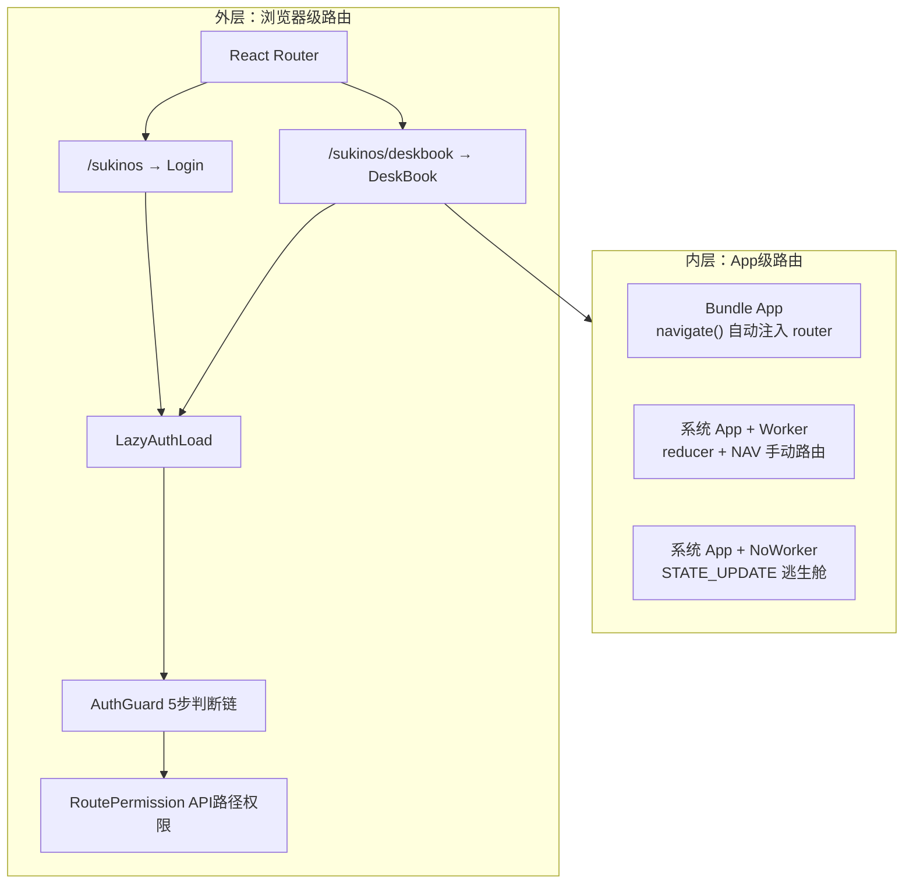
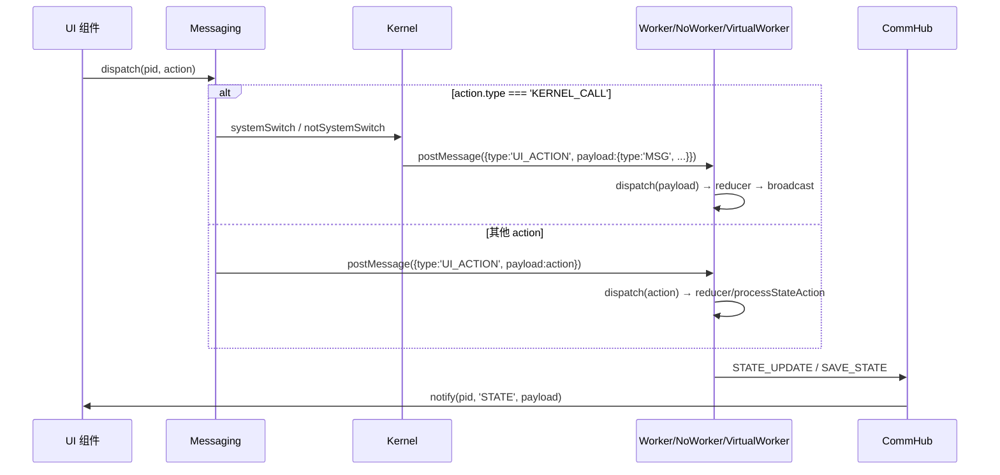

# 07 - SukinOS 路由与消息处理权威文档

## 概述

本文档是 SukinOS **路由体系与消息处理机制**的权威参考。系统路由是**双层架构**，消息处理依赖**三种运行模式**，需要从多个独立维度综合理解：

1. **浏览器级路由体系** — React Router + AuthGuard + RoutePermission + LazyAuthLoad 构成的外层页面级路由
2. **Bundle vs 系统 App** — 内层 App 级路由策略的根本分界
3. **三种运行模式** — RealWorker / VirtualWorker / NoWorker 的消息处理能力与链路差异
4. **消息分发机制** — dispatch 的 KERNEL_CALL 与 UI_ACTION 两条路径
5. **saveState 持久化链** — 数据在不同场景下的生命周期
6. **跨应用唤起与会话恢复** — evokeApp / restoreSession / autoStart
7. **Pub/Sub 主题消息体系** — 跨沙箱的发布-订阅通信

---

## 1. 浏览器级路由体系

### 1.1 路由层次

SukinOS 的浏览器级路由定义在 `src/router/sukinos/main.jsx`：

```js
const SukinOsRouter = [
  {
    path: '/sukinos',           // 登录/启动页面
    element: <LazyAuthLoad importFunc={() => import("@/sukinos/layout")} requireAuth={true} />,
  },
  {
    path: '/sukinos/deskbook',  // 桌面环境（系统核心页面）
    element: <LazyAuthLoad importFunc={() => import("@/sukinos/deskbook/layout")} requireAuth={true} />,
  },
]
```

通过 `createBrowserRouter` 注册到全局路由器（`src/router/main.jsx`）：

```
indexRouter + testRouter + educationRouter + SukinOsRouter + JumpRouter → createBrowserRouter
```

### 1.2 AuthGuard 鉴权守卫

`LazyAuthLoad` 组合了懒加载 + 鉴权，内部使用 `AuthGuard`（`src/router/AuthGuard.jsx`）执行 5 步判断链：

```
AuthGuard({element, allowRoles})
  │
  ├── 1. isVerifying? → 挂起渲染，显示 <Loading text="安全会话同步中..." />
  │     （后端校验 session 期间，防止未鉴权状态泄露）
  │
  ├── 2. isLoginPage? (/sukinos 或 /sukinos/)
  │     ├── isAuthenticated → <Navigate to="/sukinos/deskbook" replace />
  │     └── !isAuthenticated → 正常渲染登录页
  │
  ├── 3. isProtectedPath? (pathname.startsWith('/sukinos') && !isLoginPage)
  │     └── !isAuthenticated → <Navigate to="/sukinos" state={{from: pathname}} replace />
  │
  ├── 4. allowRoles.length > 0 && !allowRoles.includes(userRole)
  │     → <Navigate to="/jump?title=权限不足" replace />
  │
  └── 5. isRoutePermissionLoaded() && !checkRoutePermission('GET', pathname)
        → <Navigate to="/jump?title=路由权限不足" replace />
```

### 1.3 RoutePermission 路由权限中间件

`RoutePermission`（`src/sukinos/middleware/RoutePermission.jsx`）是后端配置驱动的 API 路由权限检查：

- **初始化**：用户登录后，从 `/api/system/permission/routes-permission` 加载权限配置表到 Redux Store
- **检查逻辑**：`checkRoutePermission(method, path)` 根据配置表判断当前用户是否有权访问该路径
- **配置规则**：
  - 未配置的路由默认放行
  - `_auto: true` 标记的自动扫描路由放行
  - `_locked: true` 的受保护路由仅 root 可访问
  - 显式配置的路由按 `allowedRoles` / `allowedUsers` 校验

### 1.4 LazyAuthLoad 懒加载组合

`LazyAuthLoad`（`src/router/routerHelper.jsx`）组合了 `LazyComponent`（懒加载 + 缓存池）和 `AuthWrapper`（鉴权包裹）：

```js
export const LazyAuthLoad = ({ importFunc, requireAuth }) => (
  <AuthWrapper requireAuth={requireAuth}>
    <LazyComponent importFunc={importFunc} />
  </AuthWrapper>
);
```

- `LazyComponent` 使用 `React.lazy()` + `Suspense` 实现路由级懒加载，并通过**缓存池**避免重复 import
- `AuthWrapper` 在 `requireAuth=true` 时注入 `AuthGuard` 鉴权守卫

### 1.5 两层路由总览图



---

## 2. 维度二：Bundle vs 系统 App — 路由策略的分界

### 2.1 Bundle App：底层自动路由

Bundle App 的 Level 1 页面导航是**系统自动处理**的。这是设计的黄金路径。

**自动化的两个环节**：

环节一：INIT 时自动注入 `router`（workerDrive.js INIT handler）：
```js
if (SYS_CONFIG["${envKeyIsBundle}"] && !base.router) {
  base.router = { path: 'home' };
}
```

环节二：`navigate()` 时自动拦截 `NAVIGATE` action（workerDrive.js dispatch）：
```js
// SDK navigate 实现 (sdk.jsx:93)
navigate: (path) => dispatch({ type: 'NAVIGATE', payload: path })

// Worker dispatch 自动注入路由
if (SYS_CONFIG["${envKeyIsBundle}"] && action.type === 'NAVIGATE') {
  const currentRouter = nextState.router || { path: 'home' };
  nextState = {
    ...nextState,
    router: { ...currentRouter, path: action.payload }
  };
}
```

**开发者只需要在 layout.jsx 中调用 `navigate('path')`**，底层自动完成一切。

### 2.2 系统 App：手动管理路由

系统 App（isBundle = false）没有自动路由。需要自己定义 reducer 来管理 `state.router`：

```js
// registry.jsx
function reducer(state = {}, action) {
  switch (action.type) {
    case 'NAV':
      return { ...state, router: { path: action.payload } };
    default:
      return state;
  }
}
```

`dispatch({ type: 'NAV', payload: 'intro' })` 由 Worker 中的 reducerFn 执行处理。

### 2.3 Render 层的分流

Bundle 和系统 App 在渲染层面也有分流（layout.jsx AppInternalRenderer）：

```js
// AppInternalRenderer
if (!resource.isBundle) {
  // 系统 App：渲染 modules['main'] 组件
  const Main = modules['main']?.Component;
  return <Main {...commonProps} PageComponent={() => <div />} />;
}

// Bundle App：按 router.path 匹配页面
const Layout = modules['layout']?.Component;
const PageObj = modules[currentPath];  // currentPath = state.router?.path
return <Layout {...commonProps} PageComponent={ConnectedPage} />;
```

---

## 3. 维度三：三种运行模式 — 消息处理的分界

### 3.1 模式总览

SukinOS 支持三种应用运行模式，每种模式的消息处理链路和能力完全不同：

| 能力 | RealWorker | VirtualWorker | NoWorker |
|------|-----------|--------------|----------|
| 执行 reducer | ✅ `reducerFn(_state, action)` | ✅ `new Function()` + `with(sandbox)` | ❌ 无 reducer |
| Bundle + NAVIGATE 自动路由 | ✅ dispatch 中自动注入 | ✅ dispatch 中自动注入 | ✅ processStateAction 处理 |
| 自定义 action（如 `NAV`） | ✅ reducer 处理 | ✅ reducer 处理 | ❌ processStateAction 只处理 NAVIGATE |
| STATE_UPDATE 直接合并 | ❌ 走 reducer（要求 reducer 兼容） | ❌ 走 reducer | ✅ 直接合并到 this.state |
| STATE_UPDATE 投递方式 | `postMessage` 即时 | `requestAnimationFrame` 帧对齐节流 | `setTimeout` 微任务 |
| 资源追踪与清理 | Worker 自管理（GC 回收） | ✅ 4 类资源注册表 + terminate 强制清理 | ❌ 无定时器/事件追踪 |
| 隔离级别 | 线程级隔离（最强） | iframe + Proxy 隔离（中等） | 无隔离（宿主线程） |
| 模式选择 | `worker: true`（默认） | `kernel.useVirtualWorker = true` | `worker: false` |

### 3.2 RealWorker 模式（默认）

绝大多数 App 使用标准 Worker 沙箱模式。Worker 沙箱中的 dispatch 流程（workerDrive.js）：

```
UI_ACTION → dispatch(action)
  → reducerFn(_state, action) ← 执行自定义 reducer
  → if (isBundle && NAVIGATE) 自动注入 router ← Bundle 自动路由
  → state 变化则 broadcast() + save()
```

**Worker 接收的消息类型**（`onmessage` 路由器）：

| 消息类型 | 触发时机 | 处理逻辑 |
|----------|----------|----------|
| `INIT` | 进程首次启动 | 初始化 `_state`，执行用户 `init(dispatch, _state)` |
| `RESTORE` | 会话恢复 | 直接设置 `_state = payload`，然后 `broadcast()` |
| `UI_ACTION` | UI 层 dispatch 转发 | 将 `payload` 传给内部 `dispatch(action)` |
| `APP_INTERACT` | App 间交互 | 同 `UI_ACTION`，传给内部 `dispatch(action)` |

**Worker 发出的消息类型**（`postMessage` 路由）：

| 消息类型 | 触发时机 | 含义 |
|----------|----------|------|
| `STATE_UPDATE` | dispatch 导致 state 变化后 broadcast() | 通知宿主：状态已更新 |
| `SAVE_STATE` | dispatch 导致 state 变化后 save() | 通知宿主：请持久化当前状态 |
| `PUBLISH_TOPIC` | 应用发布主题消息 | 跨沙箱 Pub/Sub 通信 |
| `SUBSCRIBE_TOPIC` | 应用订阅主题 | 跨沙箱 Pub/Sub 通信 |
| `UNSUBSCRIBE_TOPIC` | 应用取消订阅 | 跨沙箱 Pub/Sub 通信 |

### 3.3 VirtualWorker 模式

VirtualWorker 是 `lifecycle.js:41-269` 中定义的**虚拟轻量化沙箱**，采用 `with(sandbox) + Proxy + Shared Iframe` 方案。当 `kernel.useVirtualWorker = true` 时启用。

**核心设计**：不创建真实 Worker，而是在宿主主线程通过 `new Function('self', 'with(self) { code }')` 构造执行环境，`self` 指向一个 `Proxy` 代理对象（`sandboxSelfProxy`）。

#### 3.3.1 消息分流机制

VirtualWorker 的 `postMessage`（sandboxSelf 中定义）对两类消息采取不同的投递策略：

```js
// VirtualWorker sandboxSelf.postMessage (lifecycle.js:58-81)
postMessage: msg => {
  if (msg && msg.type === 'STATE_UPDATE') {
    // STATE_UPDATE：通过 requestAnimationFrame 帧对齐节流
    // 确保高频状态更新不会阻塞交互渲染
    if (this.pendingStateFrame) cancelAnimationFrame(this.pendingStateFrame);
    this.pendingStateFrame = requestAnimationFrame(() => {
      if (!this.terminated && this.onmessage) {
        this.onmessage({data: msg});
      }
    });
    return;
  }
  // 其他控制流事件：setTimeout 微任务快速投递
  setTimeout(() => {
    if (!this.terminated && this.onmessage) {
      this.onmessage({data: msg});
    }
  }, 0);
}
```

**分流设计理由**：
- `STATE_UPDATE` 是高频消息（每次 dispatch 后都触发），如果用 `setTimeout(0)` 会导致帧内多次渲染。`requestAnimationFrame` 确保每帧最多投递一次最新的 STATE_UPDATE
- 其他消息（如 INIT/RESTORE/KERNEL_CALL 结果等）是低频控制流事件，需要尽快投递

#### 3.3.2 资源追踪注册表

VirtualWorker 拦截并托管了 4 类浏览器资源，在 `terminate()` 时强制清理防止 CPU 空转和内存泄漏：

| 注册表 | 拦截的 API | 清理方式 |
|--------|-----------|---------|
| `activeTimeouts` (Set) | `setTimeout` | terminate 时遍历 `clearTimeout` |
| `activeIntervals` (Set) | `setInterval` | terminate 时遍历 `clearInterval` |
| `activeRAFFrames` (Set) | `requestAnimationFrame` | terminate 时遍历 `cancelAnimationFrame` |
| `attachedEventListeners` (Array) | `addEventListener` | terminate 时遍历 `removeEventListener` |

```js
// VirtualWorker.setTimeout 拦截 (lifecycle.js:84-93)
setTimeout: (handler, timeout, ...args) => {
  const id = setTimeout(() => {
    this.activeTimeouts.delete(id);
    if (typeof handler === 'function') handler(...args);
  }, timeout);
  this.activeTimeouts.add(id);
  return id;
}
```

#### 3.3.3 Proxy 代理层设计

`sandboxSelfProxy`（lifecycle.js:164-205）是 VirtualWorker 的核心隔离机制：

```js
const sandboxSelfProxy = new Proxy(iframeWin, {
  get: (target, prop) => {
    if (prop === 'self' || prop === 'globalThis' || prop === 'window') return sandboxSelfProxy;
    if (prop in sandboxSelf) return sandboxSelf[prop];    // 优先查沙箱自定义 API
    if (prop in localStore) return localStore[prop];       // 独立内存空间
    if (prop in target) {
      const val = target[prop];
      if (typeof val === 'function') {
        // 遞归类不 bind（Object, Array, Promise 等）
        const isConstructor = /^[A-Z]/.test(prop);
        if (isConstructor) return val;
        // 利用 WeakMap 缓存绑定方法，防 GC 压力
        let bound = boundMethodsCache.get(val);
        if (!bound) { bound = val.bind(target); boundMethodsCache.set(val, bound); }
        return bound;
      }
      return val;
    }
    return undefined;
  },
  set: (target, prop, value) => {
    if (prop === 'onmessage') { this.appOnMessage = value; return true; }
    localStore[prop] = value;  // 所有写操作进入独立内存
    return true;
  },
  has: () => true,  // with(sandbox) 必配：强制全部变量查找在此代理内拦截
});
```

**关键设计要点**：
- `self` / `globalThis` / `window` 均指向 `sandboxSelfProxy` 自身，防止沙箱代码访问真实 window
- 所有写操作进入 `localStore`（每个 VirtualWorker 独立），不会污染 iframe 窗口
- `has: () => true` 确保 `with(sandbox)` 下的所有变量查找被代理拦截
- `boundMethodsCache` (WeakMap) 缓存 `.bind()` 结果，防止频繁创建 short-lived GC 对象
- 大写开头的全局类（Object, Array, Promise 等）不 bind，直接返回原始引用

#### 3.3.4 terminate 清理流程

```js
// VirtualWorker.terminate() (lifecycle.js:236-268)
terminate() {
  this.terminated = true;
  this.appOnMessage = null;
  this.onmessage = null;
  if (this.pendingStateFrame) cancelAnimationFrame(this.pendingStateFrame);

  // 清理 setTimeout 残留
  for (const id of this.activeTimeouts) clearTimeout(id);
  this.activeTimeouts.clear();

  // 清理 setInterval 残留
  for (const id of this.activeIntervals) clearInterval(id);
  this.activeIntervals.clear();

  // 清理 requestAnimationFrame 残留
  for (const id of this.activeRAFFrames) cancelAnimationFrame(id);
  this.activeRAFFrames.clear();

  // 注销所有挂载到共享 Window 的全局监听器
  for (const item of this.attachedEventListeners) {
    try { item.target.removeEventListener(item.type, item.listener, item.options); }
    catch (e) { /* 捕获 DOM 移除异常 */ }
  }
  this.attachedEventListeners = [];
}
```

#### 3.3.5 消息监听器拦截

`addEventListener('message', handler)` 在 VirtualWorker 中被拦截为 `this.appOnMessage = handler`（lifecycle.js:124-127），而非真正添加到 iframe 窗口。这确保沙箱内的 `onmessage` 只接收来自宿主的消息，不会与其他 VirtualWorker 的消息混杂。

### 3.4 NoWorker 模式

NoWorker = `worker: false`。没有真正的 Worker 沙箱，在宿主主线程中模拟 Worker 通信协议。定义在 `lifecycle.js:275-377`。

#### 3.4.1 sysConfig 构建与注入

NoWorker 在构造时构建完全等价于 Worker 端 `SYS_CONFIG` 的 `sysConfig`（lifecycle.js:286-294）：

```js
constructor(pid, kernelInstance, initialState, isBundle) {
  const app = this.#kernel.getApp(this.pid);
  const resourceId = app?.[ENV_KEY_RESOURCE_ID] || '';
  const appName = app?.[ENV_KEY_NAME] || '';

  this.sysConfig = {
    [ENV_KEY_RESOURCE_ID]: resourceId,
    [ENV_KEY_NAME]: appName,
    [ENV_KEY_IS_BUNDLE]: isBundle,
  };
}
```

这确保 NoWorker 广播的 `STATE_UPDATE` payload 中包含 `config: this.sysConfig`，与 Worker 端广播格式一致（`{..._state, config: SYS_CONFIG}`）。

#### 3.4.2 initializeState 校准器

NoWorker 使用 `initializeState(initialState, isBundle)`（workerDrive.js 导出）进行状态初始化校准（lifecycle.js:297）：

```js
const calibratedState = initializeState(initialState, isBundle);
this.state = calibratedState;
```

`initializeState` 与 Worker 端 INIT handler 中的逻辑完全一致：如果 `isBundle` 且初始状态中没有 `router`，自动注入 `{router: {path: 'home'}}`。这确保 Bundle App 的 NoWorker 实例也获得正确的初始路由状态。

#### 3.4.3 初始化时状态广播

NoWorker 构造后，如果存在历史持久化状态（calibratedState 不为 null），会立即广播给 CommHub（lifecycle.js:301-313）：

```js
if (calibratedState) {
  setTimeout(() => {
    if (!this.terminated) {
      this.#kernel.commHub.handleMsg(this.pid, {
        type: 'STATE_UPDATE',
        payload: { ...calibratedState, config: this.sysConfig },
      });
    }
  }, 0);
}
```

这填充了 CommHub 的 `stateCache`，确保 UI 组件订阅时能立即获得初始状态（热启动行为）。

#### 3.4.4 UI_ACTION 处理链路

NoWorker 的 `postMessage` 拦截来自 UI 的 `UI_ACTION`（lifecycle.js:320-361），分三种处理路径：

```
NoWorker.postMessage({type: 'UI_ACTION', payload: action})
  │
  ├── 1. action.type === 'STATE_UPDATE' || action.type === 'UPDATE_STATE'
  │     → 直接合并到 this.state: this.state = {...this.state, ...newState}
  │     → broadcast STATE_UPDATE（含 config: this.sysConfig）
  │
  ├── 2. 其他 action（如 NAVIGATE、NAV、自定义业务 action）
  │     → processStateAction(prevState, action, this.isBundle)
  │     → nextState !== prevState ?
  │         ├── YES → this.state = nextState → broadcast STATE_UPDATE
  │         └── NO  → ACTION_ECHO（setTimeout 回调到 onmessage）
  │
  └── 3. 兼容 SAVE_STATE 消息
        → getCachedState(pid) → commHub.saveState(pid, currentState)
```

#### 3.4.5 processStateAction 统一路由处理

`processStateAction`（workerDrive.js:4-17）是 NoWorker 和 Worker 共用的状态动作转换器，当前只处理 Bundle + NAVIGATE：

```js
function processStateAction(prevState, action, isBundle) {
  if (isBundle && action.type === 'NAVIGATE') {
    const currentRouter = prevState.router || { path: 'home' };
    return { ...prevState, router: { ...currentRouter, path: action.payload } };
  }
  return prevState;  // 其他 action 不改变 state → 返回同引用
}
```

#### 3.4.6 ACTION_ECHO 机制

当 `processStateAction` 返回 `nextState === prevState`（即无状态变更），NoWorker 不会静默丢弃，而是产生 `ACTION_ECHO` 消息（lifecycle.js:353-360）：

```js
if (nextState !== prevState) {
  this.state = nextState;
  // → broadcast STATE_UPDATE
} else {
  // 无状态变更 → Echo 回调到应用监听器
  setTimeout(() => {
    if (this.onmessage && !this.terminated) {
      this.onmessage({data: {type: 'ACTION_ECHO', payload: action}});
    }
  }, 0);
}
```

**Echo 的意义**：某些 action 的目的是触发副作用（日志、事件通知、信号发送），而非修改 state。Echo 确保这些 action 不被静默跳过。

#### 3.4.7 NoWorker 三种 action 处理总结

| Action 类型 | 处理方式 | 是否改变 state | 是否产生 Echo |
|-------------|---------|---------------|-------------|
| `STATE_UPDATE` / `UPDATE_STATE` | 直接合并到 `this.state` | ✅ 是 | ❌ 否 |
| `NAVIGATE`（Bundle） | `processStateAction` 注入 `router.path` | ✅ 是 | ❌ 否 |
| 其他 action（自定义业务） | `processStateAction` 返回同引用 | ❌ 否 | ✅ **ACTION_ECHO** |

---

## 4. 维度四：消息分发 — dispatch 的两种路径

`dispatch(pid, action)` 在 `messaging.js` 中分为两条路径：

```
dispatch(pid, action)
  ├── action.type === 'KERNEL_CALL' → systemSwitch / notSystemSwitch
  │    系统命令（如 UPLOAD_RESOURCE）在内核层直接处理
  │    不经过 Worker，结果通过 UI_ACTION 回写给 Worker
  │
  └── 其他 → p.worker.postMessage({type: 'UI_ACTION', payload: action})
       所有非内核事件转发给 Worker/NoWorker 沙箱
```

### 4.1 KERNEL_CALL 路径

`KERNEL_CALL` 用于应用向系统请求内核级别的操作。系统应用和非系统应用分别路由到不同 handler：

**systemSwitch**（系统应用处理器）：

| 方法 | 处理逻辑 | 回写结果 |
|------|---------|---------|
| `UPLOAD_RESOURCE` | `kernel.uploadResource(args)` | 成功 → `UI_ACTION({type:'MSG', payload:'应用安装成功！'})`；失败 → `UI_ACTION({type:'MSG', payload:'错误: xxx'})` |
| default | `alert.warning('未找到对应处理器!')` | — |

**notSystemSwitch**（非系统应用处理器）：当前只有 default warning，未实现任何非系统应用的 KERNEL_CALL 方法。

### 4.2 UI_ACTION 路径（默认）

所有其他 action（包括 `NAVIGATE`、`NAV`、自定义业务 action）都通过 `UI_ACTION` 包装后发送到 Worker/NoWorker 执行。这是 99% 的 action 走的路径。

### 4.3 完整的消息流向图



---

## 5. 维度五：saveState 持久化链

### 5.1 三层存储

| 存储层 | 位置 | 生命周期 | 更新时机 |
|--------|------|---------|---------|
| stateCache | `commHub.stateCache`（Map） | 页面会话 | 每次 STATE_UPDATE |
| app.savedState | `kernel.app.savedState.app` | 页面会话 | 每次 SAVE_STATE |
| IndexedDB | `sysDb` | 跨页面刷新 | 仅非系统 App 写入 |

### 5.2 写入链路

**stateCache**（每次 state 变化）：
```
Worker: broadcast() → postMessage(STATE_UPDATE)
  → commHub.handleMsg → stateCache.set(pid, payload)
```

**app.savedState + IndexedDB**（触发保存时）：
```
触发时机：
  - Worker 内部 save()（每次 dispatch 后）
  - forceSaveAllStates()（页面 beforeunload）
  - hibernate()（应用休眠时）

链路：
  Worker.save() → postMessage(SAVE_STATE)
    → commHub.saveState(pid, payload)
      → app.savedState.app = payload    ← 所有 App 都写内存
      → if (!app.isSystemApp)           ← 仅用户 App 写 DB
          sysDb.updateData(appName, {savedState})
```

### 5.3 恢复链路

```
startProcess({pid})
  → 检查 app.savedState?.app
    → Worker: postMessage({type: stateToRestore ? 'RESTORE' : 'INIT'})
    → NoWorker: new NoWorker(pid, kernel, stateToRestore, isBundle)
```

`RESTORE` 时，Worker 直接设置 `_state = payload` 并 broadcast，`router.path` 恢复为保存时的值。

### 5.4 saveState 布尔配置：冷启动 vs 热启动

`ENV_KEY_META_INFO.saveState` 是布尔配置，决定 App 在 `forceKillProcess` / `forceReStartApp` 时是热启动还是冷启动：

| saveState 值 | forceKillProcess 行为 | forceReStartApp 行为 | 效果 |
|-------------|----------------------|---------------------|------|
| `true`（保留） | 保留 `app.savedState` | 保留状态，重启后 RESTORE 恢复 | **热启动** |
| `false`（清除） | 调用 `clearAppSavedState` | 状态清空，重启后 INIT | **冷启动** |

### 5.5 clearAppSavedState：分裂式清理

`clearAppSavedState` 不是简单清空，而是**分裂式清理**（lifecycle.js:593-612）：

```js
// 只重置应用级业务状态（app），保留窗口几何信息（window）
const prevSavedState = app.savedState || {app: null, window: null}
app.savedState = {
  ...prevSavedState,
  app: null,  // 只将应用级数据置空，保留 window 配置
}
```

| savedState 字段 | 作用 | saveState:false 时 |
|----------------|------|-------------------|
| `savedState.app` | Worker state 快照（含 router.path） | **清空设为 null** |
| `savedState.window` | 窗口几何信息（top, left, width, height） | **保留** ✅ |

即使 `saveState: false` 导致进程重启后丢失页面导航路径，窗口位置和大小仍会被复原。

### 5.6 forceSaveAllStates：页面刷新的紧急保存

页面刷新触发 `forceSaveAllStates`（lifecycle.js:548-558），而非 `forceKillProcess`：

```js
forceSaveAllStates() {
  for (const pid of this.#kernel.processes.keys()) {
    const p = this.#kernel.processes.get(pid)
    if (p && p.worker) {
      p.worker.postMessage({type: 'SAVE_STATE'})  // 无条件保存，不检查 saveState 配置
    }
  }
}
```

| 触发场景 | 调用的函数 | 检查 saveState 配置？ | saveState:false 的 state 是否保存？ |
|----------|-----------|----------------------|-----------------------------------|
| 页面刷新（beforeunload） | `forceSaveAllStates` | ❌ 不检查 | **始终保存到 IndexedDB** ✅ |
| 主动杀进程 | `forceKillProcess` | ✅ 检查 | **清除，不保存** ❌ |
| 重启 App | `forceReStartApp` | ✅ 检查 | **清除，不保存** ❌ |

---

## 6. 跨应用唤起与会话恢复

### 6.1 evokeApp 跨应用唤起

`evokeApp({pid, from, interactInfo})`（lifecycle.js:719-731）允许一个应用唤起另一个应用，并注入 `from` 信息：

```js
async evokeApp({pid, from, interactInfo}) {
  const targetApp = this.#kernel.getApp(pid);
  if (!targetApp) alert.failure('唤起失败!App未注册或已删除!');

  const p = this.#kernel.processes.get(pid);
  const newInteractInfo = {...interactInfo, from};  // 注入 from[App] 信息

  if (p) {
    // 目标 App 已在运行 → 直接发送交互消息
    this.#kernel.appIntereact({process: p.worker, interactInfo: newInteractInfo});
  } else {
    // 目标 App 未运行 → 冷启动并传入交互消息
    this.startProcess({pid, interactInfo: newInteractInfo});
  }
}
```

**唤起流程**：

```
App A → evokeApp({pid: 'appB', from: 'appA', interactInfo: {type: 'OPEN_FILE', data: ...}})
  │
  ├── App B 已运行 → appIntereact → Worker B 收到 APP_INTERACT 消息
  └── App B 未运行 → startProcess({pid, interactInfo}) → 启动 + 交互
```

`from` 字段让目标 App 知道消息来源，可以据此实现「回到来源 App」等交互逻辑。

### 6.2 restoreSession 会话恢复

`restoreSession()`（lifecycle.js:697-716）在系统初始化时批量恢复之前运行/休眠的应用：

```js
async restoreSession() {
  const allApps = [...this.#kernel.systemApps.values(), ...this.#kernel.userApps.values()];
  const appsToRestore = allApps.filter(a =>
    a.status === 'RUNNING' ||
    a.status === 'HIBERNATED' ||
    a?.[ENV_KEY_META_INFO]?.custom?.autoStart === true
  );

  for (const app of appsToRestore) {
    this.startProcess({pid: app.pid});  // 异步启动，不阻塞主流程
  }
}
```

**恢复筛选规则**：
- `status === 'RUNNING'`：上次正常运行的应用
- `status === 'HIBERNATED'`：上次休眠的应用
- `autoStart === true`：配置了开机自启动的应用

### 6.3 startProcess 会话恢复保护

`startProcess` 在冷启动时有一个关键的会话恢复保护逻辑（lifecycle.js:508-510）：

```js
// 如果该应用启动前的初始状态是 HIBERNATED（会话恢复），
// 则建立好后台 Worker 实例后应当保持其 HIBERNATED 状态，绝不强行转为 RUNNING
const targetStatus = originalStatus === 'HIBERNATED' ? 'HIBERNATED' : 'RUNNING';
app.status = targetStatus;
```

**设计理由**：会话恢复时，休眠的应用应该先建立 Worker 实例（保持"热"状态），但不自动显示窗口。用户点击图标唤醒时才转为 RUNNING。如果强行转为 RUNNING，所有休眠应用会在系统启动时同时弹出窗口，造成混乱。

### 6.4 forceResetApp：无视配置的强制重置

`forceResetApp(pid)`（lifecycle.js:618-639）无视 `saveState` 配置，强制清空所有状态并杀死进程：

```js
async forceResetApp(pid) {
  this.#kernel.kill(pid);
  this.#kernel.clearCachedState(pid);
  const app = this.#kernel.getApp(pid);
  if (app) {
    app.status = 'INSTALLED';
    if (!app.isSystemApp) await this.#kernel.sysDb.updateData(appName, {status: 'INSTALLED'});
    await this.clearAppSavedState(pid);  // 无视 saveState 配置，强制清空
  }
  this.#kernel.emitChange({type: 'APP_RESET', pid});
}
```

与 `forceKillProcess` 的差异：`forceKillProcess` 检查 `saveState` 配置决定是否清除，而 `forceResetApp` **无条件清除**。

---

## 7. Pub/Sub 主题消息体系

### 7.1 消息协议

跨沙箱的 Pub/Sub 通信通过三种 Worker→CommHub 消息实现：

| 消息类型 | 方向 | payload 结构 | 说明 |
|----------|------|-------------|------|
| `SUBSCRIBE_TOPIC` | Worker → CommHub | `{topic}` | 应用订阅指定主题 |
| `PUBLISH_TOPIC` | Worker → CommHub | `{topic, data}` | 应用向主题发布数据 |
| `UNSUBSCRIBE_TOPIC` | Worker → CommHub | `{topic}` | 应用取消订阅指定主题 |

### 7.2 CommHub 主题转发机制

CommHub 维护两个数据结构实现主题通信：

| 数据结构 | 类型 | 作用 |
|---------|------|------|
| `topicSubscribers` | `Map(topic → Set(cb))` | 全局主题订阅者注册表 |
| `processSubscriptions` | `Map(pid → Map(topic → unsubscribeFn))` | 每个进程的主题订阅追踪 |

**SUBSCRIBE_TOPIC 处理流程**：

```
Worker A → postMessage({type:'SUBSCRIBE_TOPIC', payload:{topic:'data-channel'}})
  → CommHub.handleMsg(pidA, msg)
    → processSubscriptions.set(pidA, new Map())
    → processSubscriptions.get(pidA).set('data-channel', subscribe('data-channel', cb))
    → cb = (data) => sendToWorker(pidA, {type:'TOPIC_MESSAGE', payload:{topic:'data-channel', data}})
```

**PUBLISH_TOPIC 处理流程**：

```
Worker B → postMessage({type:'PUBLISH_TOPIC', payload:{topic:'data-channel', data:someData}})
  → CommHub.handleMsg(pidB, msg)
    → this.publish('data-channel', someData)
    → topicSubscribers.get('data-channel').forEach(cb => cb(someData))
    → 包括 Worker A 的宿主端转发回调 → sendToWorker(pidA, {type:'TOPIC_MESSAGE', payload:{...}})
```

### 7.3 TOPIC_MESSAGE 缺口说明

**重要设计缺口**：当 CommHub 通过 `sendToWorker` 向订阅进程转发 `TOPIC_MESSAGE` 时，该消息类型**在 Worker 内部的消息路由器中缺少对应的 case 处理**。

当前 Worker `onmessage` 路由器（workerDrive.js）只处理 `INIT`、`RESTORE`、`UI_ACTION`、`APP_INTERACT` 四种类型，`TOPIC_MESSAGE` 会落入 `default: break` 被静默丢弃。

这意味着：虽然 Pub/Sub 的基础设施（CommHub 主题注册 + 跨进程转发）已完整实现，但**Worker 端尚无法接收和处理主题消息**。需要在 Worker 消息路由器中新增 `TOPIC_MESSAGE` case 才能使跨沙箱 Pub/Sub 完整工作。

### 7.4 进程注销时的订阅清理

`clearProcessSubscriptions(pid)` 在进程终止时被调用，遍历该进程的所有主题订阅并逐一取消，防止内存泄漏：

```
kill(pid)
  → CommHub.clearProcessSubscriptions(pid)
    → processSubscriptions.get(pid) → Map(topic → unsubscribeFn)
    → 每个 unsubscribeFn() → 从 topicSubscribers 中移除该进程的回调
    → processSubscriptions.delete(pid)
```

---

## 8. 综合：挂起恢复的实际行为

### 8.1 三种场景

| 场景 | 组件树 | Worker/NoWorker/VirtualWorker | useState | state.router |
|------|--------|------|----------|-------------|
| **hibernate + resume**（同会话） | 保持挂载 ✅ | 保持活动 ✅ | **保留** ✅ | 保留 ✅ |
| **kill + restart**（同会话） | 卸载重挂 ❌ | 重建 | **重置** ❌ | 从 savedState 恢复 ✅ |
| **页面刷新**（系统 App） | 卸载 ❌ | 重建 | **重置** ❌ | 丢失（看是否有维护） |
| **页面刷新**（用户 App） | 卸载 ❌ | 重建 | **重置** ❌ | 从 IndexedDB 恢复 ✅ |

### 8.2 加入 saveState 配置后的场景细化

| 场景 | saveState 配置 | 保存状态（app.savedState） | 恢复后 router.path |
|------|---------------|--------------------------|-------------------|
| **forceKillProcess** | `true` | 保留 ✅ | 从 savedState 恢复 ✅ |
| **forceKillProcess** | `false` | 清除 ❌ | INIT 重置 ❌ |
| **forceReStartApp** | `true` | 保留 ✅ | 从 savedState 恢复 ✅ |
| **forceReStartApp** | `false` | 清除 ❌ | INIT 重置 ❌ |
| **页面刷新** | 任意 | forceSaveAllStates 无条件保存 ✅ | 从 IndexedDB 恢复 ✅ |

### 8.3 Level 1 vs Level 2 的保留情况

| 路由层级 | 机制 | hibernate + resume | kill + restart | 页面刷新（用户App） | 页面刷新（系统App） |
|----------|------|-------------------|----------------|-------------------|-------------------|
| **Level 1**（router.path） | Worker state → props | ✅ Worker 活动 | ✅ savedState 恢复 | ✅ IndexedDB | ❌ 内存丢失 |
| **Level 2**（useState 内部标签） | React 组件 state | ✅ 组件挂载中 | ❌ 组件卸载 | ❌ | ❌ |

---

## 9. 总结对照

### 9.1 路由方式速查

| App 类型 | isBundle | worker | Level 1 路由方式 | Level 2 路由方式 |
|----------|----------|--------|-----------------|-----------------|
| **Bundle App**（自动路由） | true | true（必须） | `navigate()` 系统自动处理 | `useState` 自然管理 |
| **系统 App + Worker**（标准模式） | false | true（默认） | reducer 处理 `NAV` | `useState` 或 reducer 扩展 |
| **系统 App + NoWorker**（特殊） | false | false | `STATE_UPDATE` 逃生舱 | `useState` |

### 9.2 三种模式消息处理对比

| 消息处理能力 | RealWorker | VirtualWorker | NoWorker |
|-------------|-----------|--------------|----------|
| STATE_UPDATE 投递 | `postMessage` 即时 | `requestAnimationFrame` 帧对齐节流 | `setTimeout(0)` 微任务 |
| reducer 执行 | ✅ Worker 线程 | ✅ `new Function` + `with(sandbox)` | ❌ 无 |
| processStateAction | ❌ 不使用 | ❌ 不使用 | ✅ 处理 NAVIGATE |
| ACTION_ECHO | ❌ 不需要 | ❌ 不需要 | ✅ 无 state 变化时回传 |
| 资源追踪清理 | Worker GC 自管理 | ✅ 4 类注册表 + terminate | ❌ 无追踪 |
| 隔离级别 | 线程级 | iframe + Proxy | 无隔离 |

### 9.3 何时选择哪种方案

| 场景 | 推荐方案 | 原因 |
|------|---------|------|
| 临时 UI 状态（折叠、弹窗） | `useState` | 不需要持久化，代码最简洁 |
| App 内部页面导航（系统 App） | reducer + `NAV` | 导航状态需要持久化 |
| Bundle App 页面导航 | `navigate()` | 零代码成本，自动持久化 |
| 页面内标签需要持久化 | reducer + `NAV_SUB` | 扩展 `router.subPath` 进入 saveState |
| 页面内标签不需要持久化 | `useState` | hibernate 期间自然保留 |
| 跨应用交互 | `evokeApp()` | 自动注入 from 信息 |
| 跨沙箱通信（未来） | Pub/Sub `publish/subscribe` | 基础设施已实现，Worker 端需补 TOPIC_MESSAGE case |

---

## 10. 实际案例：Developer Helper 导航

[src/sukinos/resources/developer/right/healper/layout.jsx](src/sukinos/resources/developer/right/healper/layout.jsx) 是一个系统 App（非 Bundle），使用 `useState` 管理 16 个导航项：

```js
const Helper = () => {
  const [activeTabId, setActiveTabId] = useState('intro');  // ❌ 挂起后丢失

  const ActiveComponent = useMemo(() =>
    docSections.find(s => s.id === activeTabId)?.component || IntroSection,
  [activeTabId]);
};
```

**当前问题**：`useState` 是组件本地状态。hibernate 虽然保留，但 kill+restart 或页面刷新后导航位置丢失。

### 方案一：reducer + NAV 持久化导航

将导航状态提升到 Worker state，进入 saveState 持久化链：

```js
const initialState = { router: { path: 'intro' } };
function reducer(state = initialState, action) {
  switch (action.type) {
    case 'NAV': return { ...state, router: { path: action.payload } };
    default: return state;
  }
}
```

### 方案二：Bundle 多级路由

Level 1 由 `navigate()` 自动处理，Level 2 用 `useState` 管理。

### 方案三：Level 2 也纳入持久化

扩展 `router.subPath` 到 Worker state：
```js
case 'NAV_SUB': return { ...state, router: { ...state.router, subPath: action.payload } };
```
