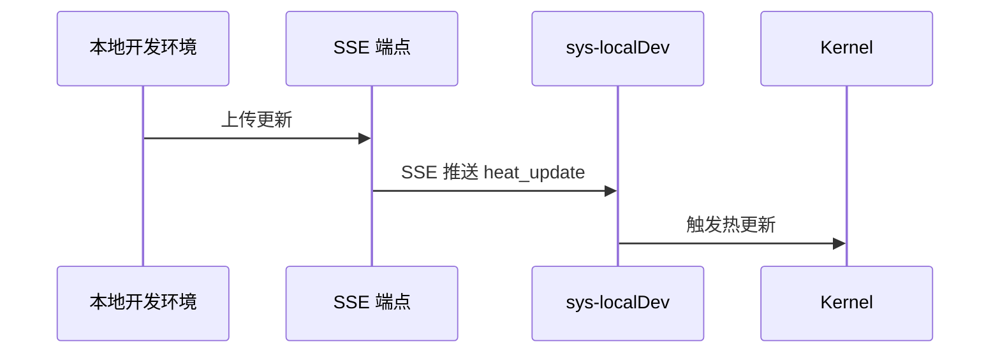

# SukinOS 开发指南

> SukinOS 应用开发完整指南，覆盖系统 APP 与非系统 APP 开发、Hooks 核心详解、跨应用通信、应用生命周期管理等。帮助开发者快速上手构建运行在 SukinOS 桌面环境中的应用程序。

## 目录

- [1. 概述](#1-概述)
- [2. 应用架构基础](#2-应用架构基础)
- [3. 系统 APP 开发](#3-系统-app-开发)
- [4. 非系统 APP / 用户 APP 开发](#4-非系统-app--用户-app-开发)
- [5. Hooks 核心详解与应用交互](#5-hooks-核心详解与应用交互)
- [6. 跨应用通信](#6-跨应用通信)
- [7. 应用生命周期](#7-应用生命周期)
- [8. 从零构建完整教程](#8-从零构建完整教程)
- [9. 调试与测试](#9-调试与测试)
- [10. 最佳实践](#10-最佳实践)

---

## 1. 概述

本文档是 SukinOS 应用开发的**完整指南**。阅读前建议先熟悉以下模块文档：

| 文档 | 内容 | 建议先读 |
|------|------|---------|
| [01-hooks.md](./01-hooks.md) | 14 个 Hook 完整接口 | 对照参考 |
| [03-resources.md](./03-resources.md) | SDK 双权限模型、createSdkForInstance 工厂 | 必读 |
| [04-process-kernel.md](./04-process-kernel.md) | Kernel 单例、CommHub、10 个子模块 | 参考 |
| [07-app-routing.md](./07-app-routing.md) | 双层路由、三种 Worker 消息链路 | 必读 |

### 本文涵盖范围

- **系统 APP 开发** — 内置在 `preset_resources.jsx` 中的应用，拥有完整 SDK 权限
- **非系统 APP 开发** — 从应用商店或开发者工具安装的第三方应用，运行在沙箱中
- **Hooks 详解** — 在 APP 开发中如何使用 14 个核心 Hook
- **跨应用通信** — APP 之间如何交互、发布/订阅消息
- **应用生命周期** — 安装→启动→休眠→恢复→终止完整流程
- **完整教程** — 从零构建一个 Markdown 笔记应用

---

## 2. 应用架构基础

### 2.1 Registry 文件结构

每个 SukinOS 应用的核心是一个 **注册表（registry）文件**。但**系统 APP 和非系统 APP 的结构完全不同**：

#### 系统 APP 结构

系统 APP 使用 `registry.jsx` + 组件目录，所有内容在 `registry.jsx` 中定义：

```
mySystemApp/
├── registry.jsx          # 注册文件（ENV_KEY_* 字符串键）
├── layout.jsx            # 主组件窗口（必需）
├── style.module.css      # BEM 命名空间样式
├── db.js                 # 数据库交互层（可选，需在 _db.js 注册）
├── logic.jsx             # Bundle 应用 reducer（可选）
├── components/           # 局部公共子组件
│   └── customButton/
│       ├── layout.jsx
│       └── style.module.css
└── pages/                # Bundle 页面组件（可选）
    ├── home.jsx
    └── detail.jsx
```

#### 非系统 APP 结构

非系统 APP 是**纯 `.js` 文件目录**，**没有 `registry.js`**，由开发者工具自动扫描加载：

```
myAppName/                # 目录名即为应用名
├── logic.js              # Reducer（无 export，内核自动识别）
├── layout.js             # 主布局（export default + export const style）
├── home.js               # 页面（export default + export const style）
├── detail.js             # 页面
└── stats.js              # 页面
```

> 非系统 APP 使用 `.js` 扩展名（而非 `.jsx`），内核通过约定文件名自动关联：`logic.js` = Reducer、`layout.js` = 主布局、其余 `.js` 文件 = 页面组件。

### 2.2 Registry 核心字段

registry 使用**字符串键名**（如 `"ENV_KEY_RESOURCE_ID"`），由 `preset_resources.jsx` 的 `replaceKeys` 自动映射为运行时 Key：

| registry 字符串键 | 映射后 Key | 说明 | 必需 |
|-------------------|-----------|------|------|
| `"ENV_KEY_RESOURCE_ID"` | `resourceId` | 应用唯一标识（如 `sys-store`、`my-notes`） | 是 |
| `"ENV_KEY_NAME"` | `name` | 显示名称 | 是 |
| `"ENV_KEY_IS_BUNDLE"` | `isBundle` | 是否多页面 Bundle 应用 | 是 |
| `"ENV_KEY_CONTENT"` | `content` | UI 视图代码（系统 APP 用字符串模板，非系统 APP 用字符串） | 是 |
| `"ENV_KEY_LOGIC"` | `logic` | Reducer 逻辑代码（字符串，在 Worker 中执行） | 否 |
| `"ENV_KEY_META_INFO"` | `metaInfo` | 元数据配置对象 | 是 |

> **重要**：registry 中必须使用**字符串键名**（如 `"ENV_KEY_RESOURCE_ID"`），而不是导入常量后的 `[ENV_KEY_RESOURCE_ID]`。因为 `replaceKeys` 通过 `keyMapping` 对象将字符串键映射为运行时 Key，而 `keyMapping` 的键就是字符串 `"ENV_KEY_RESOURCE_ID"`。如果使用 `import` 的常量，`replaceKeys` 将无法匹配映射。

### 2.3 META_INFO 配置详解

`ENV_KEY_META_INFO` 是应用的完整配置对象，包含：

```javascript
{
  version: '1.0.0',
  icon: 'logo-url',
  appType: 'system',        // 'system' | 'user'
  worker: true,              // false 使用 NoWorker
  exposeState: true,         // 是否暴露状态
  saveState: false,          // 是否持久化状态
  isParasitism: false,       // 是否寄生模式
  hasShortcut: true,         // 桌面快捷方式
  blockEd: true,             // 固定在状态栏
  isFullScreen: false,       // 启动时全屏
  autoStart: false,          // 系统启动时自动启动
  allowResize: true,         // 允许窗口缩放
  showInLauncher: true,      // 在启动器中显示
  custom: {}                 // 自定义配置
}
```

| 配置项 | 类型 | 默认值 | 说明 |
|--------|------|--------|------|
| `hasShortcut` | `boolean` | `true` | 是否在桌面显示图标 |
| `blockEd` | `boolean` | `false` | 是否固定到底部状态栏 |
| `isFullScreen` | `boolean` | `false` | 是否默认全屏打开 |
| `autoStart` | `boolean` | `false` | 是否随系统启动自动运行 |
| `allowResize` | `boolean` | `true` | 是否允许用户缩放窗口 |
| `showInLauncher` | `boolean` | `true` | 是否在应用启动器中显示 |
| `isParasitism` | `boolean` | `false` | 是否寄生模式（共用宿主窗口） |
| `saveState` | `boolean` | `false` | `true` 为热启动（保留上次状态），`false` 为冷启动 |
| `exposeState` | `boolean` | `true` | 是否向 React 暴露状态 |
| `worker` | `boolean` | `true` | 是否使用 Worker（`false` 使用 NoWorker 模式） |

### 2.4 文件命名与导出规范

- 必须以**文件夹模式**进行组件封装
- 组件必须先使用 `function` 声明，再通过 `export default` 导出
- `layout.jsx` 是应用的主入口文件，**必需存在**
- `db.js` 用于数据库交互层，必需在 `@/sukinos/utils/_db` 注册
- `registry.jsx` 作为注册文件，同时处理 dispatch 事件
- 非系统 APP **禁止使用 `import` / `require`**（任何文件内）
- 子组件放在 `components/` 目录下

### 2.5 BEM 样式命名

使用 `createNamespace` 管理 CSS 类名，生成规范的 BEM 命名：

```javascript
import style from './style.module.css'
import { createNamespace } from '/utils/js/classcreate'

const bem = createNamespace('file-system')

// 生成: file-system__header--active
className: bem('header', 'active')
// 生成: file-system--dark
className: bem('', 'dark')
```

可用生成器：

| 方法 | 格式 | 示例 |
|------|------|------|
| `b(blockSuffix)` | `prefix-blockSuffix` | `file-system-header` |
| `e(element)` | `prefix__element` | `file-system__icon` |
| `m(modifier)` | `prefix--modifier` | `file-system--dark` |
| `be(block, element)` | `prefix-block__element` | `file-system-nav__item` |
| `bm(block, modifier)` | `prefix-block--modifier` | `file-system-nav--active` |
| `em(element, modifier)` | `prefix__element--modifier` | `file-system__icon--small` |
| `bem(block, element, modifier)` | 完整 BEM | `file-system-nav__item--active` |
| `is(state)` | `is-state` | `is-active` |

---

## 3. 系统 APP 开发

### 3.1 什么是系统 APP

系统 APP 是 SukinOS **内置**的应用程序，具有以下特征：

- 定义在 `preset_resources.jsx` 中，随系统启动时自动注册
- 使用 `adminAppSdk` — 拥有完整的系统权限
- 可以直接 `import` 系统模块和组件
- 在 `sdk.jsx` 的 `adminAppSdk.Components` 中注册后，其他系统 APP 可直接引用

### 3.2 创建系统 APP Registry

系统 APP 的 registry 使用**字符串键名**（`"ENV_KEY_RESOURCE_ID"`），这些字符串在 `preset_resources.jsx` 中由 `replaceKeys` 映射为运行时 Key。**注意与实际常量值区分**：

```javascript
// mySystemApp/registry.jsx
import { getLogoBase64Url } from "@/component/logo/layout";

// 注意：这里不能直接使用 ENV_KEY_* 常量导入的值
// 必须使用字符串 "ENV_KEY_RESOURCE_ID"（与 keyMapping 匹配）
export default {
  "ENV_KEY_RESOURCE_ID": 'sys-myApp',
  "ENV_KEY_NAME": '我的应用',
  "ENV_KEY_IS_BUNDLE": false,

  // ENV_KEY_CONTENT — UI 视图层
  // 系统 APP 使用字符串模板，通过 AppSDK.Components.xxx 渲染组件
  "ENV_KEY_CONTENT": `
    export default ({ PageComponent, navigate, state }) => {
      const { Components } = AppSDK
      const { MyApp } = Components;
      return (
        <div style={{height:'100%',width:'100%', display:'flex', flexDirection:'column'}}>
          <MyApp />
        </div>
      );
    }
  `,

  // ENV_KEY_LOGIC — Reducer 逻辑（字符串，在 Worker 中执行）
  "ENV_KEY_LOGIC": `
    const initialState = { count: 0 }

    function reducer(state = initialState, action) {
      switch (action.type) {
        case 'INCREMENT':
          return { ...state, count: state.count + 1 }
        case 'SET_COUNT':
          return { ...state, count: action.payload }
        default:
          return state
      }
    }
  `,

  // ====== 元数据配置 ======
  "ENV_KEY_META_INFO": {
    version: 'v1',
    icon: getLogoBase64Url({ primaryColor: "#4a90d9", secondaryColor: "#f5a623", glowColor: "#f8e71c", shadowColor: "#417505" }),
    appType: 'system',
    worker: true,
    exposeState: true,
    saveState: false,
    isParasitism: false,
    custom: {
      hasShortcut: true,
      blockEd: true
    }
  }
}
```

> **注意**：`ENV_KEY_*` 在 registry 中使用**字符串字面量**（如 `"ENV_KEY_RESOURCE_ID"`），而不是 `import` 导入的常量。因为 `preset_resources.jsx` 的 `replaceKeys` 函数通过 `keyMapping` 对象将字符串键映射为实际运行时 Key（如 `"resourceId"`）。如果你 import 了常量并使用 `[ENV_KEY_RESOURCE_ID]`，`replaceKeys` 将无法匹配。

### 3.3 在 preset_resources.jsx 中注册（资源注册）

这是**必备步骤**，将 registry 注册到系统资源池，kernel 启动时自动加载：

```javascript
// src/sukinos/resources/preset_resources.jsx
import {
  ENV_KEY_RESOURCE_ID,
  ENV_KEY_NAME,
  ENV_KEY_IS_BUNDLE,
  ENV_KEY_LOGIC,
  ENV_KEY_CONTENT,
  ENV_KEY_META_INFO
} from "@/sukinos/utils/config"

// 1. 导入你的 registry
import myAppRegistry from './mySystemApp/registry'

// 2. keyMapping 对象 — 将字符串键映射为运行时 Key
const keyMapping = {
  ENV_KEY_RESOURCE_ID,
  ENV_KEY_NAME,
  ENV_KEY_IS_BUNDLE,
  ENV_KEY_LOGIC,
  ENV_KEY_CONTENT,
  ENV_KEY_META_INFO
}

// 3. replaceKeys 函数：遍历 registry 的每个键，
//    如果在 keyMapping 中找到匹配，则替换为运行时 Key
const replaceKeys = (registry) =>
  Object.fromEntries(
    Object.entries(registry).map(([k, v]) => [keyMapping[k] || k, v])
  )

// 4. 将你的 registry 添加到 rawResources 数组
const rawResources = [
  // ... 现有 10 个系统 APP
  developerRegistry,
  fileSystemRegistry,
  notebookRegistry,
  settingRegistry,
  startRegistry,
  storeRegistry,
  localDevRegistry,
  systemManageRegistry,
  drawBoardRegistry,
  sheetRegistry,
  myAppRegistry,        // ← 你的新 APP
]

// 5. replaceKeys 将 "ENV_KEY_RESOURCE_ID" → "resourceId" 等
export const PRESET_RESOURCES = rawResources.map(replaceKeys)
```

**注册链路**：`rawResources` → `replaceKeys`（字符串键→运行时键）→ `PRESET_RESOURCES`（导出给 kernel）

**kernel 端消费链**：`kernel.ensurePresets()` → 遍历 `PRESET_RESOURCES` → 写入 `resDb`（IndexedDB）→ `loadAllResources()` → 加载到 `resourceCache`

#### 3.3.1 Registry 字符串键说明

registry 文件中的键名规则：`"ENV_KEY_常量名"` 会被 `replaceKeys` 映射为 `常量值`：

| registry 中的字符串键 | 映射后的运行时 Key |
|----------------------|-------------------|
| `"ENV_KEY_RESOURCE_ID"` | `"resourceId"` |
| `"ENV_KEY_NAME"` | `"name"` |
| `"ENV_KEY_IS_BUNDLE"` | `"isBundle"` |
| `"ENV_KEY_CONTENT"` | `"content"` |
| `"ENV_KEY_LOGIC"` | `"logic"` |
| `"ENV_KEY_META_INFO"` | `"metaInfo"` |

### 3.4 在 sdk.jsx 中注册组件（UI 组件注册）

**注意**：这里注册的是 `layout.jsx`（UI 组件），**不是** `registry.jsx`。这是为了让其他系统 APP 在 `ENV_KEY_CONTENT` 中通过 `AppSDK.Components.xxx` 引用你的组件。

```javascript
// src/sukinos/resources/sdk.jsx
import MyAppLayout from '@/sukinos/resources/mySystemApp/layout';    // ← 导入 layout.jsx

const adminAppSdk = {
  ...devAppSdk,
  API: {
    ...devAppSdk.API,
    rootSeed: generateShortSeed,
  },
  Components: {
    ...devAppSdk.Components,
    Developer,
    FileSystem,
    NoteBook,
    Setting,
    Start,
    Store,
    LocalDev,
    SystemDashboard,
    DrawBoard,
    Sheet,
    MyApp: MyAppLayout,    // ← 注册你的 layout 组件
  },
  hooks,
  kernel: _kernel
};
```

**SDK 中的渲染模式**：在 registry 的 `ENV_KEY_CONTENT` 中通过 `AppSDK.Components` 引用组件：

```javascript
// registry.jsx — ENV_KEY_CONTENT
"ENV_KEY_CONTENT": `
  export default ({ PageComponent, navigate, state }) => {
    const { Components } = AppSDK
    const { MyApp } = Components;     // ← 引用在 sdk.jsx 中注册的组件
    return (
      <div style={{height:'100%',width:'100%', display:'flex', flexDirection:'column'}}>
        <MyApp />
      </div>
    );
  }
`
```

### 3.5 系统 APP 特权

相比非系统 APP，系统 APP 拥有以下特权：

| 能力 | 系统 APP | 非系统 APP |
|------|----------|------------|
| SDK 模板 | `adminAppSdk` | `devAppSdk` |
| Kernel 访问 | 完整 `AppSDK.kernel`（含 rootSeed） | 仅 `evokeApp` + `getTypeApps` |
| Hooks | 全部 14 个 Hook | 仅 `useFileSystem` |
| 系统组件 | 全部 10 个系统组件 | 不可用 |
| 文件系统 | `useSystemFileSystem`（无 PID 限制） | `useFileSystem`（需 PID） |
| localStorage | 直接 `window.localStorage` | 通过 `createStorageProxy` |
| `import` | 允许 | 禁止 |
| 数据库 | 直接操作 `_db.js` | 通过 PID 代理 |

### 3.6 系统 APP 权限控制

SukinOS 对系统 APP 实施**双重权限控制**，确保敏感应用仅对授权用户可见：

#### 前端硬编码层：ADMIN_APP_IDS

`src/sukinos/utils/config.js` 中定义了 `ADMIN_APP_IDS` 数组，其中的应用仅在 `currentUser.root === true` 时才加载：

```javascript
// src/sukinos/utils/config.js
export const ADMIN_APP_IDS = [
  'sys-systemManage'   // 系统管理 — 仅 root 可见
]
```

**生效位置**：
- `registry.js` 的 `initializeSystemApps()` — 跳过 ADMIN_APP_IDS 中的非 root 应用
- `core.js` 的 `ensurePresets()` — 跳过 ADMIN_APP_IDS 中的非 root 资源加载

```javascript
// 示例：registry.js 中
if (ADMIN_APP_IDS.includes(presetResId) && !this.#kernel.currentUser?.root) {
  continue  // 非 root 用户跳过此应用
}
```

#### 后端动态层：系统 APP 访问控制

后端通过 `system_builtin_apps` 表 + `system_app_access` 运行时配置，实现**细粒度**的 APP 可见性控制。

**预置 APP 访问配置（`systemAppService.py`）：**

| APP ID | 名称 | 默认可见角色 | 说明 |
|--------|------|-------------|------|
| `sys-systemManage` | 系统管理 | `root` | 硬编码，不可删除 |
| `sys-local-dev` | 本地开发 | `root` | 本地开发同步工具 |
| `sys-store` | APP商店 | `user` | 应用商店 |
| `sys-start` | 开始 | `user` | 开始菜单 |
| `sys-setting` | 设置 | `user` | 系统设置 |
| `sys-developer` | 开发者中心 | `user` | 在线开发IDE |
| `sys-fileSystem` | 文件管理 | `user` | 文件浏览器 |
| `sys-notebook` | 记事本 | `user` | 文本笔记 |
| `sys-drawBoard` | 画板 | `user` | 绘图与思维导图 |
| `sys-sheet` | 表格 | `user` | 电子表格 |

**后端鉴权流程（`check_system_app_access`）：**

1. **root 用户** → 始终返回 `true`（所有系统 APP 可见）
2. 检查 `system_app_access` 运行时配置中是否有覆盖配置
3. 有覆盖配置 → 按 `allowed_users` / `allowed_roles` / `hidden` 判断
4. 无覆盖配置 → 从 `system_builtin_apps` 表读取 `default_visible_to` 和 `hidden`
5. `sys-systemManage` 特殊处理：非 root 一律拒绝

**前端启动时同步**：`kernel.syncSystemAccess()` 在系统启动时调用后端 API `/system/permission/system-apps/available`，获取当前用户有权访问的 APP 列表，无权访问的应用从 `systemApps` 中移除。

**API 管理端点（仅 root）：**

| 端点 | 方法 | 说明 |
|------|------|------|
| `/system/permission/system-apps` | GET | 获取所有系统 APP 及访问配置 |
| `/system/permission/system-apps/{app_id}` | PUT | 更新系统 APP 可见性配置 |
| `/system/permission/system-apps` | POST | 创建新的系统内置 APP |
| `/system/permission/system-apps/{app_id}` | DELETE | 删除系统内置 APP |
| `/system/permission/system-apps/available` | GET | 当前用户可访问的 APP 列表 |

### 3.7 系统 APP 示例：笔记应用完整结构

```javascript
// registry.jsx
import { ENV_KEY_RESOURCE_ID, ENV_KEY_NAME, /* ... */ } from '@/sukinos/utils/config'
import layout from './layout'
import { getLogoBase64Url } from '@/component/logo/layout'

export default {
  [ENV_KEY_RESOURCE_ID]: 'sys-notes',
  [ENV_KEY_NAME]: '笔记',
  [ENV_KEY_IS_BUNDLE]: true,        // 多页面 Bundle 应用
  [ENV_KEY_CONTENT]: layout,
  [ENV_KEY_LOGIC]: `
    const initialState = {
      notes: [],
      currentNote: null,
      openType: null,     // 跨应用交互
      mode: 'virtual'
    }

    function reducer(state = initialState, action) {
      if (action?.openType) {
        switch (action.openType) {
          case 'wr':   // 读写模式
            return { ...state, type: 1, openType: 'wr', ...action }
          case 'r':    // 只读模式
            return { ...state, type: 1, openType: 'r', ...action }
          default:
            return state
        }
      }
      switch (action.type) {
        case 'ADD_NOTE':
          return { ...state, notes: [...state.notes, action.payload] }
        case 'SET_CURRENT':
          return { ...state, currentNote: action.payload }
        default:
          return state
      }
    }
  `,
  [ENV_KEY_META_INFO]: { /* ... */ }
}
```

### 3.8 系统 APP 全局组件（Alert / Confirm）

系统 APP 可以直接使用全局命令式组件，非系统 APP 不可用。这些组件已在根节点挂载，无需引入标签，直接调用对象方法：

```javascript
// 全局提示 Alert
import { alert } from '@/component/alert/layout'
alert.success('保存成功')
alert.failure('操作失败，请重试')
alert.warning('当前余额不足')
alert.dark('系统更新完成')

// 全局确认框 Confirm
import { confirm } from '@/component/confirm/layout'
confirm.show({
  title: '确认删除',
  content: '记录删除后不可恢复！',
  onConfirm: () => console.log('Confirmed'),
  onCancel: () => console.log('Canceled')
})
// 带输入框的确认
confirm.show({
  title: '重命名',
  content: '请输入新名称：',
  showInput: true,
  inputPlaceholder: '例如: document.txt',
  inputDefaultValue: '旧名称.txt',
  onConfirm: val => console.log('新名称:', val)
})
```

### 3.9 系统 APP 数据库注册（\_db.js 模式）

系统 APP 需要持久化数据时，使用 `_db.js` 注册自定义 Store。**注意**：表名必须以 `resourceId` 开头加 `_`，以便系统生命周期管理自动清理：

```javascript
// db.js — 系统 APP 的数据交互层
import { getStore, STORES } from '@/sukinos/utils/_db'

const myStore = getStore(STORES.MY_APP.name)

export const getData = myStore.get
export const putData = myStore.put
export const listData = myStore.getAll
export const deleteData = myStore.delete
export const uid = () => Math.random().toString(36).slice(2, 10) + Date.now().toString(36)
```

```javascript
// @/sukinos/utils/_db.js — 注册 Store
// 表名必须使用 registry 中的 resourceId 为前缀
export const STORES = {
  BOARDS: { name: 'sys-drawBoard_boards', keyPath: 'id' },
  MINDMAPS: { name: 'sys-drawBoard_mindmaps', keyPath: 'id' },
  SHEET: { name: 'sys-sheet_data', keyPath: 'id' },
  MY_APP: { name: 'sys-myApp_data', keyPath: 'id' },   // ← 注册你的 Store
}
```

### 3.10 系统 APP 的 Props 传递模式

系统 APP 渲染组件时，Props 需要手动透传。标准模式是通过 `ENV_KEY_CONTENT` 中的渲染函数将 `state`、`dispatch`、`navigate`、`pid` 传递给子组件：

```javascript
// registry.jsx — ENV_KEY_CONTENT
"ENV_KEY_CONTENT": `
  export default ({ PageComponent, navigate, state, dispatch, pid }) => {
    const { Components } = AppSDK
    const { Developer } = Components
    return (
      <div style={{height:'100%',width:'100%', display:'flex', flexDirection:'column'}}>
        <Developer state={state} dispatch={dispatch} navigate={navigate} pid={pid}/>
      </div>
    );
  }
`
```

---

## 4. 非系统 APP / 用户 APP 开发

### 4.1 什么是用户 APP

用户 APP 是通过**应用商店**或**开发者工具**安装的第三方应用：

- 使用 `devAppSdk` — 受限的 SDK 权限
- 运行在安全沙箱中，有 PID 隔离
- 通过**商店上传**（`.zip` 包）或者**开发者工具**（本地开发）部署
- **禁止使用 `import` / `require`**

### 4.2 devAppSdk 能力清单

非系统 APP 使用的 `devAppSdk` 提供以下能力：

| 模块 | 提供内容 | 说明 |
|------|----------|------|
| `React` | `React, useState, useEffect, useRef, useCallback, useMemo` | React 核心，无 `createContext` 等 |
| `Components` | `AllComponent`（`@/component/main` 全部导出） | 公共 UI 组件库 |
| `kernel` | `evokeApp`, `getTypeApps` | 仅允许唤起应用和按类型查询 |
| `hooks` | `useFileSystem` | 仅文件系统 Hook |
| `middleware` | `InteractiveAwakening`, `VfsImage` | 全部中间件 |
| `API` | 空对象，运行时注入 `fetch` | 网络请求 |

### 4.3 AppSDK 完整结构详解

`AppSDK` 是运行时注入到每个 APP 进程的全局对象。**注意**：`System` 部分（localStorage/indexedDB）不是静态 SDK 模板的一部分，而是由 `createSdkForInstance` 工厂函数在运行时动态注入。

#### 解构规范

**Hooks 必须在组件函数体内解构，非 hooks 内容可在文件顶层解构：**

```javascript
// ❌ 错误：文件顶层解构 hooks
const { useState, useEffect } = AppSDK

// ✅ 正确：在组件函数体内解构 hooks
export default ({ state, dispatch }) => {
  const { useState, useEffect } = AppSDK
  const [value, setValue] = useState('')
  // ...
}

// ✅ 正确：Components 和 System 是值对象，可顶层解构
const { Button, Input } = AppSDK.Components
const { System } = AppSDK
```

#### 可用 Components 列表

通过 `AppSDK.Components` 可访问的公共 UI 组件：

| 组件 | 导入路径 | 说明 |
|------|---------|------|
| `Button` | `@/component/button/layout` | 通用按钮，支持 type: primary/success/warning/danger/info/default/dark |
| `Input` | `@/component/input/layout` | 文本输入框 |
| `Select` | `@/component/select/drowSelection/layout` | 下拉选择器 |
| `Check` | `@/component/check/layout` | 独立开关/勾选 |
| `CheckGroup` | `@/component/checkGroup/layout` | 开关组，支持 single/multiple 模式 |
| `CheckCardBar` | `@/component/checkCardBar/layout` | 配置卡片条，适用于系统设置面板 |
| `Nav` | `@/component/nav/layout` | 导航菜单，支持 vertical/horizontal |
| `BoardSelection` | `@/component/select/boardSelection/layout` | 面板选择器，用于选择打开方式等 |

#### System 隔离存储

`AppSDK.System` 由 `createSdkForInstance` 在运行时动态注入，包含 PID 隔离的存储代理：

```javascript
const { System } = AppSDK

// localStorage（PID 前缀隔离）
System.localStorage.setItem('myapp_prefs', JSON.stringify(data))
const data = JSON.parse(System.localStorage.getItem('myapp_prefs') || 'null')
System.localStorage.removeItem('myapp_prefs')

// IndexedDB（PID 前缀隔离）
const req = System.indexedDB.open('myapp_db', 1)
```

**存储命名规范**：localStorage 的 key 建议使用应用相关前缀；DB 表名必须使用 `resourceId` 开头加 `_`，以配合系统生命周期清理。

#### 网络请求（两种方式）

```javascript
// 方式 A（推荐）：从 Props 解构 fetch
export default ({ fetch }) => {
  const load = async () => {
    const res = await fetch('https://api.example.com/data')
    return res.json()
  }
}

// 方式 B：通过 AppSDK.API
const { API } = AppSDK
const res = await API.fetch('https://api.example.com/data')
```

#### 子组件 Props 传递

子组件需要 `fetch` / `dispatch` / `state` 时，必须从父组件手动传递：

```javascript
const SubComponent = ({ state, dispatch, fetch }) => { /* ... */ }

export default ({ state, dispatch, fetch }) => (
  <SubComponent state={state} dispatch={dispatch} fetch={fetch} />
)
```

#### 文件扩展名规范

| 扩展名 | 使用场景 | 说明 |
|--------|---------|------|
| `.jsx` | **系统 APP 推荐**。组件文件 | 系统 APP 使用 `.jsx` 以区分组件类型 |
| `.js` | 纯逻辑文件 | `logic.js`（非系统 APP）/ `logic.jsx`（系统 APP） |

### 4.4 绝对禁止项

非系统 APP 必须遵守以下规则：

1. **禁止使用 `import` / `require`** — 任何文件中都不允许
2. **禁止在文件顶层解构 Hook**：
   ```javascript
   // ❌ 错误
   const { useState, useEffect } = AppSDK

   // ✅ 正确 — 在组件内部解构
   export default ({ state, dispatch }) => {
     const { useState } = AppSDK
     const [count, setCount] = useState(0)
   }
   ```
3. **禁止在 `logic.jsx` 中使用 `export` 关键字**
4. **禁止直接使用原生存储 API** — 不能使用 `window.localStorage`、`window.sessionStorage`、`window.indexedDB`
5. **禁止直接使用原生网络 API** — 不能使用 `window.fetch`、`XMLHttpRequest`、`self.fetch`
6. **禁止直接修改 `state` 对象** — 必须通过 `dispatch` 提交 action
7. **路由跳转** — 通过 `navigate(路径字符串)` 实现，文件名即为路由名
8. **状态分发** — `dispatch` 的 action 必须对应 reducer 的处理
9. **组件导出** — 至少要有一个 `export default ({}) => {}` 作为视图入口
10. **程序入口** — 必须要有 `layout.jsx`

### 4.5 Props 注入系统

非系统 APP 的组件通过 Props 接收运行时环境。`layout.jsx` 和普通页面的 Props 有所区别：

**`layout.jsx` 接收的 Props：**

| Prop | 类型 | 说明 |
|------|------|------|
| `state` | `object` | 当前应用状态（来自 Worker Reducer） |
| `dispatch` | `function` | 发送 action 到 Reducer |
| `navigate` | `function(path)` | 路由跳转（Bundle 应用） |
| `pid` | `string` | 进程 ID |
| `fetch` | `function` | 安全的 fetch（自动注入 `x-kernel-process-id`） |
| `handleFocus` | `function` | 窗口聚焦处理 |
| `reStartApp` | `function` | 重启应用 |
| `forceReStartApp` | `function` | 强制重启（清除缓存） |
| `onKill` | `function` | 终止回调 |
| `PageComponent` | `component` | 当前路由对应的页面组件（仅 Bundle 应用） |

**普通页面接收的 Props：** `state`, `dispatch`, `navigate`, `pid`, `fetch`

### 4.6 用户 APP 最小示例

非系统 APP 以**纯文件目录**形式存在，由开发者工具（sys-developer）或本地开发工具（sys-local-dev）自动扫描加载。**没有 `registry.js` 文件**，内核通过文件名自动识别：

```
todolist/                  # 目录名即为应用名
├── logic.js              # Reducer（纯逻辑，不带 export，内核自动识别）
├── layout.js             # 主布局（export default + export const style）
├── home.js               # 页面 — 路由: home（export default + export const style）
├── about.js              # 页面 — 路由: about
└── stats.js              # 页面 — 路由: stats
```

**`logic.js`** — Reducer，**不带任何 `export`**，内核自动识别：

```javascript
// logic.js — 无 export，纯函数定义
const initialState = {
  todos: [],
  filter: '全部'
};

function reducer(state = initialState, action) {
  switch (action.type) {
    case 'INIT':
      return { ...state, todos: Array.isArray(action.payload) ? action.payload : [] };
    case 'ADD':
      return { ...state, todos: [action.payload, ...(state.todos || [])] };
    case 'TOGGLE':
      return {
        ...state,
        todos: (state.todos || []).map(t =>
          t.id === action.id ? { ...t, done: !t.done, status: !t.done ? 'done' : 'pending' } : t
        )
      };
    case 'DELETE':
      return { ...state, todos: (state.todos || []).filter(t => t.id !== action.id) };
    case 'SET_FILTER':
      return { ...state, filter: action.payload };
    default:
      return state;
  }
}
```

**`layout.js`** — 主布局，使用 `export const style` 定义 CSS，`export default` 导出组件。接收 Props：`PageComponent`, `navigate`, `state`, `dispatch`：

```javascript
// layout.js — 注意是 .js 扩展名，但含 JSX
export const style = `
  .app-wrapper { display: flex; height: 100vh; background: #ffffff; }
  .sidebar { width: 280px; border-right: 1px solid #e8e8e8; padding: 40px 32px; }
  .main-content { flex: 1; overflow-y: auto; padding: 40px 60px; }
`;

export default ({ PageComponent, navigate, state, dispatch }) => {
  const { useEffect, useState, System } = AppSDK;   // ← 在组件内解构

  return (
    <div className="app-wrapper">
      <div className="sidebar">
        <button onClick={() => navigate('home')}>工作台</button>
        <button onClick={() => navigate('stats')}>统计</button>
      </div>
      <div className="main-content">
        <PageComponent />
      </div>
    </div>
  );
};
```

**`home.js`** — 页面组件，接收 Props：`state`, `dispatch`。通过 `AppSDK` 获取 hooks 和 System：

```javascript
// home.js
export const style = `
  .page-title { font-size: 32px; font-weight: 700; }
  .submit-btn { background: #000000; color: #ffffff; padding: 12px 36px; border: none; }
  .list-item { padding: 20px; border: 1px solid #eee; display: flex; align-items: center; }
`;

export default ({ state, dispatch }) => {
  const { useState, useEffect, System } = AppSDK;   // ← 组件内解构
  const [text, setText] = useState('');

  // 从隔离存储恢复数据
  useEffect(() => {
    const saved = System.localStorage.getItem('app_todos_data');
    if (saved) dispatch({ type: 'INIT', payload: JSON.parse(saved) });
  }, []);

  // 数据变更时自动保存
  useEffect(() => {
    System.localStorage.setItem('app_todos_data', JSON.stringify(state.todos));
  }, [state.todos]);

  const addTodo = () => {
    dispatch({ type: 'ADD', payload: { id: Date.now().toString(), text: text.trim(), done: false } });
    setText('');
  };

  return (
    <div>
      <h1 className="page-title">待办事项</h1>
      <input value={text} onChange={e => setText(e.target.value)} />
      <button className="submit-btn" onClick={addTodo}>添加</button>
      {state.todos.map(item => (
        <div key={item.id} className="list-item">
          <span style={{ textDecoration: item.done ? 'line-through' : 'none' }}>{item.text}</span>
          <button onClick={() => dispatch({ type: 'TOGGLE', id: item.id })}>
            {item.done ? '✓' : '◻'}
          </button>
          <button onClick={() => dispatch({ type: 'DELETE', id: item.id })}>删除</button>
        </div>
      ))}
    </div>
  );
};
```

**核心区别总结**：非系统 APP 是**纯文件目录**，没有注册表、没有 `ENV_KEY_*`、没有 `metaInfo`。内核通过 `logic.js` / `layout.js` / 页面文件的约定自动扫描识别。所有能力来自 `AppSDK` 全局对象和 Props 注入：

| 内容 | 系统 APP | 非系统 APP |
|------|----------|------------|
| 注册表 | `registry.jsx`（ENV_KEY_* 字符串键） | **无**，纯文件目录 |
| Reducer | `ENV_KEY_LOGIC` 字符串 | 独立的 `logic.js` 文件（无 export） |
| CSS | CSS Modules + `style.module.css` | `export const style = \`...\`` 字符串 |
| 组件导入 | 通过 `AppSDK.Components.xxx` | 通过 `AppSDK.Components.xxx` |
| 存储 | `import` 系统模块 | `AppSDK.System.localStorage` / `AppSDK.System.indexedDB` |
| metaInfo | 在 `ENV_KEY_META_INFO` 中配置 | 由开发工具自动生成 |

### 4.7 数据存储规范

用户 APP 的数据存储通过 PID 前缀隔离，由 SDK 自动完成：

| 存储方式 | 隔离机制 | 使用方式 |
|----------|----------|----------|
| localStorage | `pid-{pid}_` 前缀 | `AppSDK.System.localStorage.setItem(key, value)` |
| sessionStorage | `pid-{pid}_` 前缀 | `AppSDK.System.sessionStorage` |
| IndexedDB | 数据库名前缀 | `AppSDK.System.indexedDB` |
| VFS 文件系统 | PID 隔离的文件 ID | `useFileSystem` Hook |

**系统数据库注册**：如果需要自定义数据库，在 `db.js` 中定义后，必须在 `@/sukinos/utils/_db.js` 注册：

```javascript
// _db.js
const DB_CONFIG = {
  BOARDS: { name: 'boards', keyPath: 'id' },
  MINDMAPS: { name: 'mindmaps', keyPath: 'id' },
  SHEET: { name: 'sheet', keyPath: 'id' },
  MY_APP: { name: 'myAppData', keyPath: 'id' }  // ← 注册你的 Store
}
```

### 4.8 网络请求

用户 APP 通过 Props 注入的 `fetch` 发起网络请求，SDK 自动注入 `x-kernel-process-id` 头：

```javascript
// 用户 APP 中发起请求
export default ({ fetch }) => {
  const loadData = async () => {
    const res = await fetch('https://api.example.com/data')
    const data = await res.json()
    // fetch 自动携带 x-kernel-process-id 头
  }
}
```

**CDN 白名单**：外部库需要通过 CDN 加载，域名必须在白名单中。当前白名单包括：

```
cdnjs.cloudflare.com, unpkg.com, cdn.jsdelivr.net, fonts.googleapis.com,
cdn.bootcdn.net, cdn.baomitu.com, code.highcharts.com, cdn.datatables.net,
code.jquery.com
```

### 4.9 Bundle 应用 vs 单文件应用

#### 非系统 APP Bundle（纯文件模式）

非系统 APP 的 Bundle 结构是**平铺的 `.js` 文件**，**没有 `pages/` 子目录**。内核自动扫描目录，按文件名识别 role：

```
bundleApp/               # 目录名即为应用名
├── logic.jsx             # Reducer（无 export）
├── layout.jsx            # 主布局（接收 PageComponent prop）
├── home.jsx              # 路由: home
├── editor.jsx            # 路由: editor
└── settings.jsx          # 路由: settings
```

**内核扫描规则**：
- `logic.jsx` → 自动识别为 Reducer
- `layout.jsx` → 自动识别为主布局
- 其余 `.jsx` 文件 → 自动识别为路由页面，文件名即为路由名

| 文件 | 内核识别为 | 路由 |
|------|-----------|------|
| `logic.jsx` | Reducer | — |
| `layout.jsx` | 主布局（接收 `PageComponent`） | — |
| `home.jsx` | 页面组件 | `home` |
| `editor.jsx` | 页面组件 | `editor` |

**Bundle 路由机制**：
- 组件通过 `state.router.path` 获取当前路由
- `layout.jsx` 通过 `PageComponent` prop 渲染当前页面
- 页面跳转使用 `navigate('home')` 或 `navigate('/home')`

#### 系统 APP Bundle（注册表模式）

系统 APP 的 Bundle 使用 `registry.jsx` + `pages/` 目录组织：

```
systemBundle/
├── registry.jsx          # ENV_KEY_IS_BUNDLE: true
├── layout.jsx            # 主布局（含导航）
├── logic.jsx             # 独立 Reducer
├── style.module.css      # BEM CSS Modules
└── pages/                # 页面目录
    ├── home.jsx
    ├── editor.jsx
    └── settings.jsx
```

#### 对比总结

| 维度 | 非系统 APP Bundle | 系统 APP Bundle |
|------|------------------|----------------|
| 文件格式 | `.jsx` 平铺 | `registry.jsx` + `.jsx` + `pages/` 目录 |
| Reducer | `logic.jsx`（无 export） | `logic.jsx`（export default） |
| CSS | `export const style = \`...\`` | CSS Modules + `style.module.css` |
| 路由页面 | 根目录 `.js` 文件 | 任意 `.jsx` 文件 |
| import | 禁止 | 允许 |

---

### 4.10 APP 权限注册与后端权限控制

SukinOS 对已安装的 APP 实施了**完整的三层权限管理体系**，控制用户能否安装、查看和使用特定 APP。

#### 权限注册表（Permission Registry）

后端使用 `app_permission_registry` 表维护所有已注册 APP 的权限配置：

| 字段 | 类型 | 说明 |
|------|------|------|
| `resource_id` | string | APP 资源标识（主键） |
| `permission_enabled` | boolean | 是否启用权限控制 |
| `actor_rules` | JSON | 访问规则（allowed_users, allowed_roles, denied_users, denied_roles） |

**API 端点：**

| 端点 | 方法 | 权限 | 说明 |
|------|------|------|------|
| `/system/permission/registry` | GET | 注册权 | 获取全部 APP 权限注册表 |
| `/system/permission/registry` | POST | 注册权 | 注册/注销 APP 到权限控制池 |
| `/system/permission/registry/actors/{resource_id}` | PUT | root | 分配用户/角色到 APP 权限 |
| `/system/permission/my-authorized-ids` | GET | 登录 | 当前用户有权限访问的 APP 列表 |
| `/system/permission/can-register` | GET | 登录 | 当前用户是否有注册权 |

#### 注册权（Registry Power）

注册权控制**谁可以操作权限注册池**（即注册/注销 APP）：

- 默认仅有 **root** 拥有注册权
- 可通过 `PUT /system/permission/registry-power` 放权给指定角色或用户
- 前端调用 `/system/permission/can-register` 检查当前用户是否有注册权，控制 UI 显隐

#### 用户 APP 权限判定流程

```
用户通过商店安装 APP
  → 前端调用 /sukinos/app/appList（公开列表）
  → 前端调用 /system/permission/my-authorized-ids（已授权列表）
  → 后端查 app_permission_registry 表：
    1. 无记录 → 默认可访问（无需授权）
    2. permission_enabled = false → 可访问（权限未启用）
    3. permission_enabled = true → 检查 actor_rules：
       a. root → 始终允许
       b. allowed_users 包含当前用户 → 允许
       c. allowed_roles 包含当前用户角色 → 允许
       d. denied_users/denied_roles → 明确拒绝
       e. 其他情况 → 禁止访问
```

#### 前端 APP 安装过滤

用户安装 APP 时，前端请求两个接口：

```javascript
// 1. 获取公开 APP 列表（所有已上架应用）
SUKINOS_STORE_REMOTE_TOTAL        = '/sukinos/app/appList'

// 2. 获取当前用户有权限的 APP（用于过滤）
SUKINOS_STORE_REMOTE_WITH_PERMISSION = '/sukinos/app/appList/withPermission'
SUKINOS_STORE_REMOTE_AUTHORIZED     = '/sukinos/app/appList/authorized'
```

应用商店中仅展示当前用户有权限安装的 APP。

---

## 5. Hooks 核心详解与应用交互

Hooks 是 SukinOS 的核心抽象层，封装了内核通信、文件系统、认证、窗口交互等关键能力。本节聚焦于**在 APP 开发中如何使用这些 Hook**。

> 完整的 Hook 接口文档详见 [01-hooks.md](./01-hooks.md)

### 5.1 useKernel — 内核生命周期管理

**系统 APP 可用 | 非系统 APP 不可用**

**作用**：管理 Kernel 单例的生命周期，同步内核状态到 React 组件。

**返回状态：**

| 状态 | 类型 | 说明 |
|------|------|------|
| `apps` | `array` | 所有应用列表 |
| `isReady` | `boolean` | 内核是否就绪 |
| `runningApps` | `array` | 正在运行的应用 |
| `hibernatedApps` | `array` | 已休眠的应用 |
| `blockEdApps` | `array` | 固定在状态栏的应用 |
| `userApps` | `array` | 用户安装的应用 |

**核心方法：**

| 方法 | 参数 | 说明 |
|------|------|------|
| `bootSystem(config)` | `{ userInfo, config }` | 启动内核，加载所有资源和应用 |
| `startApp(args)` | `{ resourceId?, pid? }` | 启动一个应用 |
| `hibernateApp(pid)` | `pid: string` | 休眠应用（保留 Worker，标记状态） |
| `deleteApp(args)` | `{ resourceId }` | 删除应用 |
| `reStartApp(args)` | `{ pid }` | 重启（kill + start） |
| `forceReStartApp(args)` | `{ pid }` | 强制重启（清除缓存 + kill + start） |

**Delta 更新机制**：`applyDelta(change)` 支持三种增量更新：
- `APP_STATUS` — 状态变更（运行/休眠/终止）
- `APP_META` — 元数据变更（配置更新）
- `APP_REGISTRY` — 全量刷新

### 5.2 useProcessBridge — 进程通信

**系统 APP 可用 | 非系统 APP 不可用**（但 Worker 中的 dispatch 等效）

**作用**：建立 React 组件与 Worker 进程之间的双向通信通道。

**参数：**
- `pid` — 进程 ID
- `isVisible` — 窗口是否可见（默认 `true`）
- `backgroundSleep` — 是否启用后台休眠优化

**返回：**

| 方法 | 类型 | 说明 |
|------|------|------|
| `state` | `object` | 应用当前状态（来自 Worker Reducer） |
| `dispatch(action)` | `function` | 发送 action 到 Worker |
| `publish(topic, payload)` | `function` | 发布主题消息 |
| `subscribe(topic, cb)` | `function` | 订阅主题消息 |

**性能优化机制：**
- **RAF 节流** — 状态更新通过 `requestAnimationFrame` 合并，每帧只渲染一次
- **非可见窗口** — 当 `isVisible=false` 时，跳过 2/3 的状态更新
- **后台休眠** — `backgroundSleep=true` 且不可见时，完全取消订阅

**useProcessDispatch** — 轻量版，仅返回 `{ dispatch, publish }`，无状态订阅：

```javascript
const { dispatch } = useProcessDispatch(pid)
// 适用于只发送 action 不关心状态的组件
```

### 5.3 useAuth — 认证流程

**系统 APP 可用 | 非系统 APP 不可用**

**作用**：处理用户登录、注册、验证码、会话检查、退出等完整认证流程。

**参数**：`bizType` — `'login'` 或 `'recoverPassword'`

**返回：**

| 方法 | 说明 |
|------|------|
| `sendVerificationCode(account, message)` | 发送验证码，自动启动倒计时 |
| `executeAuth(mode, formData, onSuccess)` | 执行认证（`code`/`password`/`recoverPassword`） |
| `checkSession()` | 检查当前会话是否有效 |
| `logout()` | 退出登录，清除状态，断开 WebSocket |

> **认证流程详见** [06-middleware-login.md](./06-middleware-login.md)

### 5.4 useFileSystem — 文件系统

**系统 APP 可用 | 非系统 APP 可用**

**两个变体：**
- `useSystemFileSystem(mode)` — 系统级，无 PID 限制，由 DeskBook/System APP 使用
- `useFileSystem(mode, { pid })` — 开发者级，需要传入 `pid`，由用户 APP 使用

**参数**：`mode` — `'virtual'`（VFS，默认）| `'local'`（File System Access API）| `'remote'`（预留）

**返回：**

| 分类 | 方法/状态 | 说明 |
|------|-----------|------|
| **状态** | `state: { currentId, items, history, breadcrumbs, isReady }` | 当前目录状态 |
| **导航** | `loadDir(id, pushHistory)` | 加载目录 |
| | `handleBack()` | 返回上级目录 |
| | `handleRefresh()` | 刷新当前目录 |
| **操作** | `handleCreate(type, name)` | 创建文件/文件夹 |
| | `handleRename(id, name)` | 重命名 |
| | `handleDelete(id)` | 删除 |
| | `handleOpenFile(item)` | 打开文件 |
| | `handleExportFile(item)` | 导出文件 |
| | `handleSave(fileId, content)` | 保存文件内容 |
| | `handleUploadFiles()` | 上传文件 |
| | `handleClearFiles()` | 清空目录 |
| | `handleSearchBySuffix(suffix)` | 按后缀搜索 |

**跨实例同步**：所有 `useFileSystem` 实例共享一个全局监听器列表。文件变更操作自动调用 `notifyAll()` 广播变更，其他实例通过 `shouldUpdate` 或 `watchTypes` 选项决定是否重新加载。

### 5.5 useFileKernel — 轻量文件操作

**系统 APP 可用 | 非系统 APP 不可用**

**作用**：简化的 VFS 操作，适用于快速文件读写场景。

```javascript
const { items, loading, writeFile, readFile, deleteFile, isExist, refresh } = useFileKernel(parentId)

// 写入文件（冲突时自动追加时间戳重命名）
await writeFile('notes.md', '# Hello SukinOS')

// 读取文件
const content = await readFile(fileId)

// 检查文件是否存在
const exists = await isExist('notes.md')

// 按扩展名过滤
const images = await getFilesByExt(['.png', '.jpg'])
```

### 5.6 useStateHandle — 状态句柄管理

**系统 APP 可用 | 非系统 APP 不可用**

**作用**：管理 IndexedDB 实例和文件系统句柄的获取与持久化。

```javascript
const { stateInstance, systemDirHandle, getInstance,
        saveSystemDirHandle, hasInstance, hasSystemDirHandle } = useStateHandle()

// 获取内核 instanceDb
const db = await getInstance()

// 保存 File System Access API 目录句柄
await saveSystemDirHandle(directoryHandle)
```

### 5.7 useOpfs — Origin Private File System

**系统 APP 可用 | 非系统 APP 不可用**

**作用**：浏览器原生文件系统（OPFS）的安全读写封装。

```javascript
const { handle, isReady, readText, write, safeWrite, append, rename, remove } = useOpfs(target)

// 安全写入（原子操作：临时文件 + rename）
await safeWrite('file content')

// 读取
const text = await readText()

// 追加
await append('more content')
```

### 5.8 usePersonalization — 桌面个性化主题

**系统 APP 可用 | 非系统 APP 不可用**

**作用**：桌面主题配置（15套预设 + 自定义颜色/字体/背景）。

```javascript
const { config, updateConfig, applyPresetStyle, updateCustomColor,
        refreshConfig, generateBase64FromFs } = usePersonalization()

// 应用预设主题
applyPresetStyle('darkMode')     // 暗黑模式
applyPresetStyle('freshGreen')   // 清新绿
applyPresetStyle('techBluePurple') // 科技蓝紫
// 完整 15 套预设: classic, darkMode, freshGreen, warmOrange, pinkDream,
// minimalBlackWhite, techBluePurple, forestDeep, cherryBlossom,
// businessDark, sunnyBeach, purpleMystery, vintageBrown, oceanSong, goldenClassic

// 更新单个配置
updateConfig('backgroundType', 'image')

// 批量更新
updateMultipleConfigs({ backgroundType: 'video', backgroundVideo: 'url' })
```

**模块级单例 Store**：所有 `usePersonalization` 实例共享同一配置，通过发布-订阅模式同步。

### 5.9 useWindowInteraction — 窗口交互

**系统 APP 可用 | 非系统 APP 不可用**

**作用**：高性能窗口拖拽和缩放（纯 Ref 架构，无 React 重渲染）。

```javascript
const { windowElRef, handleMouseDown, setMaximized, getCurrentRect, getIsDragging } =
  useWindowInteraction({ winSize, allowResize, isIframeMode })

// 启动拖拽（type: 'drag' | 8 方向: 'n'/'s'/'e'/'w'/'ne'/'nw'/'se'/'sw'）
<div onMouseDown={e => handleMouseDown(e, 'drag')}>

// 最大化/恢复
setMaximized(true)   // 最大化
setMaximized(false)  // 恢复

// 获取当前窗口位置
const rect = getCurrentRect()
```

**iframe 模式优化**：拖拽时自动禁用 iframe 的 `pointerEvents`，防止鼠标事件被劫持。

### 5.10 工具类 Hook

| Hook | 用途 | 系统 APP | 非系统 APP |
|------|------|----------|------------|
| `useDebounce(fn, delay, deps)` | 防抖 | ✅ | ❌ |
| `useThrottle(fn, delay, deps)` | 节流（含尾调用） | ✅ | ❌ |
| `useWheelToHorizontalScroll(ref, options)` | 滚轮转水平滚动 | ✅ | ❌ |
| `userWindowForKernel(pid)` | 内核窗口权限（预留） | ✅ | ❌ |

---

## 6. 跨应用通信

SukinOS 提供三种跨应用通信机制：**State 更新**、**APP 唤起**、**Pub/Sub 消息**。

### 6.1 通信架构总览

```
┌─────────────────────────────────────────────────────┐
│                   通信架构总览                        │
├──────────────┬──────────────────┬───────────────────┤
│ STATE_UPDATE │   evokeApp       │  Pub/Sub          │
│ Worker → UI  │   APP 间唤起     │  发布/订阅        │
├──────────────┼──────────────────┼───────────────────┤
│ Worker 广播  │ 内核协调启动     │ CommHub 路由      │
│ RAF 节流     │ 或发送交互消息    │ 进程隔离          │
│ 状态同步      │ from 溯源        │ TOPIC_MESSAGE 缺口│
└──────────────┴──────────────────┴───────────────────┘
```

> 详细通信流程见 [20-app-communication-flow.mmd](../mermaid/20-app-communication-flow.mmd)

### 6.2 Worker → UI: STATE_UPDATE

Worker 中的 reducer 处理 action 后，通过 `STATE_UPDATE` 消息将新状态发回 UI：

```
Worker → postMessage({ type: 'STATE_UPDATE', payload: newState })
       → CommHub.handleMsg(pid, msg)
       → stateCache.set(pid, newState)
       → notify(subscribers)
       → useProcessBridge 收到 → RAF 节流 → setState()
```

**关键机制：**
- CommHub 维护一个 `stateCache`（Map），保存每个进程的最新状态
- 新订阅者会立即收到缓存中的最新状态（零延迟首帧）
- RAF 节流确保每帧最多一次状态更新，合并多次中间更新

### 6.3 UI → Worker: UI_ACTION

React 组件通过 `dispatch(action)` 向 Worker 发送 action：

```
组件 dispatch(action)
  → kernel.dispatch(pid, action)
    → Messaging.dispatch()

    // 如果 action.type === 'KERNEL_CALL'
    → systemSwitch(processEntry, payload)  // 系统级操作（如 UPLOAD_RESOURCE）
    → notSystemSwitch(payload)            // 用户级操作（预留）

    // 否则
    → worker.postMessage({ type: 'UI_ACTION', payload: action })
      → Worker onmessage 接收
        → reducer(state, action) 执行
          → STATE_UPDATE 广播
```

### 6.4 evokeApp — 跨应用唤起

`kernel.evokeApp` 是最主要的跨应用交互方式。它不是由 OS 维护操作表，而是**运行时执行**，由 APP 传递交互信息。

**核心机制：**

```javascript
kernel.evokeApp({
  pid,            // 目标 APP 的进程 ID
  from: "source", // 来源标识，用于溯源
  interactInfo: { // 传递的交互数据
    openType: 'wr',  // 打开模式：'wr' 读写 | 'r' 只读
    id: 'file-123',  // 目标文件 ID
    content: '...'   // 附加内容
  }
})
```

**执行流程：**

1. **目标 APP 已运行**：发送 `APP_INTERACT` 消息，携带 `from` 和 `interactInfo`
2. **目标 APP 未运行**：冷启动（`startProcess`），`interactInfo` 作为 INIT 参数传入
3. 目标 APP 的结果最终通过 `STATE_UPDATE` 广播回来

**propagate 机制（系统 APP）：**

```javascript
import { InteractiveAwakening } from '@/sukinos/middleware/main'

// 不知道目标 PID 时，使用 InteractiveAwakening 让用户选择
<InteractiveAwakening
  visible={showDialog}
  type="editor"
  title="选择交互应用"
  description="请选择一个应用来执行此操作"
  interactInfo={{ openType: 'wr', id: fileId, content: text }}
  from="system"
  onClose={() => setShowDialog(false)}
/>
```

**Reducer 中的 openType 处理：**

```javascript
// 目标 APP 的 reducer 处理交互信息
function reducer(state = initialState, action) {
  // 检测 openType
  if (action?.openType) {
    switch (action.openType) {
      case 'wr':  // 读写
        return { ...state, type: 1, openType: 'wr', ...action }
      case 'r':   // 只读
        return { ...state, type: 1, openType: 'r', ...action }
      default:
        return state
    }
  }
  // 处理常规 action
  switch (action.type) {
    // ...
  }
}
```

### 6.5 Pub/Sub 主题消息

SukinOS 支持基于主题的发布-订阅模式，允许应用间通过 CommHub 路由消息：

```javascript
// 发布消息
kernel.publish('file:updated', { fileId: '123', name: 'notes.md' })

// 或从 Worker 中发布
postMessage({ type: 'PUBLISH_TOPIC', topic: 'file:updated', payload: { fileId: '123' } })

// 订阅消息（React 端）
const unsubscribe = kernel.subscribe('file:updated', (payload) => {
  console.log('文件已更新:', payload)
})

// 或从 Worker 中订阅
postMessage({ type: 'SUBSCRIBE_TOPIC', topic: 'file:updated' })

// 取消订阅
postMessage({ type: 'UNSUBSCRIBE_TOPIC', topic: 'file:updated' })
```

**CommHub 的消息路由：**

| 消息类型 | 来源 | 目的地 | 说明 |
|----------|------|--------|------|
| `PUBLISH_TOPIC` | Worker | CommHub → 所有订阅者 | Worker 发布主题消息 |
| `SUBSCRIBE_TOPIC` | Worker | CommHub | Worker 注册主题订阅，CommHub 转发到 Worker |
| `UNSUBSCRIBE_TOPIC` | Worker | CommHub | 取消订阅 |

**已知问题 — TOPIC_MESSAGE 缺口**：
Worker 的 `onmessage` 路由器目前只处理 `INIT`、`RESTORE`、`UI_ACTION`、`APP_INTERACT` 四种消息类型。`TOPIC_MESSAGE` 类型未在 Worker 端处理，导致 CommHub 转发到 Worker 的主题消息被静默丢弃。这意味着 Worker 端暂无法接收 Pub/Sub 消息，只有 React 端订阅者能正常接收。

**进程终止时自动清理**：`clearProcessSubscriptions(pid)` 在进程终止时自动移除该进程的所有主题订阅。

### 6.6 APP_INTERACT 机制

`APP_INTERACT` 是内核发送给 Worker 的交互消息，用于在 app 间传递操作指令：

```javascript
// 内核端
appIntereact(processEntry, interactInfo)
  → worker.postMessage({ type: 'APP_INTERACT', payload: interactInfo })

// Worker 端 onmessage
case 'APP_INTERACT':
  // interactInfo 进入 reducer
  dispatch({ type: 'APP_INTERACT', payload: msg.payload })
```

**常见交互流程（文件系统 → 编辑器）：**

```
用户双击 notes.md
  → 文件系统 dispatch({ type: 'OPEN_FILE', payload: file })
  → (文件系统逻辑中选择编辑器)
  → kernel.evokeApp({
      pid: 'editor-pid',
      from: 'fileSystem',
      interactInfo: { openType: 'wr', id: file.id, content: file.content }
    })
  → 编辑器 APP 收到 APP_INTERACT → reducer 处理 openType
  → 编辑器加载内容 → STATE_UPDATE 刷新 UI
```

---

## 7. 应用生命周期

### 7.1 状态机

每个 SukinOS 应用遵循以下状态转换：

```
                    forceKillProcess
  INSTALLED ──────────────────────────────→ Terminated
     │                                          ↑
     │ startProcess (cold)                      │ hibernate() 后 kill
     ↓                                          │
  RUNNING ───────────→ HIBERNATED ──────────────┘
     ↑                      │
     │ startProcess (wake)  │ forceKillProcess
     └──────────────────────┘
```

| 状态 | 说明 | Worker 状态 |
|------|------|-------------|
| `INSTALLED` | 应用已注册，未启动 | 无 Worker |
| `RUNNING` | 应用正在运行 | Worker 活跃，接收消息 |
| `HIBERNATED` | 应用已休眠 | Worker 仍在运行（保留状态） |
| `Terminated` | 应用已终止 | Worker 已销毁 |

### 7.2 三种 Worker 模式

SukinOS 根据应用配置和系统设置选择 Worker 模式：

| 维度 | RealWorker | VirtualWorker | NoWorker |
|------|-----------|---------------|----------|
| **执行环境** | 独立 Web Worker (Blob URL) | 共享隐藏 iframe + `with(sandbox)` + Proxy | 主线程 inline |
| **隔离级别** | 强（浏览器级线程隔离） | 中（Proxy 沙箱） | 无 |
| **STATE_UPDATE** | 直接 postMessage | RAF 节流后发送 | 直接合并 |
| **资源追踪** | 无（浏览器自动管理） | 4 种（timeout/interval/raf/eventListener） | 无 |
| **初始化** | INIT 消息 | INIT 消息 | calibrator |
| **适用场景** | 复杂 APP、大量计算 | 轻量 APP、频繁交互 | 简单 UI、无 Worker |
| **配置** | `meta.worker !== false` && `!useVirtualWorker` | `meta.worker !== false` && `useVirtualWorker` | `meta.worker === false` |

> 三种模式的详细消息处理差异见 [07-app-routing.md](./07-app-routing.md)

**VirtualWorker 的关键实现：**
- 使用 `with(sandbox)` + Proxy 创建 JS 沙箱
- `sandboxSelfProxy` 的 `has` 陷阱对所有属性返回 `true`（`with` 语句的必需条件）
- 消息拆分：`STATE_UPDATE` 走 RAF 队列，其他消息走 `setTimeout(0)`
- 4 个追踪 Registry：`activeTimeouts`、`activeIntervals`、`activeRAFFrames`、`attachedEventListeners`
- `terminate()` 时清理所有追踪资源

**NoWorker 的关键实现：**
- `sysConfig` 结构保存 reducer 引用
- `initializeState` 校准器确保初始状态正确广播
- `UI_ACTION` 三路径处理：`STATE_UPDATE`（直接合并）/ `NAVIGATE`（通过 processStateAction）/ 其他（ACTION_ECHO）

### 7.3 进程启动流程

```javascript
// kernel.startProcess() 的核心流程
1. 解析 PID ↔ resourceId 双向映射
2. 检查进程是否已存在：
   a. 如果存在且是 HIBERNATED → 唤醒（设置 RUNNING，发送 interactInfo）
   b. 如果存在且 RUNNING → 返回成功
3. 冷启动：
   a. 生成 Worker 代码（generateWorker）
   b. 创建 Worker（RealWorker/VirtualWorker/NoWorker）
   c. 设置消息处理器
   d. 发送 INIT（冷启动）或 RESTORE（有保存状态）
   e. 设置 RUNNING 或 HIBERNATED（会话恢复时）
```

**会话恢复保护**：`restoreSession()` 恢复时，如果原始状态是 `HIBERNATED`，保留此状态（不会自动唤醒为 `RUNNING`）。

### 7.4 休眠 vs 终止

| 操作 | Worker | 内存 | 状态持久化 | 恢复速度 |
|------|--------|------|-----------|---------|
| `hibernate(pid)` | 保留 | 保留 | 可选 | 立即（几 ms） |
| `forceKillProcess(pid)` | 销毁 | 清除 | 按 `saveState` 配置 | 需冷启动 |
| `forceResetApp(pid)` | 销毁 | 清除 + cache | 清除 | 需冷启动 |

**选择指南：**
- **隐藏 → 休眠**：应用失去焦点时，Worker 保留，消耗极低（仅内存）
- **关闭 → 终止**：用户关闭应用时，Worker 销毁
- **`saveState: true`** → 热启动，恢复上次状态
- **`saveState: false`** → 冷启动，初始状态

### 7.5 状态持久化

**三层存储模型：**

```
stateCache (内存) → app.savedState (进程内存) → IndexedDB (持久化)
     ↑                     ↑                         ↑
    CommHub             Lifecycle                 sysDb
  实时缓存            SAVE_STATE 时写入        用户 APP 跨会话
```

**SAVE_STATE 流程：**

1. Worker 调用 `postMessage({ type: 'SAVE_STATE', payload: state })`
2. CommHub 调用 `onSaveState(pid, payload)` 回调
3. Kernel 更新 `app.savedState.app = payload`
4. 如果是用户 APP，写入 `sysDb`（IndexedDB 持久化）

**恢复流程：**

1. `startProcess()` 检查是否有保存状态
2. 有保存状态 → 发送 `RESTORE` 消息（含 `savedState.app`）
3. 无保存状态 → 发送 `INIT` 消息（初始状态）
4. `saveState: true` = 热启动（保留上次状态）
5. `saveState: false` = 冷启动（初始状态）

**`clearAppSavedState(pid)`** — 分裂式清理：
- 重置 `app.savedState.app`（应用状态）
- 保留 `app.savedState.window`（窗口几何信息）

**`forceSaveAllStates()`** — `beforeunload` 时强制保存所有运行中的应用状态。

### 7.6 会话恢复

`restoreSession()` 在系统启动时恢复之前的应用状态：

1. 遍历所有状态为 `RUNNING` / `HIBERNATED` 的应用，以及 `autoStart: true` 的应用
2. 异步启动每个应用
3. **HIBERNATED 状态保护**：原始状态为 HIBERNATED 的进程恢复后仍为 HIBERNATED
4. 用户 APP 从 `sysDb` 读取保存的状态
5. 系统 APP 从 `stateCache` 恢复（内存级）

**恢复行为对比：**

| 场景 | 系统 APP | 用户 APP |
|------|----------|----------|
| 休眠后恢复 | 保留 Worker，从 stateCache 恢复 | 保留 Worker，从 stateCache 恢复 |
| 终止后恢复 | 从 sysDb 读取 registry | 从 sysDb 读取 registry + savedState |
| 页面刷新 | 重新注册，从 stateCache 恢复 | 从 sysDb 读取 registry + savedState |

---

## 8. 从零构建完整教程

本节以 **Markdown 笔记应用**为例，展示从创建到运行的完整流程。使用非系统 APP 的**纯文件**模式（不依赖 `registry.jsx` 和系统注册）。

### 8.1 创建项目结构

```
markdown-notes/           # 目录名即为应用名
├── logic.jsx              # Reducer（无 export，内核自动识别）
├── layout.jsx             # 主布局（export default + export const style）
├── home.jsx               # 笔记列表页 — 路由: home
└── editor.jsx             # 笔记编辑器页 — 路由: editor
```

### 8.2 编写 Reducer（logic.jsx）

```javascript
// logic.jsx — 纯逻辑，无 export，内核自动识别
const initialState = {
  notes: [],
  currentNote: null,
  router: { path: 'home' }
};

function reducer(state = initialState, action) {
  if (action?.openType) {
    // 处理跨应用交互（如从文件管理器打开文件）
    return {
      ...state,
      currentNote: { id: action.id, content: action.content, title: action.title || '未命名' },
      router: { path: 'editor' }
    };
  }

  switch (action.type) {
    case 'INIT':
      return { ...state, notes: Array.isArray(action.payload) ? action.payload : [] };
    case 'ADD_NOTE':
      return { ...state, notes: [...state.notes, { id: Date.now().toString(), ...action.payload }] };
    case 'SET_CURRENT':
      return { ...state, currentNote: action.payload, router: { path: 'editor' } };
    case 'UPDATE_NOTE':
      return {
        ...state,
        notes: state.notes.map(n => n.id === action.payload.id ? { ...n, ...action.payload } : n),
        currentNote: state.currentNote?.id === action.payload.id ? { ...state.currentNote, ...action.payload } : state.currentNote
      };
    case 'DELETE_NOTE':
      return { ...state, notes: state.notes.filter(n => n.id !== action.payload) };
    case 'NAV':
      return { ...state, router: { path: action.payload } };
    default:
      return state;
  }
}
```

### 8.3 编写主布局（layout.jsx）

```javascript
// layout.jsx
export const style = `
  * { margin: 0; padding: 0; box-sizing: border-box; }
  .app { display: flex; height: 100vh; font-family: -apple-system, sans-serif; }
  .sidebar { width: 240px; border-right: 1px solid #e8e8e8; padding: 24px; }
  .brand { font-size: 24px; font-weight: 700; margin-bottom: 32px; }
  .nav-item { display: block; padding: 10px; cursor: pointer; border-radius: 6px; }
  .nav-item:hover { background: #f0f0f0; }
  .nav-item.active { background: #000; color: #fff; }
  .content { flex: 1; padding: 40px; overflow-y: auto; }
`;

export default ({ PageComponent, navigate, state, dispatch }) => {
  const { useEffect, useState, System } = AppSDK;
  const [ready, setReady] = useState(false);
  const notes = state?.notes || [];
  const path = state?.router?.path || 'home';

  // 恢复持久化数据
  useEffect(() => {
    const saved = System.localStorage.getItem('markdown_notes_data');
    if (saved) {
      try { dispatch({ type: 'INIT', payload: JSON.parse(saved) }); }
      catch (e) { console.error(e); }
    }
    setReady(true);
  }, []);

  // 自动保存
  useEffect(() => {
    if (ready) {
      System.localStorage.setItem('markdown_notes_data', JSON.stringify(notes));
    }
  }, [notes, ready]);

  return (
    <div className="app">
      <div className="sidebar">
        <div className="brand">Markdown Notes</div>
        <div className="nav-item active" onClick={() => navigate('home')}>笔记列表</div>
        <div className="nav-item" onClick={() => navigate('editor')}>新建笔记</div>
      </div>
      <div className="content">
        {ready ? <PageComponent /> : <div>加载中...</div>}
      </div>
    </div>
  );
};
```

### 8.4 编写笔记列表页（home.jsx）

```javascript
// home.jsx
export const style = `
  .header { display: flex; justify-content: space-between; align-items: center; margin-bottom: 32px; }
  .title { font-size: 28px; font-weight: 700; }
  .add-btn { background: #000; color: #fff; border: none; padding: 10px 24px; border-radius: 6px; cursor: pointer; }
  .note-card { padding: 20px; border: 1px solid #eee; margin-bottom: 12px; cursor: pointer; border-radius: 8px; transition: all 0.2s; }
  .note-card:hover { border-color: #000; transform: translateX(4px); }
  .note-title { font-size: 18px; font-weight: 600; margin-bottom: 8px; }
  .note-meta { font-size: 12px; color: #999; }
  .empty { padding: 80px; text-align: center; color: #999; }
`;

export default ({ state, dispatch }) => {
  const { navigate } = AppSDK;
  const notes = state?.notes || [];

  const handleDelete = (e, id) => {
    e.stopPropagation();
    dispatch({ type: 'DELETE_NOTE', payload: id });
  };

  return (
    <div>
      <div className="header">
        <h1 className="title">笔记列表</h1>
        <button className="add-btn" onClick={() => navigate('editor')}>+ 新建笔记</button>
      </div>
      {notes.length === 0 ? (
        <div className="empty">暂无笔记，点击"新建笔记"开始</div>
      ) : (
        notes.map(note => (
          <div key={note.id} className="note-card" onClick={() => {
            dispatch({ type: 'SET_CURRENT', payload: note });
          }}>
            <div className="note-title">{note.title || '未命名'}</div>
            <div className="note-meta" onClick={(e) => handleDelete(e, note.id)}>删除</div>
          </div>
        ))
      )}
    </div>
  );
};
```

### 8.5 编写编辑器页（editor.jsx）

```javascript
// editor.jsx
export const style = `
  .editor-title { font-size: 28px; font-weight: 700; margin-bottom: 24px; }
  .title-input { width: 100%; border: none; border-bottom: 2px solid #e0e0e0; padding: 12px 0; font-size: 20px; outline: none; margin-bottom: 24px; }
  .title-input:focus { border-bottom-color: #000; }
  .content-textarea { width: 100%; height: 400px; border: 1px solid #e0e0e0; padding: 16px; font-size: 14px; outline: none; font-family: monospace; resize: vertical; }
  .content-textarea:focus { border-color: #000; }
  .actions { display: flex; gap: 12px; margin-top: 24px; }
  .save-btn { background: #000; color: #fff; border: none; padding: 10px 32px; border-radius: 6px; cursor: pointer; }
  .back-btn { background: #f5f5f5; border: 1px solid #ddd; padding: 10px 32px; border-radius: 6px; cursor: pointer; }
`;

export default ({ state, dispatch }) => {
  const { useState, useEffect, navigate } = AppSDK;
  const note = state?.currentNote || {};
  const [title, setTitle] = useState(note.title || '');
  const [content, setContent] = useState(note.content || '');

  useEffect(() => {
    setTitle(note.title || '');
    setContent(note.content || '');
  }, [note.id]);

  const handleSave = () => {
    if (note.id) {
      dispatch({ type: 'UPDATE_NOTE', payload: { id: note.id, title, content } });
    } else {
      dispatch({ type: 'ADD_NOTE', payload: { title, content } });
    }
    navigate('home');
  };

  return (
    <div>
      <h1 className="editor-title">{note.id ? '编辑笔记' : '新建笔记'}</h1>
      <input
        className="title-input"
        placeholder="输入标题..."
        value={title}
        onChange={e => setTitle(e.target.value)}
      />
      <textarea
        className="content-textarea"
        placeholder="输入 Markdown 内容..."
        value={content}
        onChange={e => setContent(e.target.value)}
      />
      <div className="actions">
        <button className="save-btn" onClick={handleSave}>保存</button>
        <button className="back-btn" onClick={() => navigate('home')}>返回</button>
      </div>
    </div>
  );
};
```

### 8.6 部署运行

非系统 APP 通过 **开发者工具**（sys-developer）或 **本地开发工具**（sys-local-dev）部署：

1. 在桌面打开 **开发者中心**（sys-developer）应用
2. 选择"导入项目" → 选择 `markdown-notes/` 目录
3. 系统自动扫描目录结构，识别 `logic.js`、`layout.js` 和页面文件
4. 应用自动注册到桌面，显示在应用启动器中

**使用本地开发（SSE 热更新）**：

1. 打开 **本地开发**（sys-local-dev）应用
2. 使用 `sukinOsLocalDevSDK` 连接本地开发服务器
3. 修改文件后自动推送热更新，无需手动刷新

### 8.7 跨应用交互

让笔记应用支持从**文件管理器**打开文件：

```javascript
// logic.js 中添加 openType 处理（已包含在上方 reducer 中）
// 当文件管理器调用 evokeApp 时，reducer 自动处理

// 在文件管理器中选择文件后，调用：
kernel.evokeApp({
  pid: 'markdown-notes',
  from: 'sys-fileSystem',
  interactInfo: {
    openType: 'wr',
    id: file.id,
    title: file.name,
    content: file.content || ''
  }
});
-----------------
    reducer:
     return { ...state,   router: { path: action. payload } }
    default:
      return state


```

### 8.4 编写 Registry

**系统 APP 版本：**

```javascript
// registry.jsx — 系统 APP
import { ENV_KEY_RESOURCE_ID, ENV_KEY_NAME, ENV_KEY_IS_BUNDLE,
         ENV_KEY_CONTENT, ENV_KEY_LOGIC, ENV_KEY_META_INFO } from '@/sukinos/utils/config'
import layout from './layout'
import logicReducer from './logic'
import { getLogoBase64Url } from '@/component/logo/layout'

export default {
  [ENV_KEY_RESOURCE_ID]: 'sys-markdown-notes',
  [ENV_KEY_NAME]: 'Markdown 笔记',
  [ENV_KEY_IS_BUNDLE]: true,
  [ENV_KEY_CONTENT]: layout,
  [ENV_KEY_LOGIC]: `(${logicReducer.toString()})()`,  // 序列化 Reducer
  [ENV_KEY_META_INFO]: {
    version: '1.0.0',
    icon: getLogoBase64Url('defaultApp'),
    appType: 'system',
    worker: true,
    exposeState: true,
    saveState: true,
    isParasitism: false,
    hasShortcut: true,
    blockEd: true,
    isFullScreen: false,
    autoStart: false,
    allowResize: true,
    showInLauncher: true
  }
}
```

**用户 APP 版本（字符串形式,实际是自动编译的）：**

```javascript
// registry.jsx — 用户 APP[自动处理,无需手动撰写该文件,否则报错]
export default {
  'resourceId': 'markdown-notes',
  'name': 'Markdown 笔记',
  'isBundle': true,
  'content': `/* layout.jsx 字符串化 */`,
  'logic': `
    const initialState = { notes: [], currentNote: null, type: 0, router: { path: 'home' } }

    function reducer(state = initialState, action) {
      if (action?.openType) {
        return { ...state, type: 1, openType: action.openType, currentNote: { id: action.id, content: action.content }, router: { path: 'editor' } }
      }
      switch (action.type) {
        case 'ADD_NOTE': return { ...state, notes: [...state.notes, { id: Date.now(), ...action.payload }] }
        case 'SET_CURRENT_NOTE': return { ...state, currentNote: action.payload, type: 1 }
        case 'SAVE_CONTENT': return { ...state, notes: state.notes.map(n => n.id === state.currentNote.id ? { ...n, content: action.payload } : n) }
        case 'DELETE_NOTE': return { ...state, notes: state.notes.filter(n => n.id !== action.payload) }
        case 'NAVIGATE': return { ...state, router: { path: action.payload } }
        default: return state
      }
    }
  `,
  'metaInfo': {
    version: '1.0.0',
    icon: '/icons/notes.png',
    appType: 'user',
    worker: true,
    hasShortcut: true,
    blockEd: true,
    allowResize: true,
    showInLauncher: true
  }
}
```

### 8.5 编写 UI 组件

**layout.jsx — 主布局（带导航侧边栏）：**

```jsx
// 系统 APP 版本
import React, { useState } from 'react'
import style from './style.module.css'
import { createNamespace } from '/utils/js/classcreate'
const bem = createNamespace('notes')

// 用户 APP 版本使用以下模式：
// export default ({ state, dispatch, navigate, pid, fetch, PageComponent }) => {
//   const { React, useState } = AppSDK

export default ({ state, dispatch, navigate, PageComponent }) => {
  const [title, setTitle] = useState('')

  const addNote = () => {
    if (!title.trim()) return
    dispatch({ type: 'ADD_NOTE', payload: { title, content: '', createdAt: Date.now() } })
    setTitle('')
  }

  return (
    <div className={bem()}>
      <div className={bem('sidebar')}>
        <h3>笔记列表</h3>
        <div className={bem('add')}>
          <input value={title} onChange={e => setTitle(e.target.value)}
                 placeholder="新笔记标题" />
          <button onClick={addNote}>+</button>
        </div>
        {state.notes.map(note => (
          <div key={note.id} className={bem('item')}
               onClick={() => { dispatch({ type: 'SET_CURRENT_NOTE', payload: note }); navigate('editor') }}>
            {note.title}
          </div>
        ))}
      </div>
      <div className={bem('content')}>
        <PageComponent />
      </div>
    </div>
  )
}
```

**pages/home.jsx — 首页：**

```jsx
export default ({ state }) => (
  <div className="notes-home">
    <h2>欢迎使用 Markdown 笔记</h2>
    {state.notes.length === 0 && <p>还没有笔记，在左侧创建一篇吧</p>}
    {state.notes.length > 0 && <p>共 {state.notes.length} 篇笔记</p>}
  </div>
)
```

**pages/editor.jsx — 编辑器页：**

```jsx
export default ({ state, dispatch }) => {
  const [content, setContent] = useState('')
  const note = state.currentNote

  useEffect(() => {
    if (note) setContent(note.content || '')
  }, [note?.id])

  const save = () => {
    dispatch({ type: 'SAVE_CONTENT', payload: content })
  }

  if (!note) return <p>请选择一篇笔记</p>

  return (
    <div className="notes-editor">
      <h3>{note.title}</h3>
      <textarea value={content} onChange={e => setContent(e.target.value)}
                rows={20} style={{ width: '100%' }} />
      <button onClick={save}>保存</button>
    </div>
  )
}
```

### 8.6 注册与部署

**系统 APP：**

1. 在 `preset_resources.jsx` 中添加 registry 引用
2. 在 `sdk.jsx` 的 `adminAppSdk.Components` 中注册 layout
3. 重启系统即可看到新应用

**用户 APP：**

1. 将整个 `markdown-notes/` 打包为 `.zip` 文件
2. 通过开发者工具（sys-developer）上传，或通过应用商店发布
3. 安装后即可在启动器中看到

### 8.7 跨应用交互

**接收文件系统打开请求：**

```javascript
// 在 reducer 中处理 openType
if (action?.openType) {
  return {
    ...state,
    type: 1,                              // 切换到编辑器
    openType: action.openType,             // wr / r
    currentNote: { id: action.id, content: action.content },
    router: { path: 'editor' }
  }
}
```

**数据持久化（系统 APP 使用 `localStorage`，用户 APP 使用 `AppSDK.System.localStorage`）：**

```javascript
// 保存笔记列表到 localStorage
useEffect(() => {
  if (state.notes.length > 0) {
    AppSDK.System.localStorage.setItem('notes', JSON.stringify(state.notes))
  }
}, [state.notes])

// 启动时恢复
useEffect(() => {
  const saved = AppSDK.System.localStorage.getItem('notes')
  if (saved) {
    dispatch({ type: 'LOAD_NOTES', payload: JSON.parse(saved) })
  }
}, [])
```

---

## 9. 调试与测试

### 9.1 开发者工具

系统内置的 **sys-developer**（开发者中心）应用提供：

- 应用上传和安装
- Worker 代码预览
- 应用状态查看
- 本地开发同步

### 9.2 LocalDev SSE 热更新

通过 `sys-localDev` 应用，支持服务端推送热更新：



### 9.3 Babel 编译管线

UI 代码（`ENV_KEY_CONTENT`）经过 Babel 编译为 Worker 可执行的 JS：

```
JSX/ES6+ 源码 → babelLoader.js 编译 → Blob URL → Worker 加载执行
```

编译配置支持 JSX、箭头函数、解构、模板字符串等常用 ES6+ 特性。

### 9.4 ErrorBoundary 行为

系统窗口容器实现了**三级重试**策略：

```
第一次错误 → 软重试（保留 Worker）
第二次错误 → 软重试（保留 Worker）
第三次错误 → 硬重试（重建 Worker）
5 秒内连续错误 → 等待冷却
```

- 错误边界不会影响其他应用的运行
- 超过最大重试次数后，显示错误提示界面

### 9.5 console.log 可见性

| Worker 模式 | console.log 输出位置 |
|-------------|---------------------|
| RealWorker | 浏览器 DevTools → Console（需切换到对应 Worker 上下文） |
| VirtualWorker | 宿主页面 Console（共享 iframe 的上下文） |
| NoWorker | 宿主页面 Console（主线程执行） |

---

## 10. 最佳实践

### 10.1 组件架构

- **容器/展示分离**：`layout.jsx` 作为容器，管理状态和 dispatch；子组件专注渲染
- **Bundle 优先**：建议无论是否需要多页面，都使用 Bundle 架构，方便后续扩展
- **BEM 命名**：使用 `createNamespace` 生成规范类名，避免样式冲突

### 10.2 性能优化

| 策略 | 说明 |
|------|------|
| **RAF 节流** | `useProcessBridge` 自动合并状态更新，系统 APP 无需额外处理 |
| **背景休眠** | 非可见窗口设置 `backgroundSleep: true` 实现零开销 |
| **条件订阅** | 只在需要时订阅特定状态字段 |
| **资源追踪** | VirtualWorker 自动管理 timeout/interval/raf/eventListener 的清理 |

### 10.3 样式指南

- 使用 CSS Modules + BEM 命名空间
- 使用 `--su-*` CSS 变量保持主题一致性
- 避免渐变色和霓虹色，保持简洁现代风格
- 推荐圆角：小元素 4px，卡片 8px，弹窗 12px

### 10.4 注释规范

- 文件头部添加组件说明（单行）
- 复杂的 Reducer 逻辑添加注释说明作用
- 跨应用交互的 `openType` 分支添加注释说明触发来源
- JSX 中复杂的条件渲染添加 inline 注释

### 10.5 SDK 安全注意事项

- 不要试图绕过 `createReadonlySDKProxy` 修改 SDK
- 非系统 APP 的 `fetch` 自动注入 PID，不要在请求中手动添加
- 存储数据时不需要手动添加 PID 前缀，SDK 已自动处理
- CDN 白名单外的域名无法加载，需要联系管理员添加

### 10.6 设计风格约束

| 维度 | 建议 |
|------|------|
| 配色 | 使用系统主题色 `--su-accent` / `--su-bg`，避免硬编码颜色 |
| 字体 | 使用系统字体变量，不引入外部字体（除非 CDN 白名单允许） |
| 图标 | 使用系统图标库，或通过 base64 data URL 嵌入 |
| 布局 | 适配窗口缩放，设置最小尺寸（建议 300×200） |
| 动画 | 使用 CSS transition 而非 JS 动画，减少主线程压力 |

---

## 11. 本地部署指南

### 11.1 解除所有 APP 权限限制

本地开发时，只需修改前端代码即可让所有 APP 对所有用户开放，无需改动后端。

#### A. 移除 ADMIN_APP_IDS 限制

修改 `src/sukinos/utils/config.js`，将 `ADMIN_APP_IDS` 置空，使 `sys-systemManage` 等系统 APP 对所有用户可见：

```javascript
// src/sukinos/utils/config.js
// 修改前
export const ADMIN_APP_IDS = [
  'sys-systemManage'
]

// 修改后 — 清空数组，非 root 用户也能看到所有系统 APP
export const ADMIN_APP_IDS = []
```

#### B. 绕过后端系统 APP 访问检查

`kernel.syncSystemAccess()` 会调用后端 API `/system/permission/system-apps/available` 验证当前用户权限。本地开发时，可直接在 `kernel.js` 中跳过此检查：

```javascript
// src/sukinos/utils/process/kernel.js
// 修改前
async syncSystemAccess() {
  try {
    const mod = await import("@/apis/system/permissionManage");
    const res = await mod.default.getAvailableSystemApps();
    // ... 过滤逻辑
  } catch (e) {
    this.systemApps.clear();  // 失败时清空所有系统 APP
  }
}

// 修改后 — 直接返回，不做任何过滤
async syncSystemAccess() {
  return;  // 本地开发跳过后端权限检查，保留所有系统 APP
}
```

或者更简单的方式：注释掉 `bootSystem()` 中调用 `syncSystemAccess()` 的地方。

#### C. 跳过 APP 权限注册池检查

商店中用户 APP 的权限过滤通过 `/system/permission/my-authorized-ids` 接口控制。本地开发时，可在前端 `store.jsx` 的 `getAppList` 逻辑中跳过授权过滤，或直接使用 `appList` 公开接口（不经过权限过滤）。

```javascript
// 前端 store 中获取 APP 列表时
// 使用公开接口（不过滤权限）：
SUKINOS_STORE_REMOTE_TOTAL = '/sukinos/app/appList'

// 替代带权限过滤的接口：
// SUKINOS_STORE_REMOTE_WITH_PERMISSION = '/sukinos/app/appList/withPermission'
```

### 11.2 快速配置清单

| 步骤 | 修改文件 | 修改内容 | 说明 |
|------|---------|---------|------|
| 1 | `src/sukinos/utils/config.js` | `ADMIN_APP_IDS = []` | 放开系统 APP 前端限制 |
| 2 | `src/sukinos/utils/process/kernel.js` | `syncSystemAccess()` 直接 `return` | 跳过后端权限检查 |
| 3 | 商店接口选择 | 使用 `appList` 而非 `withPermission` | 跳过 APP 权限注册池过滤 |

### 11.3 注意事项

- 以上修改仅需**重新构建前端**（`npm run build`）即可生效
- 后端无需任何修改，本地开发时后端权限接口仍会返回受限结果，但前端已跳过检查
- 生产环境部署时**务必恢复这些修改**，否则非 root 用户可能访问到管理功能
- 如果本地开发时需要测试 root 功能，也可以直接使用 `config.js` 中预设的测试账户：`Sukin / sukinOs`

---

> **相关文档：**
> - [01-hooks.md](./01-hooks.md) — 14 个 Hook 完整接口
> - [03-resources.md](./03-resources.md) — SDK 双权限模型
> - [04-process-kernel.md](./04-process-kernel.md) — 进程内核详解
> - [07-app-routing.md](./07-app-routing.md) — 路由与消息处理
> - [系统APP开发(不含接口)](../../myskill/relf/sukinos系统APP开发(不含接口).md) — 原始开发笔记
> - [公共APP开发(不含接口)](../../myskill/relf/sukinos公共APP开发(不含接口).md) — 原始开发笔记
